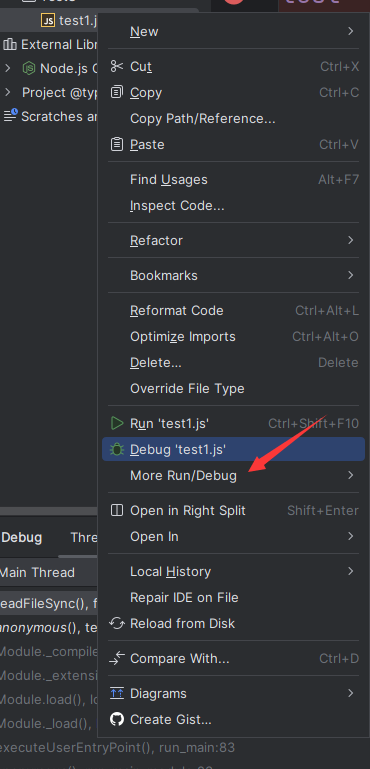
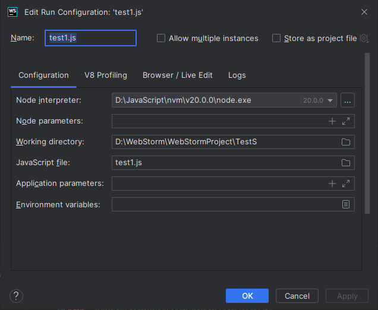
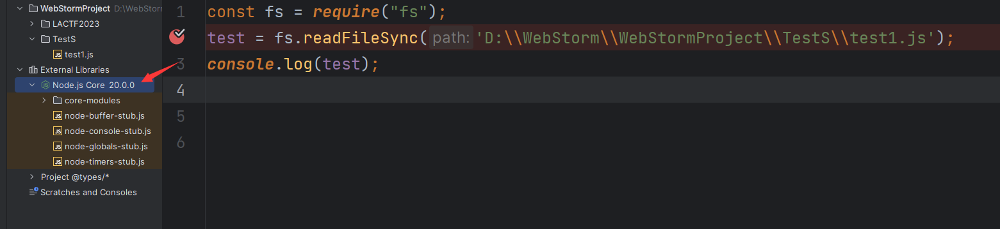

# Javascirpt 动态调试

一般都是通过浏览器的开发者工具或是IDE来动调。

我这里选用谷歌 Dev 工具以及 WebStorm

- [node 官方 github 地址](https://github.com/nodejs/node)

## WebStorm 动调配置

- 以下操作在 GPT 给出的建议上修改。

要进行动态调试调试，你首先需要创建一个 Debug 配置。WebStorm 提供了许多调试器，这里以 Node.js 应用程序为例。

以下是在 WebStorm 中配置 Node.js Debug 的步骤：

1. 打开 WebStorm 并打开你的项目。
2. 选择 `Run` > `Edit Configurations`。
3. 在窗口的左上角点击加号（+）添加一个新的配置。选择 `Node.js`。
4. 填写 `Name` 字段，并指定要调试的脚本路径 `JavaScript file` 和相应的参数 `Application parameters`。
5. 点击 `Apply` 或 `OK` 来保存更改。

你也可以直接创建一个 JS 文件然后选中它直接配置该文件的 Node.js 调试环境：



点击 More Run/Debug，然后 Modify Runtime configuration



一般来说，配置完 Node 解释器就足够了。


如果你的项目使用了 Node.js 模块，则还需要配置 `Node.js core modules` 和 `User modules`。你可以进入 `Run` > `Edit Configurations` > `Defaults` > `Node.js`；在 `Node parameters` 中填写以下代码来配置：

```
复制代码--require /absolute/path/to/your/project/node_modules/ts-node/register
```

以上是以 TypeScript 项目为例的配置方法，请根据需要进行适当修改。

完成以上配置后，你可以点击运行按钮来启动调试器或使用快捷键 Shift + F9 进行调试。

- 除了 Node.js 调试之外，WebStorm 还支持其他许多调试器，包括 Chrome、Firefox、Safari、Edge 和 React Native 调试器等。每个调试器都有相应的配置方法，你可以在 `Edit Configurations` 中找到相应的选项进行配置。

## WebStorm 动态注意点

有时候配置完 Node 解释器之后，你可能会发现你所用的 Node 解释器版本和当前正在审计的代码的 Node 版本不一致（我就是这样的，之前用的老版本），这个时候需要把老版本的相关源码目录删掉，然后让 WebStorm 自动重新下载对应源码。



主要就是去观察内部库所用的 Node.js core 是啥版本的，一定要和你的 Node 解释器版本一致。

弄好这些就可以愉快的动调了！