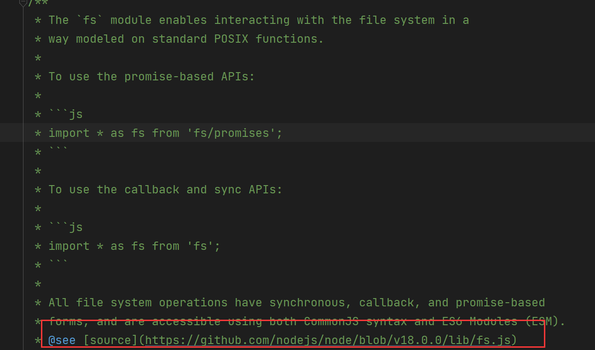

# Node.js 源码查看

有时候我们想要查看一下 Node.js 相关库的源码，这时候该怎么办？

比如我要查看 fs 库的某函数源码我该如何做？
通过 WebStorm 可以很方便地实现这一点：

1. 首先用以下代码导入库：

   ```
   require('fs');
   ```

2. 鼠标右击选中库跳转进去，然后根据 WebStorm 给出的注释查看对应的源码地址即可。



- 注意要配置 webstorm 允许 node.js 啥的，我也不清楚，总之鼠标放上去会弹出相关配置的，我们选中配置即可。

