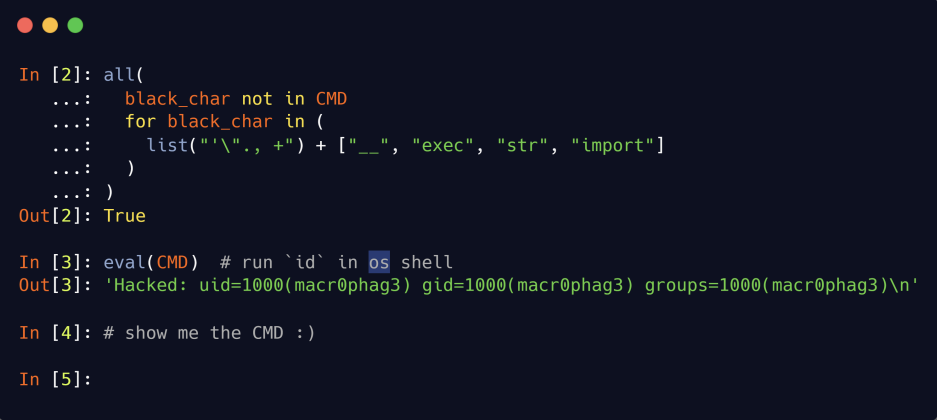
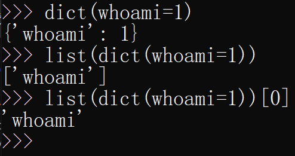

# Python 沙箱逃逸的通解探索之路-解法一分析

## 题目



黑名单包括：

1. 单引号
2. 双引号
3. 点
4. 逗号
5. 空格
6. 加号
7. 双下划线
8. exec
9. str
10. import

## 解法一 payload 分析

从执行上下文看，我们要构造出的 `CMD` 显然是一个字符串，因为下面会进行 `eval`。那么这里就有第一个问题：如何构造出任意字符串？

因为上面的限制条件把单/双引号都干掉了，所以直觉上我们会选择用 `chr` 函数和加号来拼接出字符串，但是加号也被干掉了。

而由于逗号也被干掉了，所以虽然能调用函数，但是也只能传一个参数。并且点也被限制掉了，所以就算可以 `__import__` 也没法调用方法。

对 Python CTF 题比较熟悉的橘友，第一反应可能是用：

```python
list(dict(whoami=1))[0]
```

这个 payload 还是比较好用的，但问题是，由于 `whoami` 作为参数名，无法携带一些特殊的字符，例如空格、引号、括号 等等，所以仅凭这个手法去构造的 exp，在实际的利用过程中不是非常实用。



所以需要寻找其他办法。经过一番寻找，我在内置的函数中发现了 `bytes()`：


## 参考链接

- [橘子杀手](https://cn-sec.com/archives/1322842.html)