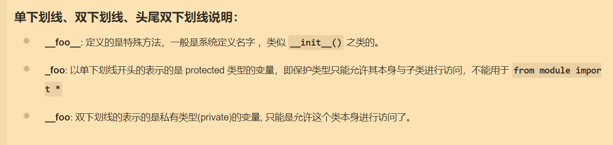
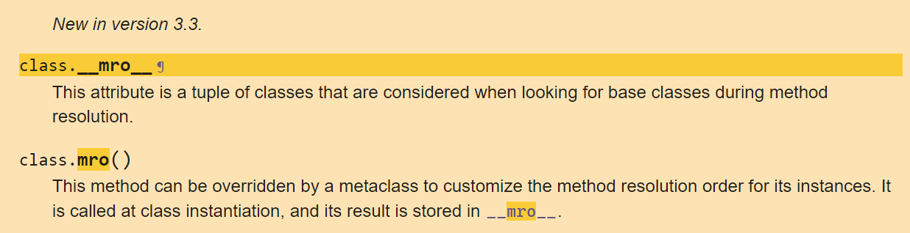

# Python 基础

> 入门参看-[菜鸟教程](https://www.runoob.com/python/python-tutorial.html)

## 前言

一定要对 python 面向对象方面多加了解，因为 CTF 的 SSTI、沙箱逃逸等都要用到 python 一些类的方法和属性。

## Python 面向对象之内置类属性

> 可以先看看[这篇](https://segmentfault.com/a/1190000042311727)

```
__init__ 是 类的构造函数或初始化方法，当创建了类的实例时就会调用该方法。
__dict__：类的属性（包含一个字典，由类的数据属性组成）
__name__：类名
__module__：类定义所在的模块。如果类位于一个导入模块 mymod 中，那么 className.__module__ 等于 mymod
__bases__：类的所有父类构成元素（包含了一个由所有父类组成的元组）
__del__：析构函数，在对象销毁时被调用
```



### \_\_mro\_\_

要稍加学习一些的是 python 的 [mro](https://docs.python.org/3/library/stdtypes.html?highlight=mro#class.__mro__) 方法及属性：



官方文档说 \_\_mro\_\_ 属性是一个类的元组，是什么类呢？是在方法解析期间寻找基类时所考虑的类。这样看来有些抽象，我在[此处](https://cloud.tencent.com/developer/article/1741952)找到了一个比较好的回答。看完这篇文章后对 mro 方法是做什么的、结果是咋样的会有一个清晰的了解，如果说要想明白 mro 是如何做的呢？可以参看[知乎](https://www.zhihu.com/tardis/zm/art/416584599?source_id=1003)的这篇文章。

### \_\_class\_\_

类的实例在获取 `__class__` 属性时会指向该实例对应的类。

```python
>>> ''.__class__
<class 'str'>
```

### \_\_globals\_\_

参看[官方文档](https://docs.python.org/3/reference/datamodel.html?highlight=__globals__)