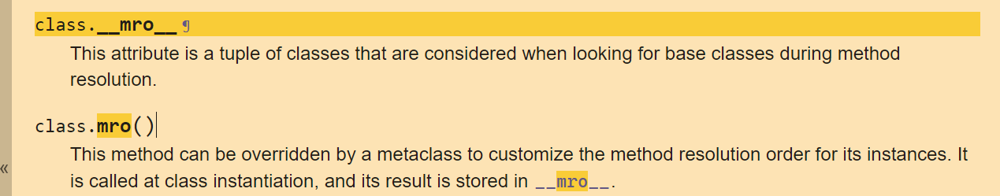

# Python 基础

> [菜鸟教程](https://www.runoob.com/python/python-tutorial.html)

## 前言

一定要对 python 面向对象方面多加了解，因为 CTF 的 SSTI、沙箱逃逸等都要用到 python 一些类的方法和属性。

## Python 面向对象之内置类属性

```
__init__ 是 类的构造函数或初始化方法，当创建了类的实例时就会调用该方法。
__dict__：类的属性（包含一个字典，由类的数据属性组成）
__name__：类名
__module__：类定义所在的模块。如果类位于一个导入模块 mymod 中，那么 className.__module__ 等于 mymod
__bases__：类的所有父类构成元素（包含了一个由所有父类组成的元组）
__del__：析构函数，在对象销毁时被调用
```

要稍加学习一些的是 python 的 [mro](https://docs.python.org/3/library/stdtypes.html?highlight=mro#class.__mro__) 方法：
