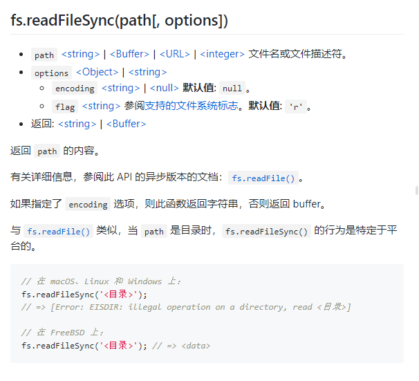
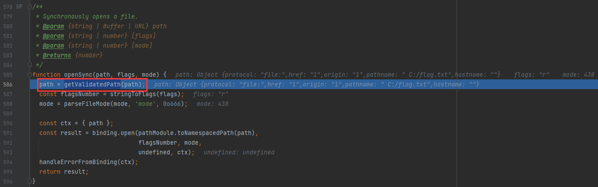
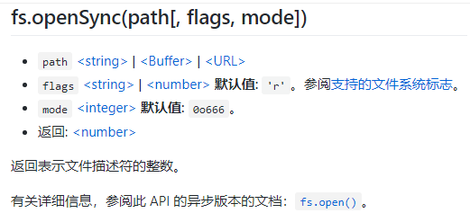
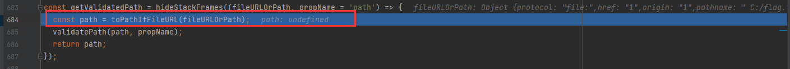
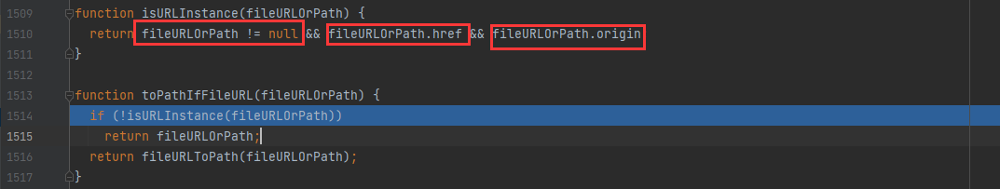
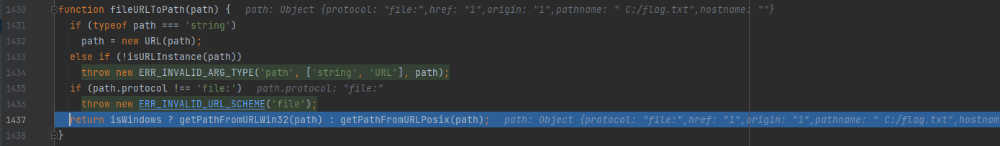
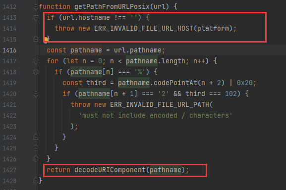
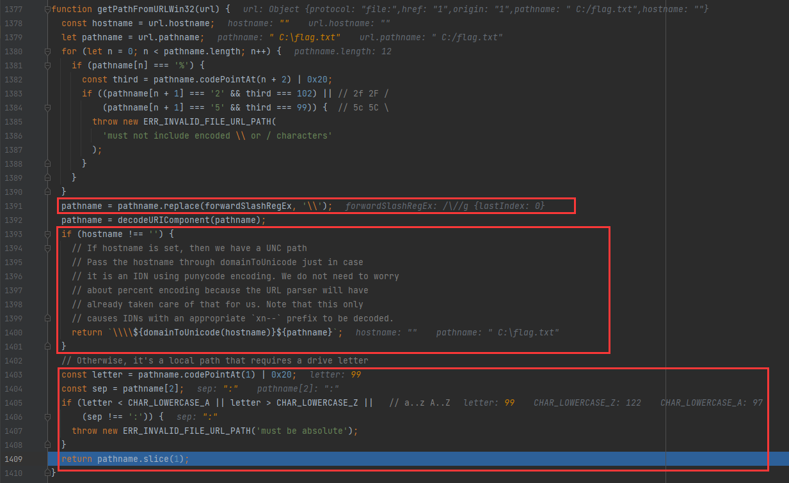
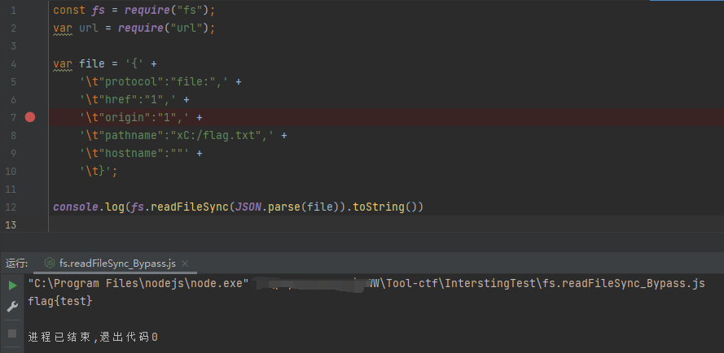
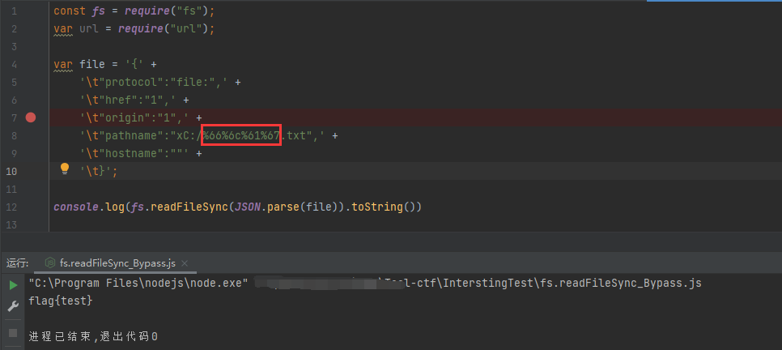

# readFileSync 函数利用

## 前言

不会记录太多，和原文一起看。

## 参考

- [奇安信攻防社区](https://forum.butian.net/share/1986)


## 了解函数

看一下Nodejs官方文档对`fs.readFileSync`的介绍



可以看到, `fs.readFileSync`函数共支持4种格式的文件路径`path`,

1. `字符串类型`就是我们常用的直接指定文件名的方式了
2. `Buffer类型`是一个`buffer`缓冲区
3. `Int整型`就是读取对应的文件描述符
4. `URL类型`可以指定一个URL对象或者对应格式的数组

关于返回的内容就是一个Buffer对象或者String字符串, 这个就不多说了

函数`readFileSync`的源代码中的很多函数几乎都是见名知意的, 所以这里直接贴一下源代码

```javascript
/**
 * Synchronously reads the entire contents of a file.
 * @param {string | Buffer | URL | number} path
 * @param {{
 *   encoding?: string | null;
 *   flag?: string;
 *   }} [options]
 * @returns {string | Buffer}
 */
function readFileSync(path, options) {
  options = getOptions(options, { flag: 'r' });
  const isUserFd = isFd(path); // File descriptor ownership
  const fd = isUserFd ? path : fs.openSync(path, options.flag, 0o666);

  const stats = tryStatSync(fd, isUserFd);
  const size = isFileType(stats, S_IFREG) ? stats[8] : 0;
  let pos = 0;
  let buffer; // Single buffer with file data
  let buffers; // List for when size is unknown

  if (size === 0) {
    buffers = [];
  } else {
    buffer = tryCreateBuffer(size, fd, isUserFd);
  }

  let bytesRead;

  if (size !== 0) {
    do {
      bytesRead = tryReadSync(fd, isUserFd, buffer, pos, size - pos);
      pos += bytesRead;
    } while (bytesRead !== 0 && pos < size);
  } else {
    do {
      // The kernel lies about many files.
      // Go ahead and try to read some bytes.
      buffer = Buffer.allocUnsafe(8192);
      bytesRead = tryReadSync(fd, isUserFd, buffer, 0, 8192);
      if (bytesRead !== 0) {
        ArrayPrototypePush(buffers, buffer.slice(0, bytesRead));
      }
      pos += bytesRead;
    } while (bytesRead !== 0);
  }

  if (!isUserFd)
    fs.closeSync(fd);

  if (size === 0) {
    // Data was collected into the buffers list.
    buffer = Buffer.concat(buffers, pos);
  } else if (pos < size) {
    buffer = buffer.slice(0, pos);
  }

  if (options.encoding) buffer = buffer.toString(options.encoding);
  return buffer;
}
```

简单说一下几个关键函数步骤以及整个函数的执行过程:

1. 检查传入的`path`是不是一个文件描述符(Int), 如果不是的话则通过`fs.openSync`打开文件获得文件描述符, 然后将文件描述符赋值给`fd`
2. `tryStatSync`获取记录文件的相关属性的`fs.Stats` 对象
3. `isFileType`从Stats检查打开的是不是一个文件,如果是一个文件的话将文件大小赋值给`size`
4. `tryCreateBuffer`创建一个读取文件的缓冲区
5. `tryReadSync`使用`fs.readSync`从文件描述符中读取文件内容
6. 关闭文件描述符
7. 将读取文件内容的buffer返回

## URL 数组绕过关键字

这个我们可以尝试调试一下,主要关键的点就是`fs.openSync`函数处理URL类型的过程, 而这个解析过程并不是`fs.readFileSync`特有的逻辑代码, 而是打开文件资源的时候使用的`fs.openSync`的路径解析问题, 更具体的说就是`fs.openSync`的路径解析函数`getValidatedPath`(直接就是第一行获得`path`)的过程出的问题

### fs.openSync

```javascript
function openSync(path, flags, mode) {
  path = getValidatedPath(path);
  const flagsNumber = stringToFlags(flags);
  mode = parseFileMode(mode, 'mode', 0o666);

  const ctx = { path };
  const result = binding.open(pathModule.toNamespacedPath(path),
                              flagsNumber, mode,
                              undefined, ctx);
  handleErrorFromBinding(ctx);
  return result;
}
```

在这里下断点





### **getPathFromURLWin32**

继续跟进`getValidatedPath`函数

```javascript
const getValidatedPath = hideStackFrames((fileURLOrPath, propName = 'path') => {
  const path = toPathIfFileURL(fileURLOrPath);
  validatePath(path, propName);
  return path;
});
```



继续跟进 toPathIfFileURL

### toPathIfFileURL(重点)



这里就是先检查`fileURLOrPath`对象(就是我们传入的 path 变量)

1. `fileURLOrPath`不能为空
2. 存在`fileURLOrPath.href`
3. 存在`fileURLOrPath.origin`

如果全部满足就直接返回原`fileURLOrPath`对象,满足条件(这时候会将传入的对象看做是一个 URL 对象,然后就从URL对象获取文件名)就将`fileURLOrPath`传入`fileURLToPath`函数处理, 然后将处理结果返回，否则直接把原对象返回作为文件路径。

### fileURLToPath



1. 检查`path`是不是一个`String`字符串, 是则通过`path = new URL(path)`处理拿到一个 URL 对象(不是的话就不会处理了,这里为 Object 对象所以不执行)
2. 执行刚才的`origin`和`href`检查全部满足就抛出 Error
3. 检查`path.protocol`, 协议必须指定为`file:`
4. 检查是否为 Windwos, 然后使用对应的路径获取函数得到路径后返回

> Windows 与 Linux 各自获取路径的函数是`getPathFromURLWin32`和`getPathFromURLPosix`是不一样的而且区别稍大, 这个注意一下。

### **getPathFromURLPosix**

后面的因为我是在 Windwos 主机上运行所以这部分就是直接看源码不能调试了

`url`就是我们一开始传入的路径对象

1. `url.hostname`非空直接报错
2. `url.pathname`中不能包含`%2f|%2F`(/)或`%5c|%5C`(\),如果有的话就抛出Error, 否则使用`decodeURIComponent`解析之后将结果返回作为文件路径(这里的`decodeURIComponent`就是关键点, **`decodeURIComponent`函数对`pathname`进行URL解码**)



在此之后 return 的文件路径会直接一路返回, 交回到`getValidatedPath`, 然后执行一个`validatePath`函数检验, 检验函数有如下要求

1. 路径的类型必须为`string`或`Uint8Array`
2. 不管是 String 还是 Uint8Array, 其中都不能含有16进制为`00`的字节(防止 00截断??)

之后打开了文件之后`openSync`就将这个资源返回给`fs.readFileSync`, 再之后就是读取文件内容的操作了, 到此这个函数就可以说跟完了。

### **之后的一些\\远程路径的加载**

结果类型和 00 检验之后`getValidatedPath`函数将 path 路径直接返回到`fs.openSync`函数中

> 在拿到最后的文件名后, `fs.openSync`函数又会调用`module:path.path.PlatformPath.toNamespacedPath`对文件路径进行处理, 主要就是以下两种情况
>
> 1. `\\`开头且第3个字符不是`.`或者`?`, 打开文件的地址就是return `\\\\?\\UNC\\${StringPrototypeSlice(resolvedPath, 2)}`, 其中的`${StringPrototypeSlice(resolvedPath, 2)}`就是原字符串减掉前两个字符
> 2. 第一个字符属于`A-Za-z`, 第二第三个字符分别为`:`和`\`, 打开文件地址为`\\\\?\\${resolvedPath}`,其中的`${resolvedPath}`就是原本的路径
>
> 上面的两个情况都是用于打开远程文件的,不用管。

### Windwos 与 Linux 获取文件名函数的差异

细心的师傅可以发现我的测试demo读取的文件路径并不是`C:\\flag.txt`而是" C:\flag.txt",区别在于前面多了一个空格, 这是什么原因呢?

之前我们有说过 Windows 与 Linux 各自获取路径的函数是`getPathFromURLWin32`和`getPathFromURLPosix`是不一样的, 刚刚已经看了Linux的`getPathFromURLPosix`, 下面我们在看一下Windwos的`getPathFromURLWin32`有什么不一样的:



1. `pathname`不能包含`\`或`/`的URL编码(和之前一样)
2. 将`pathname`的`/`替换为`\`(取标准的 Windwos 文件路径)
3. 使用`decodeURIComponent`对`pathname`URL解码(和之前一样)
4. `hostname`如果非空就返回`\\\\${domainToUnicode(hostname)}${pathname}`, 其中的`domainToUnicode`会进行 unicode 解码(有 hostname 就进行远程文件加载)
5. 1. `pathname`的第二个字符必须是字母`a-zA-Z`;
   2. `pathname`第3个字符必须是`:`, 任何一个条件不满足抛出Error`must be absolute`
6. 丢弃第一个字母返回作为文件路径(感觉这点是比较有意思的)

所以主要区别有三点:

1. 支持`hostname`非空任何进行远程加载
2. 必须是绝对路径
3. 传入路径第一个字符被丢弃(可以看到下面读取`xC:/flag.txt`成功了)



## 构造 payload

可以知道要满足`fs.readFileSync`的数组格式读取需要满足以下条件

1. 有`href`且非空- toPathIfFileURL
2. 有`origin`且非空 - toPathIfFileURL
3. `protocol` 等于`file:`
4. 有`hostname`且等于空( Windwos 下非空的话会进行远程加载)
5. 有`pathname`且非空(读取的文件路径)

利用点在于`pathname`会被 URL 解析一次, 所以可以使用 URL 编码绕过关键字检测(但是不能包含有`\/`的URL编码)

```
flag => %66%6c%61%67
```


