# JDBC 笔记

- https://www.bilibili.com/video/BV1sK411B71e/?vd_source=ed636173e6c328be468a244d33ee03e1

## 一、前言

### 1.1 课程需要哪些前置技术

|                 |        |          |
| --------------- | ------ | -------- |
| 技术            | 版本   | 备注     |
| idea            | 2022.2 | 最新版本 |
| jdk             | 1.8    |          |
| mysql-jdbc 驱动 | 8.0.27 | 8.0.25+  |
| druid           | 1.1.21 |          |
| mysql           | 8.0.25 |          |

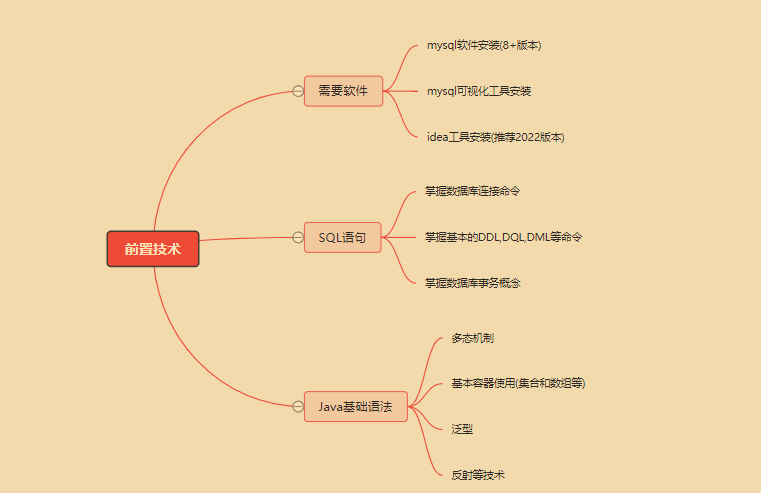

### 1.2 课程学习路线设计

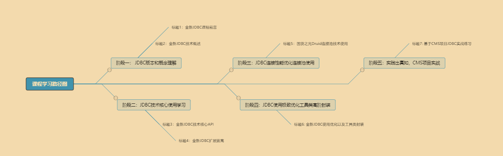

## 二. 全新 JDBC 技术概述

### 2.1 jdbc 技术概念和理解

#### 2.1.1 jdbc 技术理解

- JDBC：Java Database Connectivity | Java 连接数据库技术！

> 其实我觉得应该叫 JAVA 数据库连接

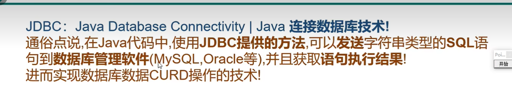

> CURD 即查增改查


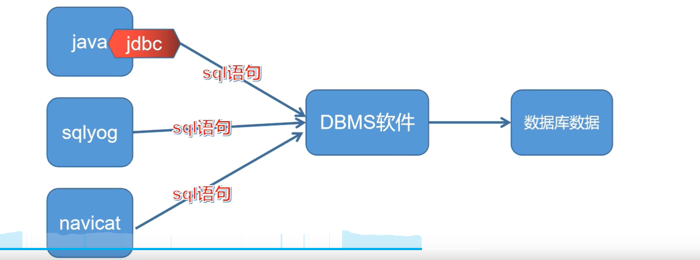

> 从这个图也可以看到，JDBC 其实起的作用和 sqlyog、navicat 这些图形化数据库连接软件的作用是一样的，不过我们这一次是在 Java 代码中连接到 DBMS！


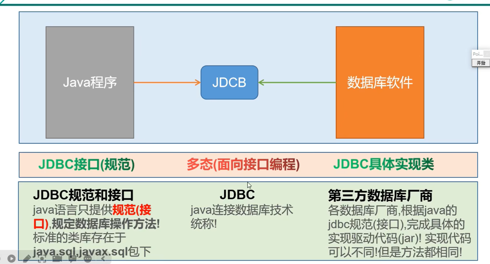


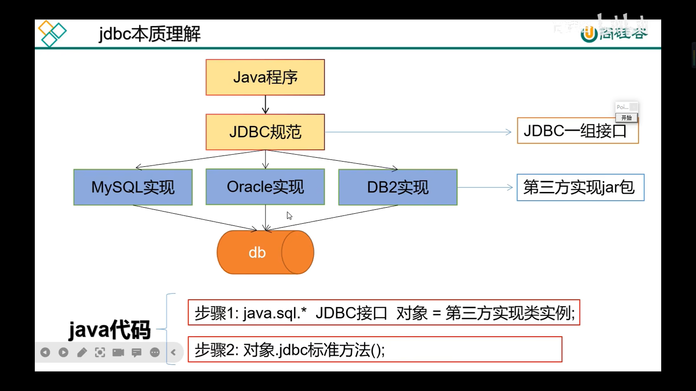

JDK 只提供 JDBC 规范的接口，规范的具体实现交给第三方数据库厂商来实现，通常是以一个 jar 包的形式给出这些实现。我们可以从网络上下载这些 jar 包。

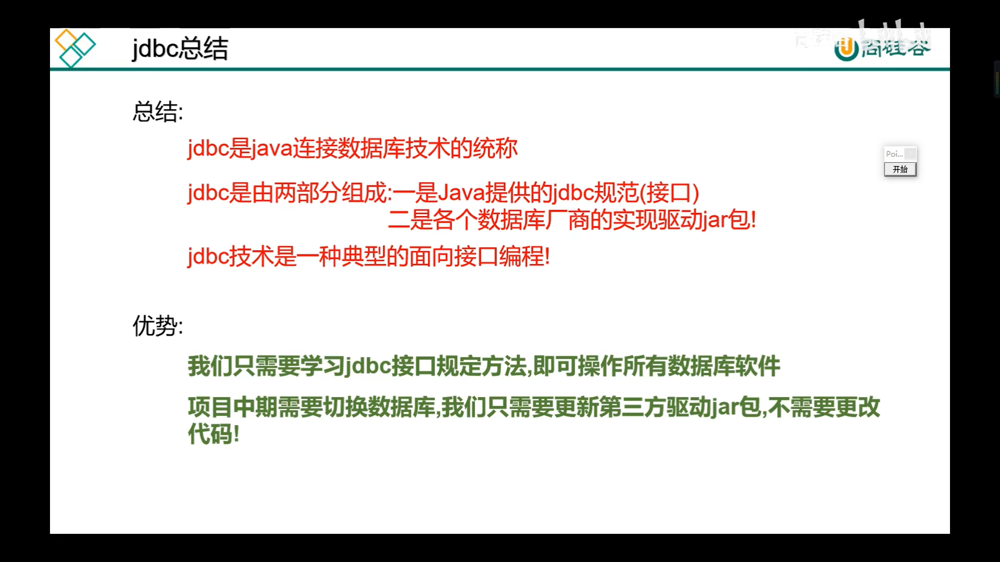

#### 2.1.2 jdbc 概念总结

1. jdbc是(Java Database Connectivity)单词的缩写,翻译为 java 连接数据库
2. jdbc 是 java 程序连接数据库的**技术统称**
3. jdbc 由 **java 语言的规范(接口)**和**各个数据库厂商的实现驱动(jar)组成**
4. **jdbc 是一种典型的面向接口编程**
5. jdbc 优势
    1. 只需要学习 jdbc 规范接口的方法,即可操作**所有的数据库软件**
    2. 项目中期切换数据库软件,只需要更换对应的数据库驱动 jar 包,不需要更改代码

### 2.2 jdbc 核心 api 和使用路线

#### 2.2.1 jdbc 技术组成

1. jdk 下 jdbc 规范接口, 该接口存储在 java.sql 和 javax.sql 包中。

    > 为了项目代码的可移植性，可维护性，SUN 公司从最初就制定了 Java 程序连接各种数据库的统一**接口规范**。这样的话，不管是连接哪一种 DBMS 软件，Java 代码都可以保持一致性。
2. 各个数据库厂商提供的驱动 jar 包

    > 因为各个数据库厂商的 DBMS 软件各有不同，那么内部如何通过 sql 实现增、删、改、查等管理数据，只有这个数据库厂商自己更清楚，因此把接口规范的实现交给各个数据库厂商自己实现。

    **jar 包是什么?**

    > java 程序打成的一种压缩包格式，你可以将这些 jar 包引入你的项目中，然后你可以使用这个 java 程序中的类和方法以及属性了!
    >
    > 后面会讲到如何把 jar 包加到 IDEA 的项目中

#### 2.2.2 涉及具体核心类和接口

所以 JDBC 规范接口都有什么类和方法？

- **DriverManager**
  1. 将第三方数据库厂商的实现驱动 jar 注册到程序中
  2. 可以根据数据库连接信息获取 connection
- Connection

  - 和数据库建立的连接,在连接对象上,可以多次执行数据库 curd 动作

  - 可以获取 statement 和 preparedstatement,callablestatement 对象
- Statement | **PreparedStatement** | CallableStatement

  - Statement等是负责具体发送 SQL 语句到 DBMS软件 的对象。
  - Statement、PreparedStatement 等对象发送方式稍有不同!
  - **Preparedstatement **使用为重点!
- Result

  - **面向对象思维的产物**(抽象成数据库的查询结果表)

  - 存储 DQL 查询数据库结果的对象

  - 需要我们进行解析,获取具体的数据库数据

#### 2.2.3 jdbc api 使用路线

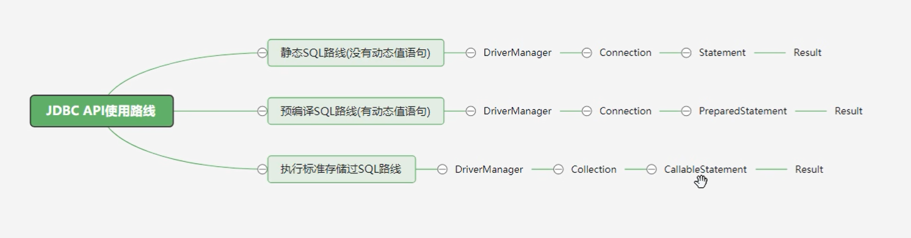

> 常用的是第二种预编译 SQL 路线！

### 2.3 为什么选择全新 8+ 版本 mysql-jdbc 驱动？

主要有以下四点：

1. 支持 8.0+ 版本 mysql 数据管理软件


2. 支持 java jdbc 规范 4.2+ 版本新特性

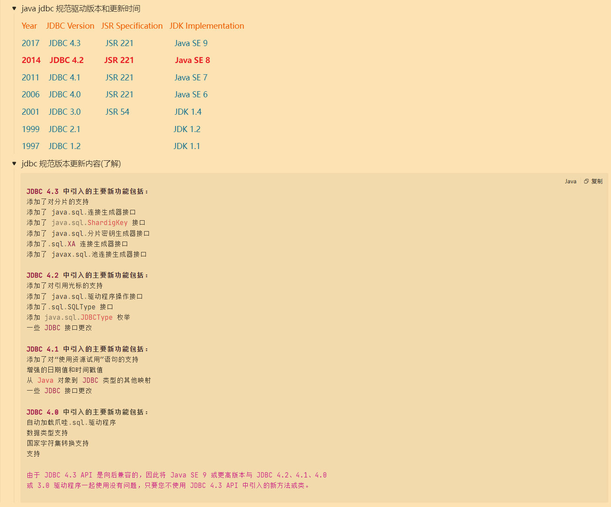

3. 支持 jdk1.8 版本语法变更新特性

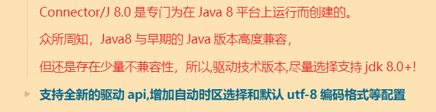

## 三、全新 JDBC 核心 API

### 3.1 引入 mysql-jdbc 驱动 jar

首先说明程序如何引入 jar 包。

- 驱动 jar 版本选择

先从尚硅谷的课件资料中[下载](https://pan.baidu.com/s/1btlZWcMNMJahrZEgkbzGxw?pwd=yyds) jar 包，然后选择 8.0.27 版本的哪个。

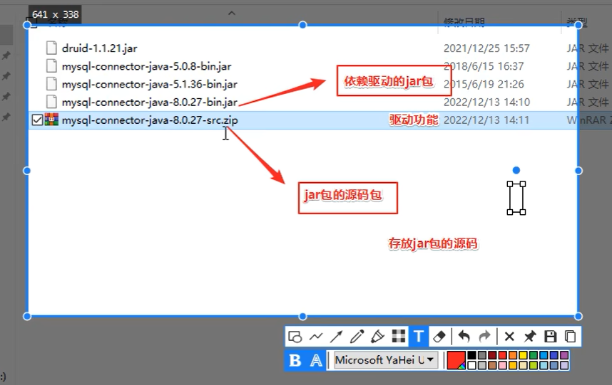


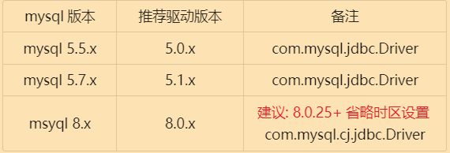

> 同一 mysql 版本可能有多个可用的驱动版本。


- 在 IDEA 中创建项目

构建系统注意要选择 **IntelliJ**，这样就是一个普通的 Java 工程。

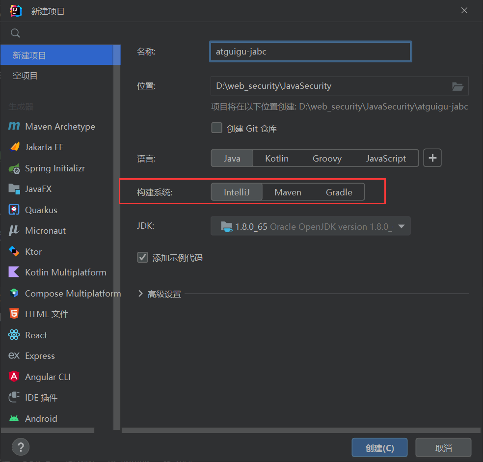

- 新建 lib 目录，然后把上上上图俩文件复制到这个目录下边，之后右键该目录选择添加为库。

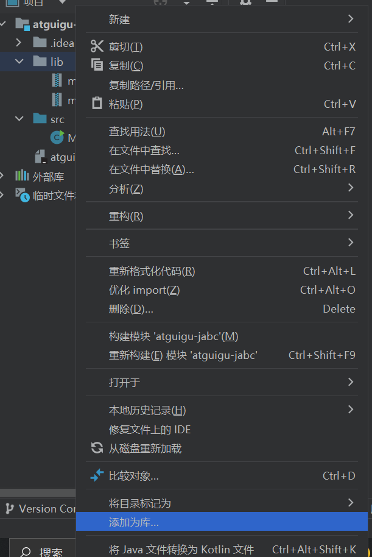

### 3.2 jdbc 使用步骤

> 步骤非常固定，记忆下来即可。

1. 注册 jar 包驱动
2. 建立连接对象 connection
3. 创建发送 SQL 语句的对象 statement
4. 让 statement 对象发送 SQL 语句到数据库并且获取返回结果对象 resultset
5. 解析结果集
6. 销毁资源，包括 connection、statement、resultset 的释放。

### 3.3 基于 statement 演示查询-实战演练！

- 准备数据库数据

```sql
CREATE DATABASE atguigu;

USE atguigu;

CREATE TABLE t_user(
   id INT PRIMARY KEY AUTO_INCREMENT COMMENT '用户主键',
   account VARCHAR(20) NOT NULL UNIQUE COMMENT '账号',
   PASSWORD VARCHAR(64) NOT NULL COMMENT '密码',
   nickname VARCHAR(20) NOT NULL COMMENT '昵称');
   
INSERT INTO t_user(account,PASSWORD,nickname) VALUES
  ('root','123456','经理'),('admin','666666','管理员');
```

- 查询目标

查询目标：查询全部用户信息，进行控制台输出

先在数据库管理软件中导入以上的 SQL 语句创建数据库和表。

> 我用的 Navicat 破解版 🤭

查询语句：

```sql
select id,account,password,nickname from t_user;
```

关键的问题来了，如何利用 JAVA 代码实现以上查询呢？只需要调用相应的 Java 类、方法即可。

我们根据 jdbc 使用步骤来进行：

```sql
/**
 * @Author 赵伟风
 * Description: 利用jdbc技术,完成用户数据查询工作
 *
 * TODO: 步骤总结 (6步)
 *    1. 注册驱动
 *    2. 获取连接
 *    3. 创建statement
 *    4. 发送SQL语句,并获取结果
 *    5. 结果集解析
 *    6. 关闭资源
 */
public class JdbcBasePart {

    public static void main(String[] args) throws SQLException {

        //1.注册驱动
        /**
         * TODO: 注意
         *   Driver -> com.mysql.cj.jdbc.Driver
             8+ 版本选择带有 cj 的
             5+ 版本选择没有 cj 的
         */
        DriverManager.registerDriver(new Driver());

        //2.获取连接
        /**
         * TODO: 注意
         *   面向接口编程
         *   java.sql 接口 = 实现类
         *   connection 使用java.sql.Connection接口接收
         */
        Connection connection = DriverManager.getConnection("jdbc:mysql://localhost:3306/atguigu",
                "root",
                "root");

        //3.创建小车
        Statement statement = connection.createStatement();

        //4.发送SQL语句
        String sql = "select id,account,password,nickname from t_user ;";
        ResultSet resultSet =  statement.executeQuery(sql);

        //5.结果集解析
        while (resultSet.next()){
            int id = resultSet.getInt("id");
            String account = resultSet.getString("account");
            String password = resultSet.getString("password");
            String nickname = resultSet.getString("nickname");
            System.out.println(id+"::"+account+"::"+password+"::"+nickname);
        }

        //6.关闭资源  【先开后关】
        resultSet.close();
        statement.close();
        connection.close();

    }

}
```

### 3.4 基于 statement 方式的问题

- 本案例目标

  - 明确 jdbc 流程和详细讲解使用(**注册驱动**,**获取连接**,**发送语句**,**结果解析**)

  - 发现问题,引出 preparedstatement。

- 准备数据库数据

  > 上个案例相同的数据库

```SQL
CREATE DATABASE atguigu;

USE atguigu;

CREATE TABLE t_user(
   id INT PRIMARY KEY AUTO_INCREMENT COMMENT '用户主键',
   account VARCHAR(20) NOT NULL UNIQUE COMMENT '账号',
   PASSWORD VARCHAR(64) NOT NULL COMMENT '密码',
   nickname VARCHAR(20) NOT NULL COMMENT '昵称');
   
INSERT INTO t_user(account,PASSWORD,nickname) VALUES
  ('root','123456','经理'),('admin','666666','管理员');
```

- 演示目标

  模拟登录,控制台输入账号和密码,判断是否登陆成功成功!

  

- 基于 statement 实现模拟登录

```SQL
/**
 * @Author 赵伟风
 * Description: 输入账号密码,模拟用户登录!
 */
public class JdbcStatementLoginPart {

    public static void main(String[] args) throws ClassNotFoundException, SQLException {

        //1.输入账号和密码
        Scanner scanner = new Scanner(System.in);
        String account = scanner.nextLine();
        String password = scanner.nextLine();
        scanner.close();

        //2.jdbc的查询使用
        /**
         * 类加载： java文件 -> 编译 -> 【 class字节码文件 -->  类加载 --> jvm虚拟中  --> Class对象】
         * 类加载具体步骤：  加载 【class文件转成对象加载到虚拟机中】->
         *                连接 【验证（检查类文件） -> 准备 (静态变量赋默认值) -> 解析 (调用静态代码块) 】 ->
         *                初始化 -> (赋真实值)
         * 以下7种方式会触发类加载：
         *    1. new关键字
         *    2. 调用静态属性
         *    3. 调用静态方法
         *    4. 接口 包含1.8 新特性 default关键字
         *    5. 反射 【Class.forName() 类名.class】
         *    6. 子类调用会触发父类的静态代码块
         *    7. 触发类的入口方法main
         */
        //注册一次驱动
        Class.forName("com.mysql.cj.jdbc.Driver");


        /**
         * 重写： 为了子类扩展父类的方法！父类也间接的规范了子类方法的参数和返回！
         * 重载： 重载一般应用在第三方的工具类上，为了方便用户多种方式传递参数形式！简化形式！
         */
        /**
         * 三个参数：
         *    String URL: 连接数据库地址
         *    String user: 连接数据库用户名
         *    String password: 连接数据库用户对应的密码
         * 数据库URL语法：
         *    JDBC:
         *        ip port
         *        jdbc:mysql | jdbc:oracle :// 127.0.0.1 | localhost : 3306 / 数据库名
         *        jdbc:mysql://localhost:3306/day01
         *        192.168.33.45
         *        jdbc:mysql://192.168.33.45/3306/day01
         *        当前电脑的省略写法！ 注意：本机和端口3306
         *        jdbc:mysql://localhost:3306/day01 = jdbc:mysql:///day01
         *
         * 两个参数：
         *     String URL : 写法还是jdbc的路径写法！
         *     Properties : 就是一个参数封装容器！至少要包含 user / password key!存储连接账号信息！
         *
         * 一个参数：
         *    String URL: URl可以携带目标地址，可以通过?分割，在后面key=value&key=value形式传递参数
         *                jdbc:mysql:///day01?user=root&password=123456
         * 扩展路径参数(了解):
         *    serverTimezone=Asia/Shanghai&useUnicode=true&characterEncoding=utf8&useSSL=true
         *
         */
        //获取连接
        Connection connection = DriverManager.getConnection("jdbc:mysql:///atguigu", "root", "root");

        //固定方法固定剂
        //创建statement
        Statement statement = connection.createStatement();

        //执行SQL语句 [动态SQL语句,需要字符串拼接]
        String sql = "select * from t_user where account = '" + account + "' and password = '" + password + "' ;";


        /**
         *  ResultSet 结果集对象 = executeQuery(DQL语句)
         *  int       响应行数  = executeUpdate(非DQL语句)
         DQL 查询
         
         */
        ResultSet resultSet = statement.executeQuery(sql);


        //ResultSet == 小海豚  你必须有面向对象的思维：Java是面向对象编程的语言 OOP！
        /**
         *
         * TODO:1.需要理解ResultSet的数据结构和小海豚查询出来的是一样，需要在脑子里构建结果表！
         * TODO:2.有一个光标指向的操作数据行，默认指向第一行的上边！我们需要移动光标，指向行，在获取列即可！
         *        boolean = next()
         *              false: 没有数据，也不移动了！
         *              true:  有更多行，并且移动到下一行！
         *       推荐：推荐使用if 或者 while循环，嵌套next方法，循环和判断体内获取数据！
         *       if(next()){获取列的数据！} ||  while(next()){获取列的数据！}
         *
         *TODO：3.获取当前行列的数据！
         *         get类型(int columnIndex | String columnLabel)
         *        列名获取  //lable 如果没有别名，等于列名， 有别名label就是别名，他就是查询结果的标识！
         *        列的角标  //从左到右 从1开始！ 数据库全是从1开始！
         */

        //进行结果集对象解析
        if (resultSet.next()){
            //只要向下移动，就是有数据 就是登录成功！
            System.out.println("登录成功！");
        }else{
            System.out.println("登录失败！");
        }

        //关闭资源
        resultSet.close();
        statement.close();
        connection.close();
    }

}
```

- Statement 存在的问题
  1. SQL 语句需要字符串拼接,比较麻烦
  2. 只能拼接字符串类型,其他的数据库类型无法处理
  3. **可能发生注入攻击**

      > 动态值充当了 SQL 语句结构,影响了原有的查询结果! 

### 3.5 基于 preparedStatement 方式优化

- 利用 preparedStatement 解决上述案例注入攻击和 SQL 语句拼接问题! (重点掌握)

```java
/**
 * @Author 赵伟风
 * Description: 使用预编译Statement解决注入攻击问题
 */
public class JdbcPreparedStatementLoginPart {


    public static void main(String[] args) throws ClassNotFoundException, SQLException {

        //1.输入账号和密码
        Scanner scanner = new Scanner(System.in);
        String account = scanner.nextLine();
        String password = scanner.nextLine();
        scanner.close();

        //2.jdbc的查询使用
        //注册驱动
        Class.forName("com.mysql.cj.jdbc.Driver");

        //获取连接
        Connection connection = DriverManager.getConnection("jdbc:mysql:///atguigu", "root", "root");

        //创建preparedStatement
        //connection.createStatement();
        //TODO 需要传入SQL语句结构
        //TODO 要的是SQL语句结构，动态值的部分使用 ? ,  占位符！
        //TODO ?  不能加 '?'  ? 只能替代值，不能替代关键字和容器名
        String sql = "select * from t_user where account = ? and password = ? ;";
        PreparedStatement preparedStatement = connection.prepareStatement(sql);

        //占位符赋值
        //给占位符赋值！ 从左到右，从1开始！
        /**
         *  int 占位符的下角标
         *  object 占位符的值
         */
        preparedStatement.setObject(2,password);
        preparedStatement.setObject(1,account);

        //这哥们内部完成SQL语句拼接！
        //执行SQL语句即可
        ResultSet resultSet = preparedStatement.executeQuery();
        //preparedStatement.executeUpdate()

        //进行结果集对象解析
        if (resultSet.next()){
            //只要向下移动，就是有数据 就是登录成功！
            System.out.println("登录成功！");
        }else{
            System.out.println("登录失败！");
        }

        //关闭资源
        resultSet.close();
        preparedStatement.close();
        connection.close();
    }

}

```

### 3.6 基于 preparedStatement 演示 CURD

#### 3.6.1 数据库数据插入

```
/**
 * 插入一条用户数据!
 * 账号: test
 * 密码: test
 * 昵称: 测试
 */
@Test
public void testInsert() throws Exception{

    //注册驱动
    Class.forName("com.mysql.cj.jdbc.Driver");

    //获取连接
    Connection connection = DriverManager.getConnection("jdbc:mysql:///atguigu", "root", "root");

    //TODO: 切记, ? 只能代替 值!!!!!  不能代替关键字 特殊符号 容器名
    String sql = "insert into t_user(account,password,nickname) values (?,?,?);";
    PreparedStatement preparedStatement = connection.prepareStatement(sql);

    //占位符赋值
    preparedStatement.setString(1, "test");
    preparedStatement.setString(2, "test");
    preparedStatement.setString(3, "测试");

    //发送SQL语句
    int rows = preparedStatement.executeUpdate();

    //输出结果
    System.out.println(rows);

    //关闭资源close
    preparedStatement.close();
    connection.close();
}
```

#### 3.6.2 数据库数据修改

```
/**
 * 修改一条用户数据!
 * 修改账号: test的用户,将nickname改为tomcat
 */
@Test
public void testUpdate() throws Exception{

    //注册驱动
    Class.forName("com.mysql.cj.jdbc.Driver");

    //获取连接
    Connection connection = DriverManager.getConnection("jdbc:mysql:///atguigu", "root", "root");

    //TODO: 切记, ? 只能代替 值!!!!!  不能代替关键字 特殊符号 容器名
    String sql = "update t_user set nickname = ? where account = ? ;";
    PreparedStatement preparedStatement = connection.prepareStatement(sql);

    //占位符赋值
    preparedStatement.setString(1, "tomcat");
    preparedStatement.setString(2, "test");

    //发送SQL语句
    int rows = preparedStatement.executeUpdate();

    //输出结果
    System.out.println(rows);

    //关闭资源close
    preparedStatement.close();
    connection.close();
}
```

#### 3.6.3 数据库数据删除

```
/**
 * 删除一条用户数据!
 * 根据账号: test
 */
@Test
public void testDelete() throws Exception{

    //注册驱动
    Class.forName("com.mysql.cj.jdbc.Driver");

    //获取连接
    Connection connection = DriverManager.getConnection("jdbc:mysql:///atguigu", "root", "root");

    //TODO: 切记, ? 只能代替 值!!!!!  不能代替关键字 特殊符号 容器名
    String sql = "delete from t_user where account = ? ;";
    PreparedStatement preparedStatement = connection.prepareStatement(sql);

    //占位符赋值
    preparedStatement.setString(1, "test");

    //发送SQL语句
    int rows = preparedStatement.executeUpdate();

    //输出结果
    System.out.println(rows);

    //关闭资源close
    preparedStatement.close();
    connection.close();
}
```

#### 3.6.4 数据库数据查询

```java
/**
 * 查询全部数据!
 *   将数据存到List<Map>中
 *   map -> 对应一行数据
 *      map key -> 数据库列名或者别名
 *      map value -> 数据库列的值
 * TODO: 思路分析
 *    1.先创建一个List<Map>集合
 *    2.遍历resultSet对象的行数据
 *    3.将每一行数据存储到一个map对象中!
 *    4.将对象存到List<Map>中
 *    5.最终返回
 *
 * TODO:
 *    初体验,结果存储!
 *    学习获取结果表头信息(列名和数量等信息)
 */
@Test
public void testQueryMap() throws Exception{

    //注册驱动
    Class.forName("com.mysql.cj.jdbc.Driver");

    //获取连接
    Connection connection = DriverManager.getConnection("jdbc:mysql:///atguigu", "root", "root");

    //TODO: 切记, ? 只能代替 值!!!!!  不能代替关键字 特殊符号 容器名
    String sql = "select id,account,password,nickname from t_user ;";
    PreparedStatement preparedStatement = connection.prepareStatement(sql);

    //占位符赋值 本次没有占位符,省略

    //发送查询语句
    ResultSet resultSet = preparedStatement.executeQuery();

    //创建一个集合
    List<Map> mapList = new ArrayList<>();

    //获取列信息对象
    ResultSetMetaData metaData = resultSet.getMetaData();
    int columnCount = metaData.getColumnCount();
    while (resultSet.next()) {
        Map map = new HashMap();
        for (int i = 1; i <= columnCount; i++) {
            map.put(metaData.getColumnLabel(i), resultSet.getObject(i));
        }
        mapList.add(map);
    }

    System.out.println(mapList);

    //关闭资源close
    preparedStatement.close();
    connection.close();
    resultSet.close();
}
```

## 四、全新 JDBC 扩展提升

> 这一块看下 4.3 小节即可，毕竟咱不是开发，对于性能提升什么的暂时不关心。

### 4.1 自增长主键回显实现


#### 4.1.1 功能需求

1. 用 **java 程序**获取**插入**数据时 mysql 维护**自增长**的主键**id值**,这就是主键回显
2. 作用: 在多表关联插入数据时,一般主表的主键都是自动生成的,所以在插入数据之前无法知道这条数据的主键,但是从表需要在插入数据之前就绑定主表的主键,这是可以使用主键回显技术:

## 五、国货之光 Druid 连接池技术使用

其实我认为连接池创立的初衷就是为了提高真正进行数据库操作的利用率，我们不希望在建立连接、销毁连接上花费太多的时间，仅仅希望于在进行数据库操作时花费时间。

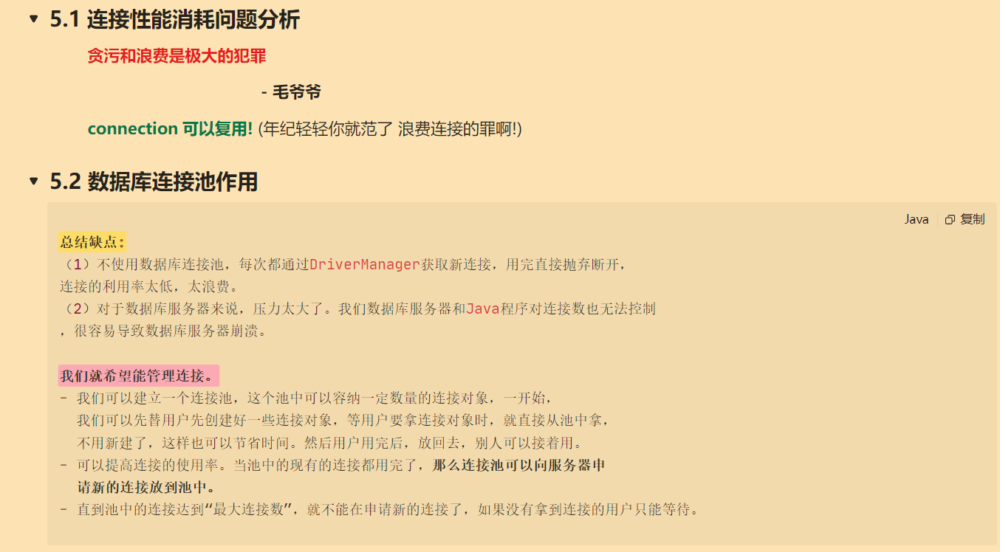

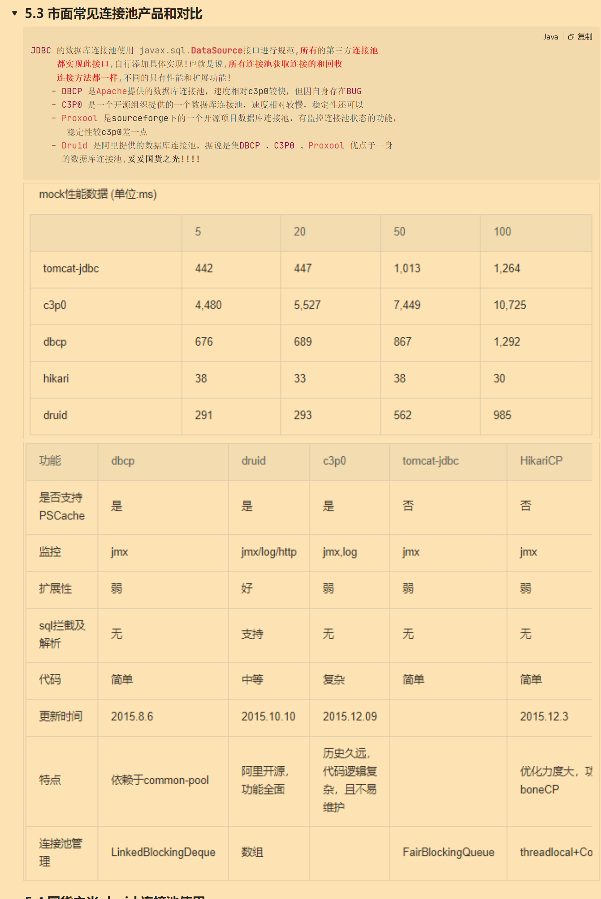

### 5.4 国货之光 druid 连接池使用

1. 下载 jar 包，在 idea 中添加为库

使用方式有两种，分别是硬编码方式和软编码方式，不推荐硬编码方式。

#### 5.4.1 硬编码方式

```java
/**
 * 创建druid连接池对象，使用硬编码进行核心参数设置！
 *   必须参数： 账号
 *             密码
 *             url
 *             driverClass
 *   非必须参数：
 *           初始化个数
 *           最大数量等等  不推荐设置
 */
@Test
public void druidHard() throws SQLException {

   DruidDataSource dataSource = new DruidDataSource();

   //设置四个必须参数
   dataSource.setDriverClassName("com.mysql.cj.jdbc.Driver");
   dataSource.setUsername("root");
   dataSource.setPassword("root");
   dataSource.setUrl("jdbc:mysql:///day01");

   //获取连接
   Connection connection = dataSource.getConnection();
   // JDBC的步骤
   //回收连接
   connection.close();
}

```

#### 5.4.2 软编码方式

软编码就是把连接池的核心参数写在一个外部的配置文件里，必须以 **properties** 后缀命名。

这里我们把配置文件写在 idea 的 src 目录下。

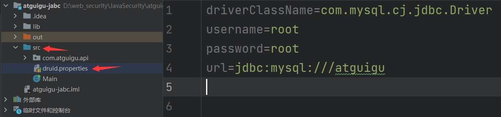

**配置文件内容：**

```sql
# druid连接池需要的配置参数,key固定命名
driverClassName=com.mysql.cj.jdbc.Driver
username=root
password=root
url=jdbc:mysql:///atguigu

```

注意，这里有点小小的坑，注意不要导错包!!!

我被这个 createDataSource 卡了一下，好在网上有位哥哥发了篇[文章](https://blog.csdn.net/weixin_43139254/article/details/106000867)警醒了我。

```java
import com.alibaba.druid.pool.DruidDataSourceFactory;
import org.junit.Test;

import javax.sql.DataSource;
import java.io.IOException;
import java.io.InputStream;
import java.util.Properties;

/**
 * 不直接在java代码编写配置文件！
 * 利用工厂模式，传入配置文件对象，创建连接池！
 * @throws Exception
 */
@Test
public void druidSoft() throws Exception {
    Properties properties = new Properties(); //选择 java.util 包下的 Properties
    InputStream ips = DruidDemo.class.getClassLoader().getResourceAsStream("druid.properties");
    properties.load(ips);
    DataSource dataSource = DruidDataSourceFactory.createDataSource(properties);
}

```

## 六、全新 JDBC 使用优化以及工具类封装

我们必然不可能每次手工创建连接池对象啥的，所以需要来一个工具类帮助我们完成这些过程。

首先还是先编写外部配置文件

位置：src/druid.properties

```mysql
# druid连接池需要的配置参数,key固定命名
driverClassName=com.mysql.cj.jdbc.Driver
username=root
password=root
url=jdbc:mysql:///atguigu
```

工具类代码

```java

import com.alibaba.druid.pool.DruidDataSourceFactory;

import javax.sql.DataSource;
import java.sql.Connection;
import java.sql.SQLException;
import java.util.Properties;

public class JDBCToolsVersion1 {
    private static DataSource ds;
    static{//静态代码块，JDBCToolsVersion1类初始化执行
        try {
            Properties pro = new Properties();
            pro.load(ClassLoader.getSystemResourceAsStream("druid.properties"));
            ds = DruidDataSourceFactory.createDataSource(pro);
        } catch (Exception e) {
            e.printStackTrace();
        }
    }

    public static Connection getConnection() throws SQLException {
        return ds.getConnection();//这么写，不能保证同一个线程，两次getConnection()得到的是同一个Connection对象
                            //如果不能保证是同一个连接对象，就无法保证事务的管理
    }

    public static void free(Connection conn) throws SQLException {
        conn.setAutoCommit(true);
        conn.close();//还给连接池
    }
}
```

测试工具类

```java
package com.atguigu.api.DruidUtil;

import java.sql.Connection;
import java.sql.SQLException;

public class Main {
    public static void main(String[] args) throws SQLException {

        JDBCToolsVersion1 jdbcToolsVersion1 = new JDBCToolsVersion1();

        Connection connection = JDBCToolsVersion1.getConnection();

        JDBCToolsVersion1.free(connection);


    }
}

```

