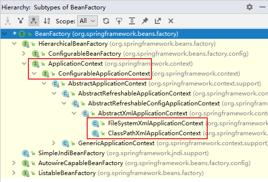

## 3、容器：IoC

IoC 是 Inversion of Control 的简写，译为“控制反转”，它不是一门技术，而是一种设计思想，是一个重要的面向对象编程法则，能够指导我们如何设计出松耦合、更优良的程序。

**Spring 通过 IoC 容器来管理所有 Java 对象的实例化和初始化**，**控制对象与对象之间的依赖关系**。**我们将由 IoC 容器管理的 Java 对象称为 Spring Bean**，它与使用关键字 new 创建的 Java 对象没有任何区别。

IoC 容器是 Spring 框架中最重要的核心组件之一，它贯穿了 Spring 从诞生到成长的整个过程。

### 3.1、IoC 容器

#### 3.1.1、控制反转（IoC）

- 控制反转是一种思想。
- 控制反转是为了降低程序耦合度，提高程序扩展力。
- 控制反转，反转的是什么？

- - 将对象的创建权利交出去，交给第三方容器负责。
  - 将对象和对象之间关系的维护权交出去，交给第三方容器负责。

- 控制反转这种思想如何实现呢？

- - DI（Dependency Injection）：依赖注入

#### 3.1.2、依赖注入

**DI（Dependency Injection）：依赖注入，依赖注入实现了控制反转的思想。**

**依赖注入指 Spring 创建对象的过程中，将对象依赖属性通过配置进行注入**

依赖注入常见的实现方式包括两种：

- 第一种：set 注入
- 第二种：构造注入

所以结论是：IOC 就是一种控制反转的思想， 而 DI 是对 IoC 的一种具体实现。

**Bean 管理说的是：Bean 对象的创建，以及 Bean 对象中属性的赋值（或者叫做 Bean 对象之间关系的维护）。**

##### 3.1.2.1 基于set注入

第一步 创建类，定义属性，生成属性的 set 方法

第二步 在 spring 中配置属性

这个依赖注入也很简单，无非就是在配置文件中设定类中属性的值，然后在测试类中实例化的时候，类中属性就得到了赋值。

##### 3.1.2.2 基于构造器完成

第一步 创建类 定义属性 生成有参构造方法

第二步 进行配置

#### 

#### 3.1.3、IoC 容器在 Spring 的实现

Spring 的 IoC 容器就是 IoC思想的一个落地的产品实现。IoC容器中管理的组件也叫做 bean。在创建 bean 之前，首先需要创建IoC 容器。Spring 提供了 IoC 容器的两种实现方式：

**①BeanFactory（顶层接口）**

这是 IoC 容器的基本实现，是 Spring 内部使用的接口。面向 Spring 本身，不提供给开发人员使用。

**②ApplicationContext**

BeanFactory 的子接口，提供了更多高级特性。面向 Spring 的使用者，几乎所有场合都使用 ApplicationContext 而不是底层的 BeanFactory。

**③ApplicationContext 的主要实现类**



| 类型名                          | 简介                                                         |
| ------------------------------- | ------------------------------------------------------------ |
| ClassPathXmlApplicationContext  | 通过读取类路径下的 XML 格式的配置文件创建 IOC 容器对象       |
| FileSystemXmlApplicationContext | 通过文件系统路径读取 XML 格式的配置文件创建 IOC 容器对象     |
| ConfigurableApplicationContext  | ApplicationContext 的子接口，包含一些扩展方法 refresh() 和 close() ，让 ApplicationContext 具有启动、关闭和刷新上下文的能力。 |
| WebApplicationContext           | 专门为 Web 应用准备，基于 Web 环境创建 IOC 容器对象，并将对象引入存入 ServletContext 域中。 |

### 管理 bean 的方法

最初用的是 XML 管理 bean 对象，但是这种手法太笨重了，所以现在都用注解来管理 bean，很方便。

### 3.3、基于注解管理Bean（☆）

从 Java 5 开始，Java 增加了对注解（Annotation）的支持，它是代码中的一种特殊标记，可以在编译、类加载和运行时被读取，执行相应的处理。开发人员可以通过注解在不改变原有代码和逻辑的情况下，在源代码中嵌入补充信息。

Spring 从 2.5 版本开始提供了对注解技术的全面支持，我们可以使用注解来实现自动装配，简化 Spring 的 XML 配置。

Spring 通过注解实现自动装配的步骤如下：

1. 引入依赖
2. 开启组件扫描
3. 使用注解定义 Bean
4. 依赖注入

#### 3.3.1、搭建子模块spring6-ioc-annotation

**①搭建模块**

搭建方式如：spring6-ioc-xml

**②引入配置文件**

引入spring-ioc-xml模块日志log4j2.xml

**③添加依赖**

```xml
<dependencies>
    <!--spring context依赖-->
    <!--当你引入Spring Context依赖之后，表示将Spring的基础依赖引入了-->
    <dependency>
        <groupId>org.springframework</groupId>
        <artifactId>spring-context</artifactId>
        <version>6.0.3</version>
    </dependency>

    <!--junit5测试-->
    <dependency>
        <groupId>org.junit.jupiter</groupId>
        <artifactId>junit-jupiter-api</artifactId>
    </dependency>

    <!--log4j2的依赖-->
    <dependency>
        <groupId>org.apache.logging.log4j</groupId>
        <artifactId>log4j-core</artifactId>
        <version>2.19.0</version>
    </dependency>
    <dependency>
        <groupId>org.apache.logging.log4j</groupId>
        <artifactId>log4j-slf4j2-impl</artifactId>
        <version>2.19.0</version>
    </dependency>
</dependencies>
```

#### 3.3.2、开启组件扫描

Spring 默认不使用注解装配 Bean，因此我们需要在 Spring 的 XML 配置中，通过 <context:component-scan> 元素开启 Spring Beans的自动扫描功能。开启此功能后，Spring 会自动扫描指定的包（base-package 属性设置）及其子包下的所有类，如果类上使用了 @Component 注解，就将该类装配到容器中。

```xml
<?xml version="1.0" encoding="UTF-8"?>
<beans xmlns="http://www.springframework.org/schema/beans"
       xmlns:xsi="http://www.w3.org/2001/XMLSchema-instance"
       xmlns:context="http://www.springframework.org/schema/context"
       xsi:schemaLocation="http://www.springframework.org/schema/beans
    http://www.springframework.org/schema/beans/spring-beans-3.0.xsd
    http://www.springframework.org/schema/context
            http://www.springframework.org/schema/context/spring-context.xsd">
    <!--开启组件扫描功能-->
    <context:component-scan base-package="com.atguigu.spring6"></context:component-scan>
</beans>
```

注意：在使用 <context:component-scan> 元素开启自动扫描功能前，首先需要在 XML 配置的一级标签 <beans> 中添加 context 相关的约束。

**情况一：最基本的扫描方式**

```xml
<context:component-scan base-package="com.atguigu.spring6">
</context:component-scan>
```

**情况二：指定要排除的组件**

```xml
<context:component-scan base-package="com.atguigu.spring6">
    <!-- context:exclude-filter标签：指定排除规则 -->
    <!-- 
 		type：设置排除或包含的依据
		type="annotation"，根据注解排除，expression中设置要排除的注解的全类名
		type="assignable"，根据类型排除，expression中设置要排除的类型的全类名
	-->
    <context:exclude-filter type="annotation" expression="org.springframework.stereotype.Controller"/>
        <!--<context:exclude-filter type="assignable" expression="com.atguigu.spring6.controller.UserController"/>-->
</context:component-scan>
```

**情况三：仅扫描指定组件**

```xml
<context:component-scan base-package="com.atguigu" use-default-filters="false">
    <!-- context:include-filter标签：指定在原有扫描规则的基础上追加的规则 -->
    <!-- use-default-filters属性：取值false表示关闭默认扫描规则 -->
    <!-- 此时必须设置use-default-filters="false"，因为默认规则即扫描指定包下所有类 -->
    <!-- 
 		type：设置排除或包含的依据
		type="annotation"，根据注解排除，expression中设置要排除的注解的全类名
		type="assignable"，根据类型排除，expression中设置要排除的类型的全类名
	-->
    <context:include-filter type="annotation" expression="org.springframework.stereotype.Controller"/>
	<!--<context:include-filter type="assignable" expression="com.atguigu.spring6.controller.UserController"/>-->
</context:component-scan>
```


#### 3.3.3、使用注解定义 Bean

Spring 提供了以下多个注解，这些注解可以直接标注在 Java 类上，将它们定义成 Spring Bean。

| 注解        | 说明                                                         |
| ----------- | ------------------------------------------------------------ |
| @Component  | 该注解用于描述 Spring 中的 Bean，它是一个泛化的概念，仅仅表示容器中的一个组件（Bean），并且可以作用在应用的任何层次，例如 Service 层、Dao 层等。  使用时只需将该注解标注在相应类上即可。 |
| @Repository | 该注解用于将数据访问层（Dao 层）的类标识为 Spring 中的 Bean，其功能与 @Component 相同。 |
| @Service    | 该注解通常作用在业务层（Service 层），用于将业务层的类标识为 Spring 中的 Bean，其功能与 @Component 相同。 |
| @Controller | 该注解通常作用在控制层（如SpringMVC 的 Controller），用于将控制层的类标识为 Spring 中的 Bean，其功能与 @Component 相同。 |