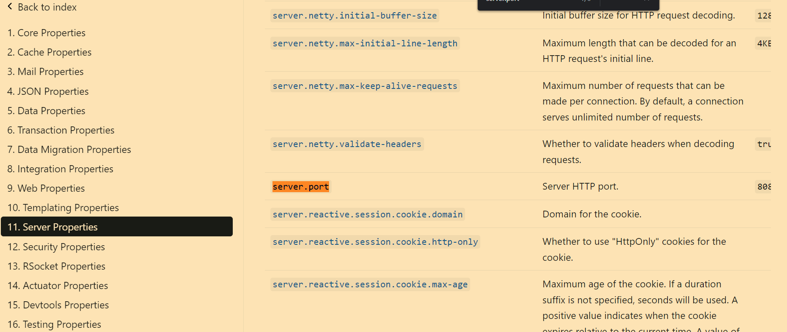
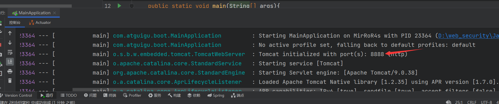

# SpringBoot

- 没啥好说的，直接跟着尚硅谷[文档](https://www.yuque.com/atguigu/springboot/lcfeme)走。
- 也可以看看配套[视频](https://www.bilibili.com/video/BV19K4y1L7MT/?vd_source=ed636173e6c328be468a244d33ee03e1)

## 1、系统要求

- [Java 8](https://www.java.com/) & 兼容java14 .
- Maven 3.3+
- idea 2019.1.2


### 1.1、maven设置

> 路径为：maven根目录/conf/settings.xml

```xml
<mirrors>
      <mirror>
        <id>nexus-aliyun</id>
        <mirrorOf>central</mirrorOf>
        <name>Nexus aliyun</name>
        <url>http://maven.aliyun.com/nexus/content/groups/public</url>
      </mirror>
  </mirrors>
 
  <profiles>
         <profile>
              <id>jdk-1.8</id>
              <activation>
                <activeByDefault>true</activeByDefault>
                <jdk>1.8</jdk>
              </activation>
              <properties>
                <maven.compiler.source>1.8</maven.compiler.source>
                <maven.compiler.target>1.8</maven.compiler.target>
                <maven.compiler.compilerVersion>1.8</maven.compiler.compilerVersion>
              </properties>
         </profile>
  </profiles>
```

## 2、HelloWorld

需求：浏览发送 /hello 请求，响应 Hello，Spring Boot 2 

### 2.1、创建maven工程

操作步骤就是直接在 IDEA 下新建一个 Maven 项目。注意先把你的 IDEA 的 Maven 改成本地的。

### 2.2、引入依赖

上一步创建完 maven 工程后，在 IDEA 左边会有一个 **pom.xml**，我们在其中添加如下内容：

```xml
<parent>
        <groupId>org.springframework.boot</groupId>
        <artifactId>spring-boot-starter-parent</artifactId>
        <version>2.3.4.RELEASE</version>
    </parent>


    <dependencies>
        <dependency>
            <groupId>org.springframework.boot</groupId>
            <artifactId>spring-boot-starter-web</artifactId>
        </dependency>

    </dependencies>
```

### 2.3、创建主程序

在 src/main/java 新建一个包 com.antiguigu.boot，包下创建一个 Java 类 MainApplication。

```java
/**
 * 主程序类
 * @SpringBootApplication：这是一个SpringBoot应用
 */
@SpringBootApplication
public class MainApplication {

    public static void main(String[] args) {
        SpringApplication.run(MainApplication.class,args);
    }
}
```

### 2.4、编写业务

在包 com.antiguigu.boot 下新建子包 controller，在其下新建 Java 类 HelloController

```java
@RestController
public class HelloController {
 

    @RequestMapping("/hello") // 请求映射
    public String handle01(){
        return "Hello, Spring Boot 2!";
    }


}
```

### 2.5、测试

直接运行 MainApplication 的 **main** 方法，然后浏览器访问 127.0.0.1:8080/hello


### 2.6、简化配置

SpringBoot 给我们准备了一个统一的配置文件 application.properties（在 resource 目录下自行创建），可以修改 SpringBoot 的 Web 容器启动的端口等等。

```xml
server.port=8888 // 把 Web 容器开放的端口改为 8888
```

那我们具体能修改什么呢？可以参照一下[官方文档](https://docs.spring.io/spring-boot/docs/current/reference/html/application-properties.html#appendix.application-properties)：





### 2.7、简化部署

```xml
 <build>
        <plugins>
            <plugin>
                <groupId>org.springframework.boot</groupId>
                <artifactId>spring-boot-maven-plugin</artifactId>
            </plugin>
        </plugins>
    </build>
```

把项目打成 jar 包，直接在目标服务器执行即可。


注意点：

- 取消掉 cmd 的快速编辑模式


### 
