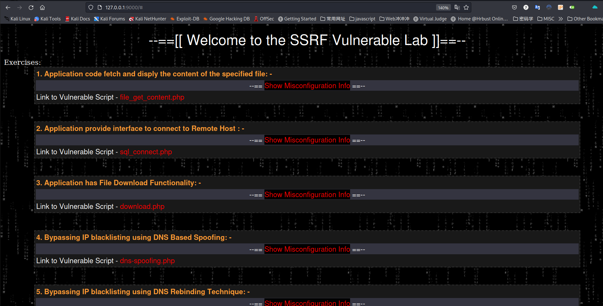
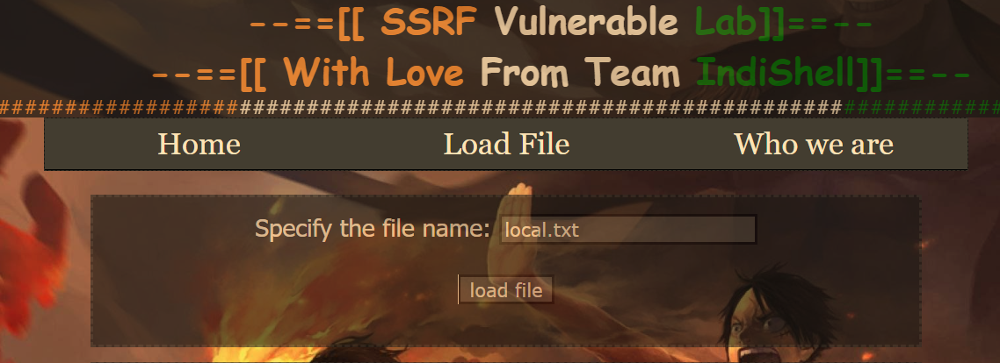
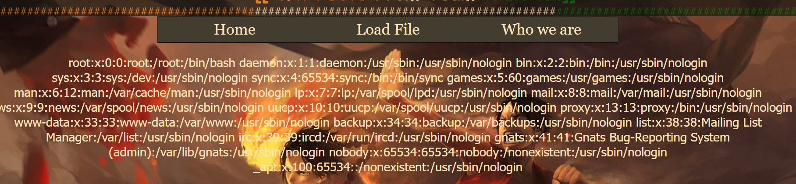
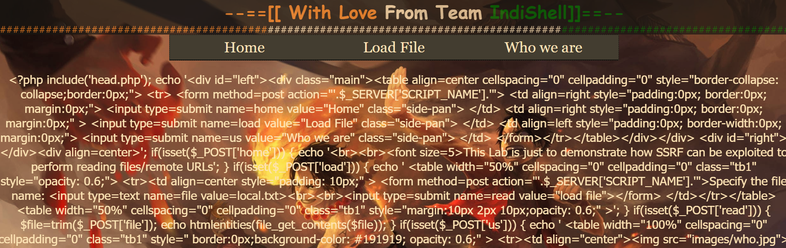
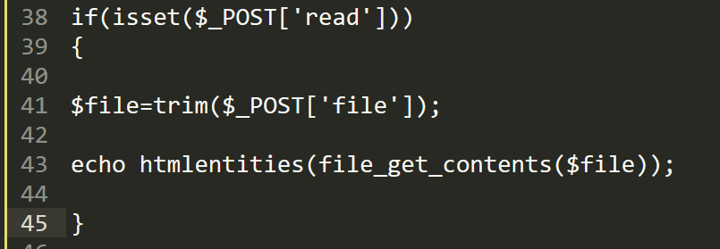

# SSRF 靶场练习记录

## ssrf-lab

## SSRF_Vulnerable_Lab

- 地址： [SSRF_Vulnerable_Lab](https://github.com/incredibleindishell/SSRF_Vulnerable_Lab)

### 环境搭建

```
docker build -t ssrf
docker run -p 9000:80 ssrf
```



- 看下自己虚拟机 eth0 网卡的 ip，从物理机访问方便一些。

### 第一关-获取应用程序源码并展示指定文件的内容

#### 漏洞描述

在编程语言中，有很多函数可以获取本地文件的内容。有时这些函数也可以从远程的 URL 中获取文件的内容，就像在本地一样，比如 PHP 的 file_get_contents 函数。

如果应用程序提供了这些功能，但是未对用户提供的数据进行过滤，比如增添前缀目录名、目录路径等，那我们就可以滥用这些功能读取任意文件。

在这种情况下，文件读取函数会处理像 http:// 或是 file:// 这样的协议。当用户在文件名部分指定了一个远程的 URL 时，比如 "http://localhost"，函数就会从指定的 URL 获取数据。

如果应用程序对用户输入的数据增添了前置字符串的话（比如目录名），那么此时 http:// 或 file:// 协议将会失效，所以就不会存在 SSRF 漏洞。

本关旨在演示如何利用 SSRF 漏洞读取文件内容（本地或远程）

#### 漏洞分析

点击 Load File 可以读取指定文件的内容：



此处应该就是 SSRF 漏洞的触发点了，我们尝试读取一下本地的 /etc/passwd 文件。

```
file:///etc/passwd #不用 file 协议也可以
```



读取当前 php 文件源码：


html 解码一下得到关键的源码：



程序调用 file_get_contents() 函数读取 $file 变量指定路径的文件内容，而这个变量来自于外部的用户输入。所以这是一个典型的 SSRF 漏洞示例，允许我们通过 file 协议读取任意文件。


