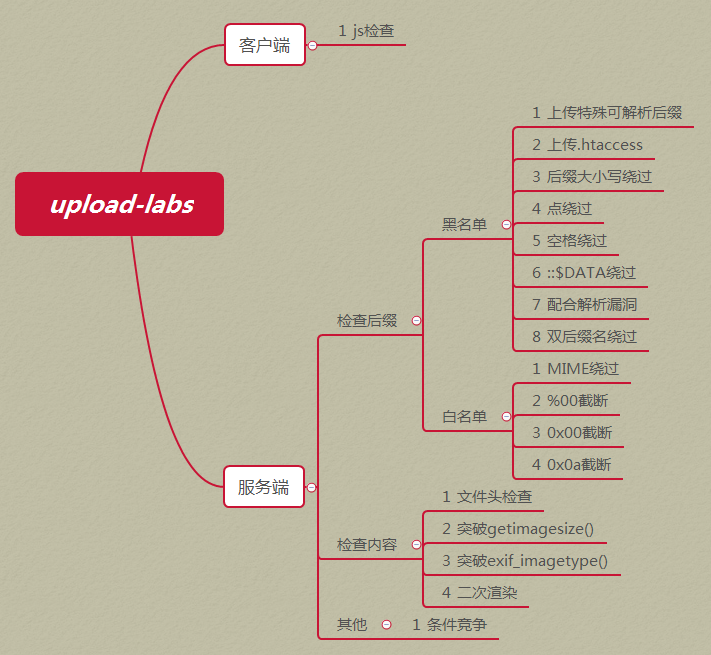

###### tags: `Web 安全`

# 第 1 章 文件上传漏洞


 <!-- more-->

## 1.1 文件上传漏洞定义

文件上传漏洞是指用户上传了一个可执行的脚本文件，并通过此脚本文件获得了执行服务器端命令的能力。这种攻击方式是最为直接和有效的，“文件上传” 本身没有问题，有问题的是文件上传后，服务器怎么处理、解释文件。如果服务器的处理逻辑做的不够安全，则会导致严重的后果。

你可能会疑惑为什么服务端要提供文件上传功能，以下是一个简单的回答：

>"文件上传"功能已经成为现在 Web 应用的一种常见需求，它不但有助于提高业务效率(例如：企业内部文件共享)，更有助于优化用户的体验（例如：上传视频、图片、头像等各种其他类型的文件）。"文件上传"功能一方面带来了良好的体验，另一方面也带来了“安全问题”。
>
>目前文件上传漏洞已经成为 web 安全中经常利用到的一种漏洞形式，**对于缺少安全防护的 web 应用，攻击者可以利用提供的文件上传功能将恶意代码植入到服务器中**，之后再通过 url 去访问以执行代码从而达到攻击的目的。

## 1.2 文件上传漏洞的危害

1. 上传文件是 web 脚本语言，服务器的 web 容器解释并执行了用户上传的脚本，导致代码执行。

2. 上传文件是病毒或者木马时，主要用于诱骗用户或者管理员下载执行或者直接自动运行；

3. 上传文件是 Flash 的策略文件 crossdomain.xml，黑客用以控制 Flash 在该域下的行为(其他通过类似方式控制策略文件的情况类似);

4. 上传文件是钓鱼图片或是包含了脚本的图片，在某些版本的浏览器中会被作为脚本执行，被用于钓鱼和欺诈。 除此之外，还有一些不常见的利用方法，比如将上传文件作为一个入口，溢出服务器的后台处理程序，如图片解析模块;或者上传一个合法的文本文件，其内容包含了 PHP 脚本，再通过 "本地文件包含漏洞(Local File Include)" 执行此脚本。


## 1.3 文件上传漏洞利用需要满足的条件（同时满足）

- 恶意文件可以成功上传
- 知道恶意文件上传后的路径
- 恶意文件可以被访问或执行


## 1.4 文件上传漏洞的成因

造成文件上传漏洞的原因有：

- 开源编辑器的上传漏洞
- 服务器配置不当
- 本地文件上传限制被绕过
- 过滤不严或被绕过
- 文件解析漏洞导致文件执行
- 文件路径截断

## 1.5 文件上传漏洞的原理

大部分的网站和应用系统都有上传功能，一些文件上传功能的实现代码没有严格限制用户上传的文件后缀以及文件类型，从而允许攻击者向某个可通过 web 访问的目录上传任意 PHP（包括但不限于 PHP） 文件，并能够将这些文件传递给 PHP 解释器，最终可在远程服务器上执行任意 PHP 脚本。

当系统存在文件上传漏洞时攻击者可以将病毒，木马，WebShell、恶意脚本或者是包含了恶意脚本的图片上传到服务器，这些文件将对攻击者后续攻击提供便利。根据具体漏洞的差异，此处上传的脚本可以是正常后缀的 PHP，ASP 以及 JSP 脚本，也可以是篡改后缀后的这几类脚本。

## 1.6 文件上传过程中的检测点以及绕过方法

文件上传漏洞危害极大，所以我们必须对用户上传的文件做好检测，防止恶意用户对我们的服务器进行攻击。所以在阐述如何绕过文件上传漏洞的防护之前，先说说文件上传过程中一般都会做哪些防护和校验。

- 以 PHP 为例子，其他语言的防护都大同小异。

### 1.6.1 客户端校验

这类检测通常在上传页面里含有专门检测上传文件的 javascript 代码，**最常见的就是检测上传文件的扩展名是否合法**，以下面的代码为例来说说如何绕过前端的 js 检测。

以下就是一个经典的客户端扩展名检测代码：


以上代码只允许我们上传 jpg、png、gif 后缀名的图片，但我们现在想要上传一个 shell.php，那么该如何绕过呢？

### 1.6.2 客户端校验绕过方法

#### 1. 禁用前端 JS 绕过客户端 JS 检测

以火狐浏览器为例说说如何关闭浏览器的 JS 功能：

- 在 Firefox 地址栏里输入 `about:config`
- 在搜索栏输入 `javascript.enabled` 查找到首选项
- 点击鼠标右键选择 `切换` ，把 `javascript.enabled` 键值改为 `false`

这样一来我们的浏览器就不支持 Javascript 了，此时客户端的检测将会失效。


>我们也可以安装一个名为 `disable javascript` 的浏览器插件来帮助我们禁用当前页面的 JavaScript 进而绕过前端的 JavaScript 检测。

#### 2. burpsuite 抓包改包绕过客户端 JS 检测

利用 burpsuite 可以轻松绕过前端检测，具体的做法如下：

1. 打开 burpsuite 代理模式，捕获本机的 http 请求。
2. 将要上传的恶意文件后缀名改为合法的后缀名并上传。（这样我们就可以通过前端的校验）
3. burpsuite 会捕获到上传的 http 请求包，此时我们在请求包中将我们的文件后缀名改回原本的形式。


- 客户端校验基本没啥用，我们的重点还是要放再服务器端。

### 1.6.2 服务端校验

从前文我们可以看到，在客户端的校验是非常不安全且无效的，所以真正的防护手段应该在服务器端实施。

服务器端的校验一般有如下四种：

- 服务端 MIME 类型检测（检测 Content-Type 内容）
- 服务端目录路径检测（检测跟 path 参数相关的内容）
- 服务端文件扩展名检测（检测跟文件 extension 相关的内容）
- 服务端文件内容检测（检测内容是否合法或含有恶意代码）


#### 1. 服务端 MIME 类型检测与绕过

关于什么是 MIME，读者可以看看这篇[文章](https://www.runoob.com/http/mime-types.html)。
我们以 PHP 代码为例，来看看服务端的 **MIME** 类型检测的示例代码：


MIME 类型检测属于白名单检测的一种，在服务器端完成，它会对上传文件请求包中的 `Content-Type` 字段值进行校验，判断是否属于白名单，如果不属于则不允许上传。对于服务端的这种校验方式，我们可以**通过 burpsuite 抓包来更改 Content-Type 为其允许的类型从而绕过这种检测手段！**

#### 3.  服务端目录路径检测

#### 4.  服务端文件扩展名检测与绕过
这种检测方式会对文件的后缀名进行检测，常见的有**白名单**和**黑名单**两种。这里可谓是重中之重，一般来说这里才是服务端真正下功夫进行防护的地方。


##### 黑名单检测
黑名单检测表示服务器端不允许上传文件的后缀名包含非法的后缀名，比如 PHP、ASP、JSP 等。当采用黑名单检测时，服务端通常会定义一个黑名单数组，凡是出现在黑名单数组中的后缀名都被定义为非法后缀名。

以下是一个 PHP 黑名单检测的示例代码


##### 黑名单检测绕过

黑名单检测绕过一般有如下几个手法：

1. 大小写转换，比如 php 写成 PHP、pHp 等
2. 寻找未在黑名单中但可解析的后缀名

如果服务端是 Windows 系统的话，那我们可以利用 Windows 特性绕过黑名单后缀名检测，主要包括以下两种手段：

1. `::$DATA` 绕过

针对这个绕过手法，我们的操作方式是使用 burpsuite 抓包在文件后缀中加 `::$DATA` ！

2. 点绕过

在 Windows 系统下，后缀名的最后一个点会被自动删除掉，所以可以通过在结尾加一个点的方式绕过黑名单。


##### 白名单检测后缀名

与黑名单检测不同，白名单检测只允许上传后缀名在白名单内的文件。这可以说是黑名单检测的逆向思维，黑名单是不允许谁进来，而白名单则是只允许谁进来。

一般来说，当服务器端采用白名单时，我们是无法上传非法后缀名文件的。但是有一些情况可以使我们绕过此限制。比如最经典的 **00** 截断，但这其实是 PHP 这个语言的问题，而不是文件上传漏洞本身。

**00 截断条件：php版本小于 5.3.4，php 的 magic_quotes_gpc 为 OFF 状态**

如：1.php0x00.jpg

值得注意的是，在 GET 型 00 截断中，我们要使用 %00 来截断，因为 GET 型提交的内容会被自动进行URL解码；而在POST型00截断中，%00 是不会被自动解码的，我们需要在 16 进制中对其进行修改，将其改为 00 即可截断。


####  文件内容检测与绕过

前面已经说到，服务器端可能会对上传文件的内容进行检测，其中就包括文件内容开始处的**文件幻数检测**。

[文件幻术详解](https://blog.csdn.net/just_h/article/details/126789044)

文件幻数是用来唯一标识文件类型的一系列数字（十六进制），也就是我们常说的文件头，当白名单限制了文件幻数时，我们就要给我们的文件制造可以过关的文件头：


以下是常见文件的幻数

```xml
（1） .JPEG;.JPE;.JPG，”JPGGraphic File”
（2） .gif，”GIF 89A”
（3） .zip，”Zip Compressed”
（4） .doc;.xls;.xlt;.ppt;.apr，”MS Compound Document v1 or Lotus Approach APRfile”
```

绕过文件头校验的方式也很简单，只需要在上传的木马文件前加上一些文件头信息。如果检测的是 gif 图片的文件幻数，那么应添加 `GIF89a`。

```php
GIF89a<?php phpinfo(); ?>
```


## 总结

从参考链接的大佬处拿来的一副思维导图，非常 nice！




## 文件上传绕过的奇技淫巧

除了上述常规的绕过技巧，文件上传还有一些巧妙的绕过手法，下面对这些手法展开分析。

### .user.ini 文件的妙用：

这部分参看 [P 神](https://www.leavesongs.com/PENETRATION/php-user-ini-backdoor.html)即可，写的很棒。

- 关于 .user.ini 的[例题](https://xz.aliyun.com/t/6091)

### .htaccess

.htaccess 文件是 Apache 服务器中的一个配置文件，它负责相关目录下的网页配置通过 htaccess 文件，可以实现:网页 301 重定向、自定义 404 页面、改变文件扩展名、允许/阻止特定的用户或者目录的访问、禁止目录列表、配置默认文档等功能。

在apache中，如果需要启动.htaccess，必须在http.conf中设置AllowOverride为All。

如果我们上传一个.htaccess，其内容为：

`SetHandler application/x-httpd-php`
这样的话所有文件都会被解析为php。

注意由于直接创建txt文档会显示必须键入文件名，所以可以采用cmd命令方式来生成 .htaccess。

### 配合文件包含漏洞

上传一个符合条件格式的文档，文档内容为一句话木马，比如 test.txt，然后利用文件包含漏洞包含上传的木马文件。比如 `page?id=D:/www/test.txt`

### 基于文件解析的漏洞
#### IIS篇
**；截断**

当文件名为abc.asp;xx.jpg时，IIS6会将此文件解析成abc.asp，文件名被截断了，从而导致脚本被执行。

**处理文件夹拓展名出错**

在 IIS6.0 的网站目录中创建有 *.asp 形式的文件夹，该文件夹下的所有文件都会以 asp 脚本格式进行解析。

**WebDav漏洞**

WebDav是一种基于HTTP1.1协议的通信协议。在GET、POST、HEAD等HTTP标准方法之外扩展了新方法。

攻击者可以通过PUT方法向服务器上传危险脚本。

#### NGINX 解析漏洞
- 这其实是 php 配置错误导致的解析漏洞，和 Nginx 关系不大。

我们用一个 test.jpg（其内容为一句话木马）来构造 payload：

```http
http://127.0.0.1/test.jpg/test.php
```

Nginx 在拿到 `/test.jpg/test.php` 后，一看后缀是 .php，便认为该文件是 php 文件，转交给 php 去处理。php一看 `/test.jpg/test.php` 不存在，便删去最后的 /test.php，又看/ test.jpg 存在，便把 /test.jpg 当成要执行的文件了。

原理是，当打开php的一个选项：`cgi.fix_pathinfo`（该值默认为1，表示开启）之后，php 就会对文件的路径进行 ”修理“ ，当 php 遇到文件路径 `/aaa.xxx/bbb.yyy/ccc.zzz` 时，若这个路径对应文件不存在，则会去掉最后的 `/ccc.zzz` ，然后判断 `/aaa.xxx/bbb.yyy` 是否存在，若存在，则把 `/aaa.xxx/bbb.yyy` 当做文件` /aaa.xxx/bbb.yyy/ccc.zzz` ，若 `/aaa.xxx/bbb.yyy` 仍不存在，则继续去掉 `/bbb.yyy`，以此类推。

- 新版本的 php 引入了 `security.limit_extensions`，限制了可执行文件的后缀，默认只允许执行 .php 文件。我们可以考虑修改该文件中的 `security.limit_extensions`，添加上 .jpg ，这样php就认为 .jpg 也是合法的 php 文件了。

#### APACHE 篇
多后缀名
Apache认为一个文件可以有多个后缀，如：example.php.abc，Apache会从右往左辨别后缀，一开始看到这个abc，不认识所以读到了php, 就把我们输入的这个文件当作了php文件，不再继续往下读。

换行解析漏洞
此漏洞的出现是由于apache在修复第一个后缀名解析漏洞时，用正则来匹配后缀。在解析php时xxx.php\x0A将被按照php后缀进行解析，导致绕过一些服务器的安全策略。

用法是在用burp抓包后在例如1.php后插入以一个\x0A绕过黑名单过滤，访问1.php%0A，即可看到文件被当作php解析。

此外，文件上传漏洞也经常用于和文件包含漏洞打”组合拳“，也就是先上传恶意代码，再包含上传文件。

## Java 文件上传
https://javasec.org/java-vuls/FileUpload.html

## 学习链接

### 狼组安全
[狼组安全](https://wiki.wgpsec.org/knowledge/ctf/uploadfile.html)
基本都讲到了，但是没有 .user.ini。

[飞书](https://birkenwald.feishu.cn/wiki/wikcnLrGq0GJQBCFjYAKv6U3e2f)

[文件上传漏洞总结](https://yinwc.github.io/2020/04/21/%E6%96%87%E4%BB%B6%E4%B8%8A%E4%BC%A0%E6%BC%8F%E6%B4%9E%E6%80%BB%E7%BB%93/)


### Upload-Labs 题解链接

https://xz.aliyun.com/t/2435


[ctfshow-文件上传总结](https://www.cnblogs.com/amazingman113/p/16074544.html)


