## 前言

改编自红日安全，加入了自己的一些东西。

## 一、 Day 1 - Wish List

题目叫做愿望清单，代码如下：

> 代码地址：https://github.com/vulnspy/ripstech-php-security-calendar-2017/blob/master/html/day1.php

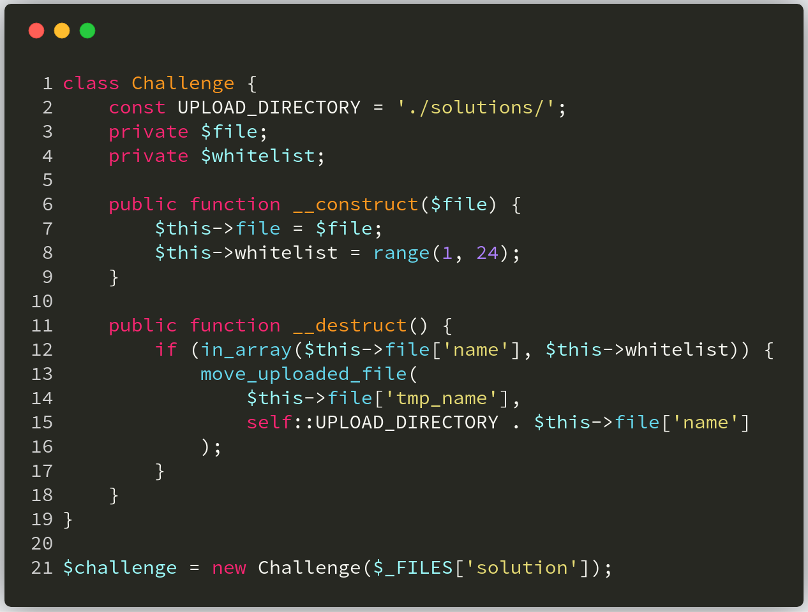

**漏洞解析** ：

这一关卡考察的是一个任意文件上传漏洞，而导致这一漏洞的发生则是不安全的使用 **in_array()** 函数来检测上传的文件名，即上图中的第12行部分。由于该函数并未将第三个参数设置为 **true** ，这导致攻击者可以通过构造的文件名来绕过服务端的检测，例如文件名为 **7shell.php** 。因为 PHP 在使用 **in_array()** 函数判断时，会将 **7shell.php** 强制转换成数字 7，而数字 7 在 **range(1,24)** 数组中，最终绕过 **in_array()** 函数判断，导致任意文件上传漏洞。（这里之所以会发生强制类型转换，是因为目标数组中的元素为数字类型）我们来看看PHP手册对 **in_array()** 函数的定义。

>[ **in_array** ](http://php.net/manual/zh/function.in-array.php)：(PHP 4, PHP 5, PHP 7)
>
>**功能** ：检查数组中是否存在某个值
>
>**定义** ： `bool in_array ( mixed $needle , array $haystack [, bool $strict = FALSE ] )` 
>
>在 **$haystack** 中搜索 **$needle** ，如果第三个参数 **$strict** 的值为 **TRUE** ，则 **in_array()** 函数会进行强检查，检查 **$needle** 的类型是否和 **$haystack** 中的相同。如果找到 **$haystack** ，则返回 **TRUE**，否则返回 **FALSE**。


### 环境搭建

往后的每天审计都需要用到这个环境，所以搭建一次就可以了。

1. 在[此处](https://github.com/vulnspy/ripstech-php-security-calendar-2017)下载源码，得到 docker-compose.yml
2. 运行 `sudo docker-compose -up` . 启动容器

### 漏洞利用


## 二、实例分析-piwigo2.7.1 sql 注入漏洞

本次实例分析，我们选取的是 **piwigo2.7.1** 版本。该版本由于SQL 语句直接拼接 **$rate** 变量，而 **$rate** 变量也仅是用 **in_array()** 函数简单处理，并未使用第三个参数进行严格匹配，最终导致 sql 注入漏洞发生。下面我们来看看具体的漏洞位置。漏洞的入口文件是 **/picture.php** ，具体代码如下：

> 据我测试，漏洞入口文件应是在 piwigo 根目录下的 picture.php 中。

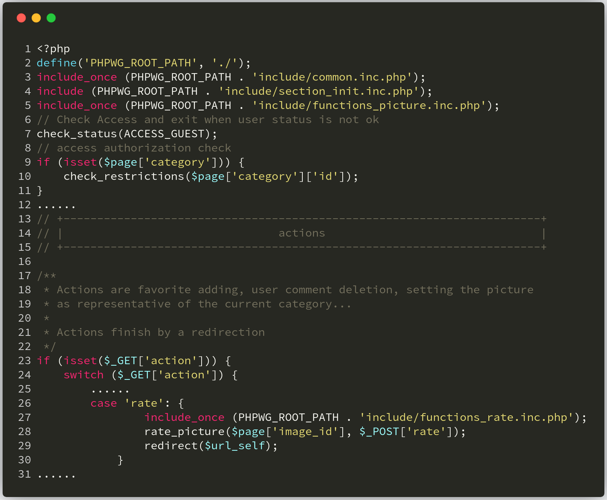

当 **$_GET['action']** 为 **rate** 的时候，就会调用文件 **include/functions_rate.inc.php** 中的 **rate_picture** 方法，而漏洞便存在这个方法中。

我们可以看到下图第 23 行处直接拼接 **$rate** 变量，而在第 6 行使用 **in_array()** 函数对 **$rate** 变量进行检测，判断 **$rate** 是否在 **$conf['rate_items']** 中。

**$conf['rate_items']** 的内容可以在 **include\config_default.inc.php** 中找到，为 `$conf['rate_items'] = array(0,1,2,3,4,5);` 

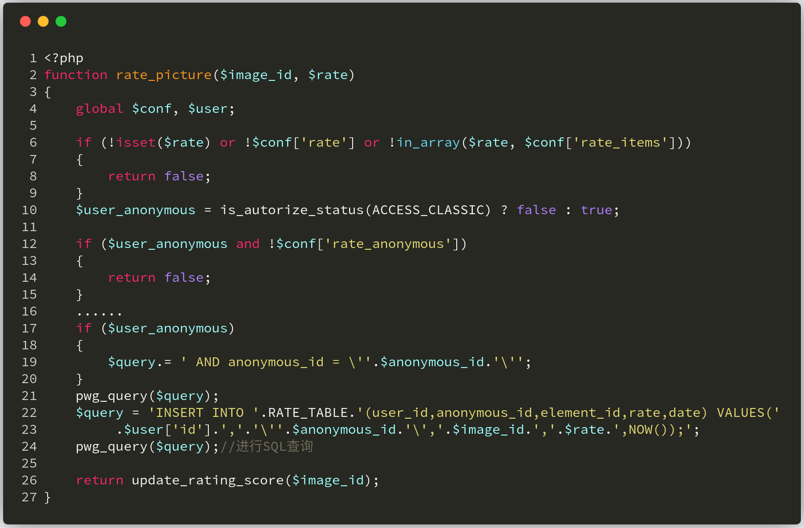

由于这里（上图第6行）并没有将 **in_array()** 函数的第三个参数设置为 **true** ，所以会进行弱比较，我们可以轻松绕过。比如我们将 **$rate** 的值设置成 

```sql
1,1 and if(ascii(substr((select database()),1,1))=112,1,sleep(3)));#
```

 那么SQL语句就变成：

```sql
INSERT INTO piwigo_rate (user_id,anonymous_id,element_id,rate,date) VALUES (2,'192.168.2',1,1,1 and if(ascii(substr((select database()),1,1))=112,1,sleep(3)));#,NOW()) ;
```

这样就可以进行盲注了，如果上面的代码你看的比较乱的话，可以看下面简化后的代码：

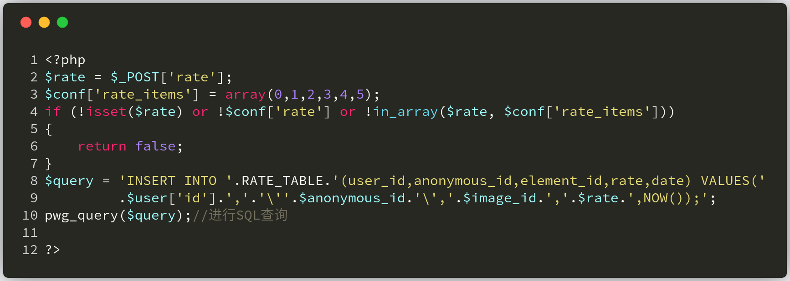

## 2.1 漏洞利用 

### 2.1.1 环境搭建

1. 根据红日的压缩包解压得到系统源代码

2. 访问 install.php 进行安装

   - 我的管理员账号密码是 admin admin
   - 数据库版本是 5.5.29，更高的版本会有一些[错误](https://blog.csdn.net/m0_52284206/article/details/120313678)。

   - 本地新建一个 piwigo 数据库

   - 我的 PHP 版本是 5.4.45

     

   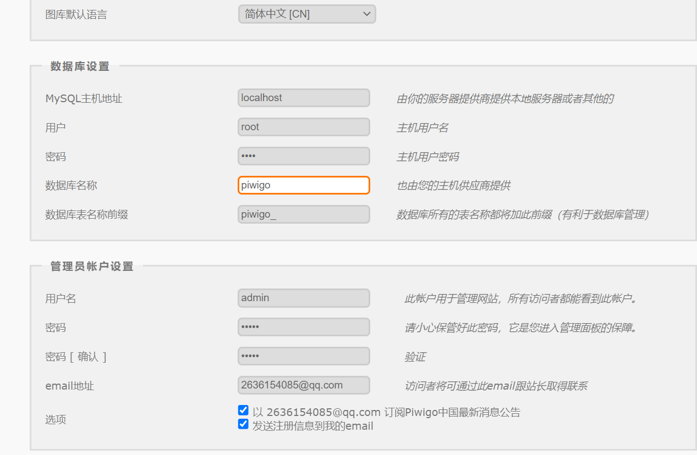

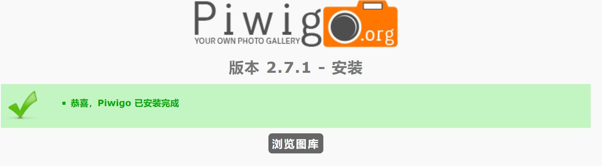

### 2.2.2 漏洞复现

前文仅简单分析了漏洞发生的关键点，但是落到实地进行利用的时候还有很多问题需要解决。

1. 访问 picture.php 添加图片

2. 访问图片

   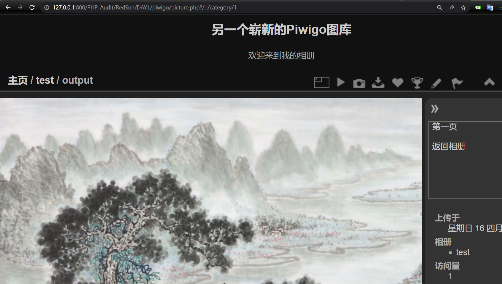

3. 发起攻击

> 有个点真的卡了我很久，就是没有图片的时候无论咋给 picture.php 传参都会退出来。
>
> 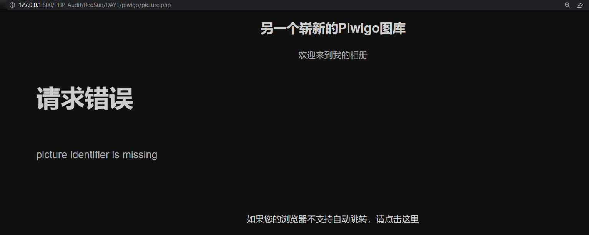
>
> 出于好奇心，我想要弄清楚为什么报错，这只能通过一行行地打断点调试实现。


### 2.2.3 流程图

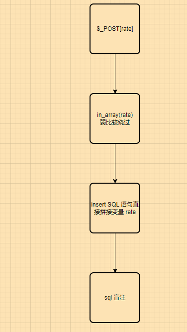

## 修复建议

可以看到这个漏洞的原因是弱类型比较问题，那么我们就可以使用强匹配进行修复。例如将 **in_array()** 函数的第三个参数设置为 **true** ，或者使用 **intval()** 函数将变量强转成数字，又或者使用正则匹配来处理变量。这里我将 **in_array()** 函数的第三个参数设置为 **true** ，代码及防护效果如下：

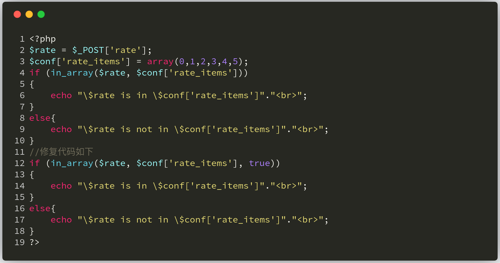

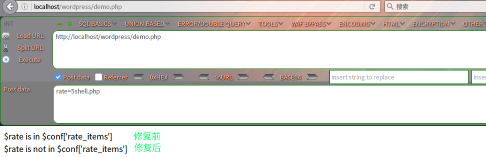


## 结语

看完了上述分析，不知道大家是否对 **in_array()** 函数有了更加深入的理解，文中用到的CMS可以从 [这里](https://piwigo.org/download/dlcounter.php?code=2.7.1) 下载，当然文中若有不当之处，还望各位斧正。如果你对我们的项目感兴趣，欢迎发送邮件到 **hongrisec@gmail.com** 联系我们。**Day1** 的分析文章就到这里，我们最后留了一道CTF题目给大家练手，题目如下：

```php
//index.php
<?php
include 'config.php';
$conn = new mysqli($servername, $username, $password, $dbname);
if ($conn->connect_error) {
    die("连接失败: ");
}

$sql = "SELECT COUNT(*) FROM users";
$whitelist = array();
$result = $conn->query($sql);
if($result->num_rows > 0){
    $row = $result->fetch_assoc();
    $whitelist = range(1, $row['COUNT(*)']);
}

$id = stop_hack($_GET['id']);
$sql = "SELECT * FROM users WHERE id=$id";

if (!in_array($id, $whitelist)) {
    die("id $id is not in whitelist.");
}

$result = $conn->query($sql);
if($result->num_rows > 0){
    $row = $result->fetch_assoc();
    echo "<center><table border='1'>";
    foreach ($row as $key => $value) {
        echo "<tr><td><center>$key</center></td><br>";
        echo "<td><center>$value</center></td></tr><br>";
    }
    echo "</table></center>";
}
else{
    die($conn->error);
}

?>
```

```php
//config.php
<?php  
$servername = "localhost";
$username = "fire";
$password = "fire";
$dbname = "day1";

function stop_hack($value){
	$pattern = "insert|delete|or|concat|concat_ws|group_concat|join|floor|\/\*|\*|\.\.\/|\.\/|union|into|load_file|outfile|dumpfile|sub|hex|file_put_contents|fwrite|curl|system|eval";
	$back_list = explode("|",$pattern);
	foreach($back_list as $hack){
		if(preg_match("/$hack/i", $value))
			die("$hack detected!");
	}
	return $value;
}
?>
```

```sql
# 搭建CTF环境使用的sql语句
create database day1;
use day1;
create table users (
id int(6) unsigned auto_increment primary key,
name varchar(20) not null,
email varchar(30) not null,
salary int(8) unsigned not null );

INSERT INTO users VALUES(1,'Lucia','Lucia@hongri.com',3000);
INSERT INTO users VALUES(2,'Danny','Danny@hongri.com',4500);
INSERT INTO users VALUES(3,'Alina','Alina@hongri.com',2700);
INSERT INTO users VALUES(4,'Jameson','Jameson@hongri.com',10000);
INSERT INTO users VALUES(5,'Allie','Allie@hongri.com',6000);

create table flag(flag varchar(30) not null);
INSERT INTO flag VALUES('HRCTF{1n0rrY_i3_Vu1n3rab13}');
```

题解我们会阶段性放出，如果大家有什么好的解法，可以在文章底下留言，祝大家玩的愉快！