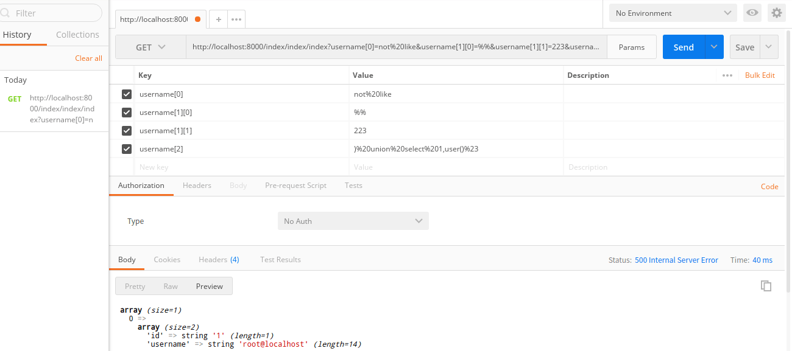
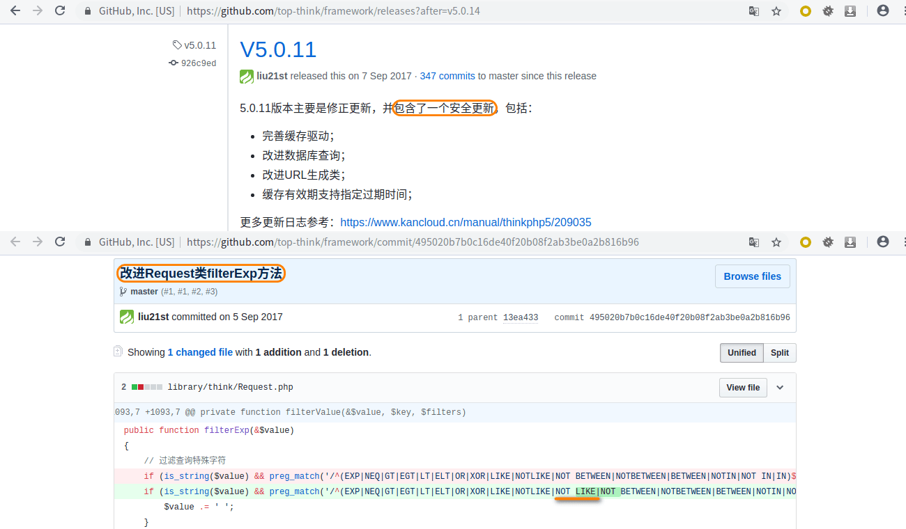
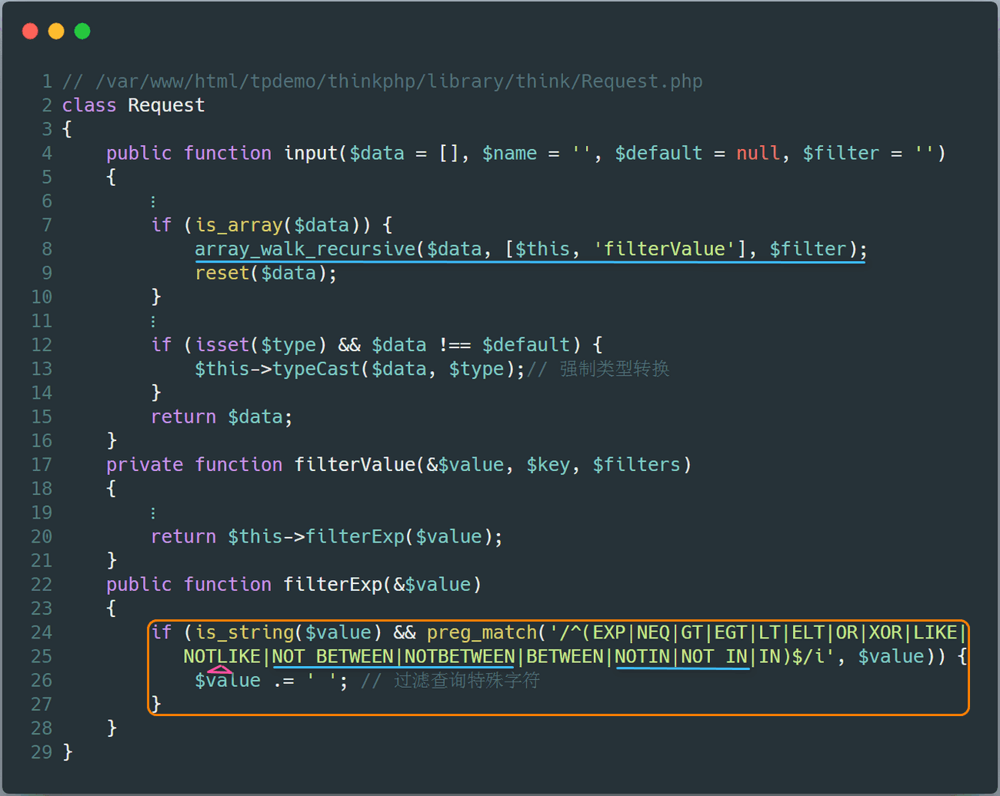
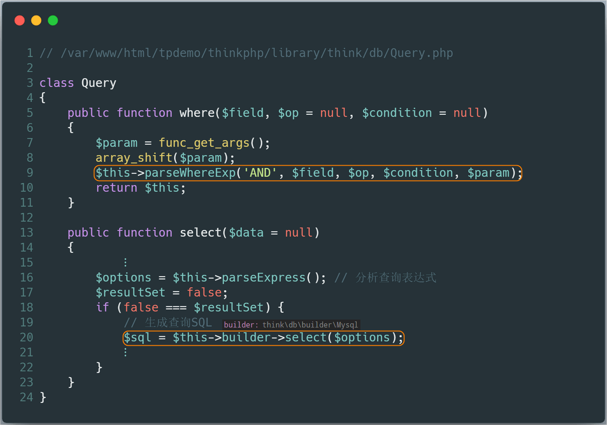
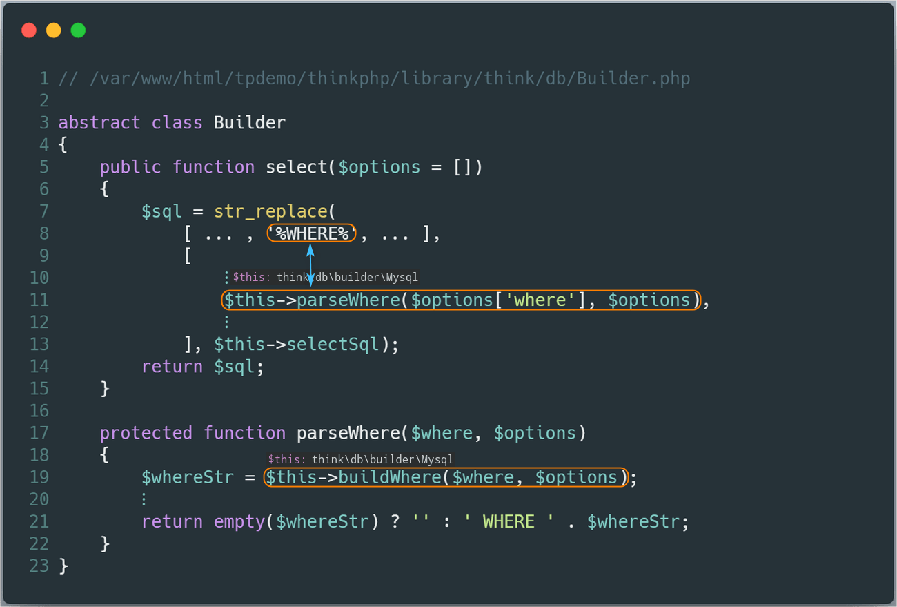
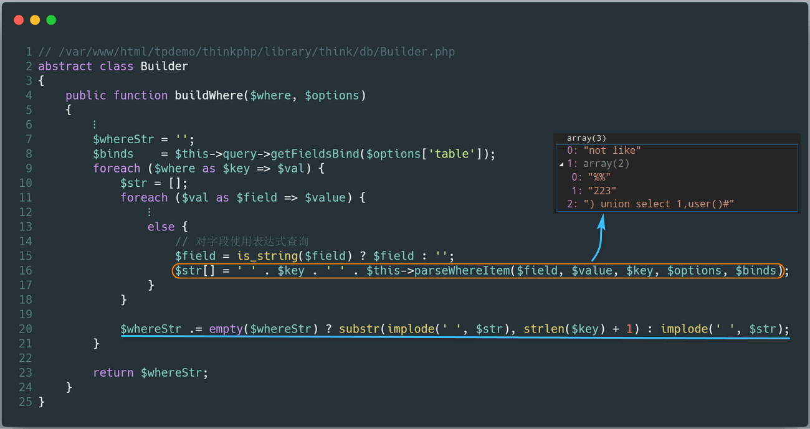
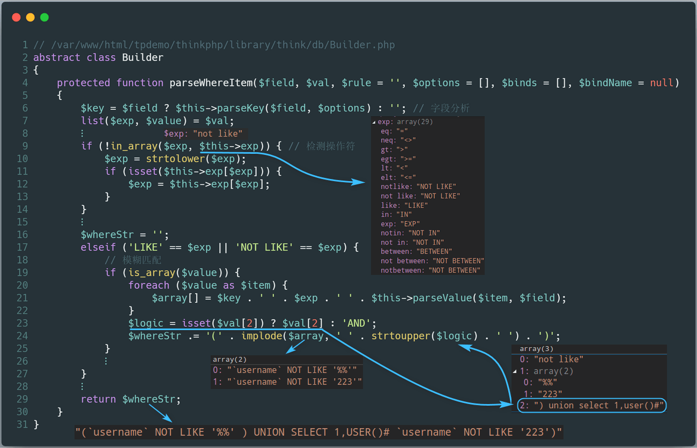
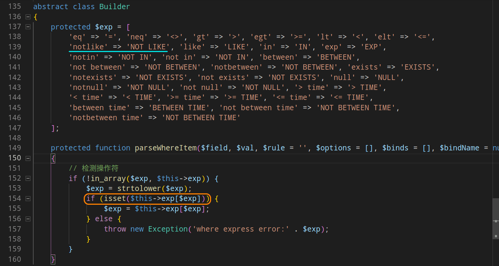
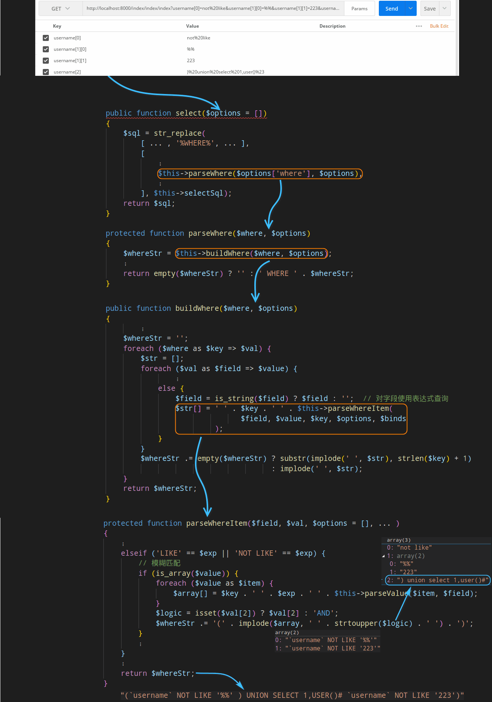

本系列文章将针对 **ThinkPHP** 的历史漏洞进行分析，今后爆出的所有 **ThinkPHP** 漏洞分析，也将更新于 [ThinkPHP-Vuln](https://github.com/Mochazz/ThinkPHP-Vuln) 项目上。本篇文章，将分析 **ThinkPHP** 中存在的 **SQL注入漏洞** （ **select** 方法注入）。

## 漏洞概要

本次漏洞存在于 **Mysql** 类的 **parseWhereItem** 方法中。由于程序没有对数据进行很好的过滤，直接将数据拼接进 **SQL** 语句。再一个， **Request** 类的 **filterValue** 方法漏过滤 **NOT LIKE** 关键字，最终导致 **SQL注入漏洞** 的产生。漏洞影响版本： **ThinkPHP=5.0.10** 。

## 漏洞环境

通过以下命令获取测试环境代码：

```bash
composer create-project --prefer-dist topthink/think=5.0.10 tpdemo
```

将 **composer.json** 文件的 **require** 字段设置成如下：

```json
"require": {
    "php": ">=5.4.0",
    "topthink/framework": "5.0.10"
},
```

然后执行 `composer update` ，并将 **application/index/controller/Index.php** 文件代码设置如下：

```php
<?php
namespace app\index\controller;

class Index
{
    public function index()
    {
        $username = request()->get('username/a');
        $result = db('users')->where(['username' => $username])->select();
        var_dump($result);
    }
}
```

在 **config/database.php** 文件中配置数据库相关信息，并开启 **config/app.php** 中的 **app_debug** 和 **app_trace** 。创建数据库信息如下：

```sql
create database tpdemo;
use tpdemo;
create table users(
	id int primary key auto_increment,
	username varchar(50) not null
);
insert into users(id,username) values(1,'mochazz');
```

访问 **http://localhost:8000/index/index/index?username[0]=not like&username[1][0]=%%&username[1][1]=233&username[2]=) union select 1,user()#** 链接，即可触发 **SQL注入漏洞** 。（没开启 **app_debug** 是无法看到 **SQL** 报错信息的）



## 漏洞分析

首先在官方发布的 **5.0.11** 版本更新说明中，发现其中提到该版本包含了一个安全更新，我们可以查阅其 **commit** 记录，发现其修改的 **Request.php** 文件代码比较可疑。



接着我们直接跟着上面的攻击 **payload** 来看看漏洞原理。首先，不管以哪种方式传递数据给服务器，这些数据在 **ThinkPHP** 中都会经过 **Request** 类的 **input** 方法。数据不仅会被强制类型转换，还都会经过 **filterValue** 方法的处理。该方法是用来过滤表单中的表达式，但是我们仔细看其代码，会发现少过滤了 **NOT LIKE** ，而本次漏洞正是利用了这一点。



我们回到处理 **SQL** 语句的方法上。首先程序先调用 **Query** 类的 **where** 方法，通过其 **parseWhereExp** 方法分析查询表达式，然后再返回并继续调用 **select** 方法准备开始构建 **select** 语句。



上面的 **$this->builder** 为 **\think\db\builder\Mysql** 类，该类继承于 **Builder** 类，所以接着会调用 **Builder** 类的 **select** 方法。在 **select** 方法中，程序会对 **SQL** 语句模板用变量填充，其中用来填充 **%WHERE%** 的变量中存在用户输入的数据。我们跟进这个 **where** 分析函数，会发现其会调用生成查询条件 **SQL** 语句的 **buildWhere** 函数。



继续跟进 **buildWhere** 函数，发现用户可控数据又被传入了 **parseWhereItem** where子单元分析函数，该函数的返回结果存储在 **$str** 变量中，并被拼接进 **SQL** 语句。（下图 **第16、20行**）



我们跟进 **parseWhereItem** 方法，发现当操作符等于 **NOT LIKE** 时，程序所使用的 **MYSQL** 逻辑操作符竟然可由用户传来的变量控制（下图 **第23行** ），这样也就直接导致了 **SQL注入漏洞** 的发生。



正是由于 **ThinkPHP** 官方的 **filterValue** 方法漏过滤了 **NOT LIKE** ，同时 **MYSQL** 逻辑操作由用户变量控制，使得这一漏洞可以被利用。

## 漏洞修复

在 **5.0.10** 之后的版本，官方的修复方法是：在 **Request.php** 文件的 **filterValue** 方法中，过滤掉 **NOT LIKE** 关键字。而在 **5.0.10** 之前的版本中，这个漏洞是不存在的，但是其代码也没有过滤掉 **NOT LIKE** 关键字，这是为什么呢？经过调试，发现原来在 **5.0.10** 之前的版本中，其默认允许的表达式中不存在 **not like** （注意空格），所以即便攻击者可以通过外部控制该操作符号，也无法完成攻击。（会直接进入下入157行，下图是 **5.0.9** 版本的代码）相反， **5.0.10** 版本其默认允许的表达式中，存在 **not like** ，因而可以触发漏洞。



## 攻击总结

最后，再通过一张攻击流程图来回顾整个攻击过程。

