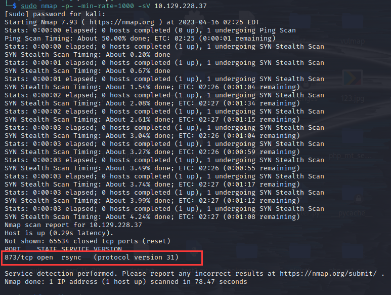

# Synced

## 前言

今天的靶机涉及到和文件传输有关的协议，提起文件传输协议，很自然地就会想到FTP文件传输协议。该协议用于通过网络传输完整的文件，但是在许多情况下我们并不想要完整的传输一个文件，而是仅传输文件改动过的那一部分，即对文件作一个部分的更新，此时FTP协议就不适用了。在这种情况下，我们可以利用 `rsync` 协议来帮助我们解决这个问题。

在 rsync 协议中，需要被传输的“改动”称为 [deltas](https://en.wikipedia.org/wiki/Delta_update)（增量）。使用 deltas 更新文件是一个极其高效的方式，能够减少传输所需带宽和时间。

基于rsync协议，人们开发了一个名为`rsync`的同名工具，linux手册页对其的定义如下：

```
Rsync is a fast and extraordinarily versatile file copying tool. It can copy locally,
to/from another host over any remote shell, or to/from a remote rsync daemon. It offers
a large number of options that control every aspect of its behavior and permit very
flexible specification of the set of files to be copied. It is famous for its deltatransfer algorithm, which reduces the amount of data sent over the network by sending
only the differences between the source files and the existing files in the
destination. Rsync is widely used for backups and mirroring and as an improved copy
command for everyday use.
```

Rsync 是一个快速的、非常通用的文件复制工具。可在任何远程shell上将文件从本地复制到另一个主机或是一个远程的同步程序上，反之亦然。Rsync提供了大量的选项以控制其行为的每个方面，同时也允许非常灵活地指定要复制的文件集。

Rsync因其增量传输算法而闻名，增量传输算法通过仅传输源文件和目标上已存的文件之间的差异，减少了网络上所发送的数据量。Rsync被广泛用于复制备份文件和镜像，同时也可作为一个用于日常使用的升级版的copy命令。

从官方文档可以知道，rsync是一个创建、维护备份文件和保持远程机器彼此同步的好工具。

rsync传输文件的主要步骤如下：

1. rsync和远程主机建立连接并生成一个rsync接收进程。
2. 发送方、接收方的进程比较什么文件已改变
3. 已改变的文件在远程主机上进行更新


有时候人们会错误地配置rsync，使其允许匿名的登录，这可能会使潜在的攻击者获得敏感信息的访问权限。今天的靶机 Synced在rsync上暴露了一个允许匿名访问的目录，我们可以使用命令行工具`rsync` 远程访问这个目录并得到flag。

## 渗透

还是以经典的Nmap扫描开始，用以下命令扫描目标上开放的端口及运行着的服务:

```bash
nmap -p- -min-rate=1000 -sV {target_ip}
```




可以发现 873 端口上运行着一个名为 rsync 的服务。我们在前文已描述过，rsync是一个可以提供快速的增量文件传输的实用工具。

> 我发现还是阅读英文更快，而且我发现随着阅读的增多，我记忆英文并不比记忆中文难了....

## What is rsync? 

As we have already mentioned rsync is an open source utility that provides fast incremental file transfer. The way rsync works makes it an excellent choice when there is a need to synchronize files between a computer and a storage drive and across networked computers. Because of the flexibility and speed it offers, it has become a standard Linux utility, included in all popular Linux distribution by default. More information about rsync can be found at the Wikipedia page

## Connecting to rsync

Since rsync is already pre-installed on almost all Linux distributions, we can start interacting with the remote machine.

The generic syntax used by rsync is the following:

```bash
rsync [OPTION] ... [USER@]HOST::SRC [DEST]
```

where _**SRC**_ is the file or directory (or a list of multiple files and directories) to copy from, _**DEST**_ is the file or
directory to copy to, and square brackets indicate optional parameters.

The [OPTION] portion of the syntax, refers to the available options in rsync. The list with all valid options is available over at the official manual page of rsync under the section Options Summary.

The [USER@] optional parameter is used when we want to access the the remote machine in an authenticated way. （because）In this case, we don't have any valid credentials at our disposal so we will omit this portion and try an _anonymous_ authentication.

As our first attempt we will try to simply list all the available directories to an anonymous user. Reading
through the manual page we can spot the option `--list-only`, which according to the definition is used to "list the files instead of copying them".

At this point, we have crafted our first command that we will use to interact with the remote machine.

```bash
rsync --list-only {target_IP}::
```

Looking at the output, we can see that we can access a directory called public with the description `Anonymous Share`. It is a common practice to call shared directories just shares. Let's go a step further and list the files inside the public share.

```bash
rsync --list-only {target_IP}::public
```


We notice a file called flag.txt inside the public share. Our last step is to copy/sync this file to our local machine. To do that, we simply follow the general syntax by specifying the SRC as public/flag.txt and the DEST as flag.txt to transfer the file to our local machine.

```
rsync {target_IP}::public/flag.txt flag.txt
```

Executing this command returns no output. But, on our local directory we have a new file called flag.txt. Let's read its contents.

```
cat flag.txt
```

Congratulations! You have successfully retrieved the flag file from the remote machine using the rsync

protocol.


