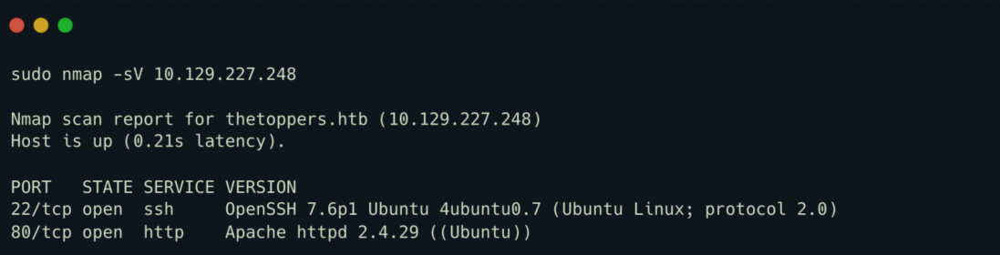
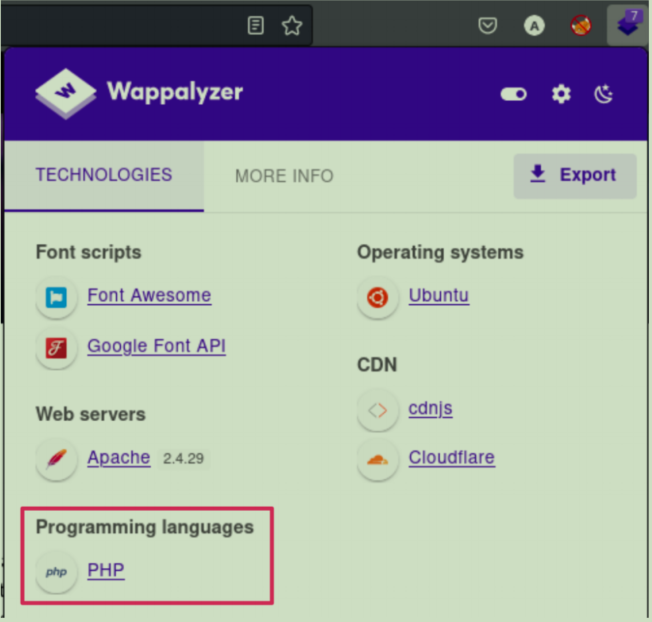
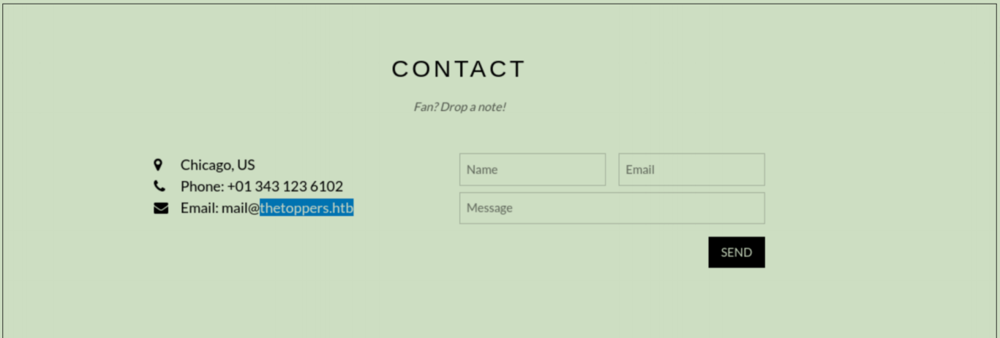

# Three

## 前言

- 本期来到 TIER1 系列的第五个靶机，难度评级为 Very Easy！

在当前时代，各种企业，无论大小都在使用云。它们主要用云进行数据备份、数据存储、数据的灾难恢复、邮箱、虚拟桌面、软件开发和测试等等。所以为了应对可能的攻击，对公司的云进行一个安全地配置是一件很重要的事情。

Three 靶机包含了一个网站，并使用一个 AWS S3 bucket 作为它的云存储服务设备。但是这个 bucket 未进行安全配置，所以我们可以在这个 bucket 上上传一个反弹 shell，从而读取 flag 并通过本关。


## 枚举

首先我们扫描靶机上开放的端口：

```bash
sudo nmap -sV ip
```



扫描结果显示 TCP  的 22 和 80 端口是开放的。我们在浏览器访问一下靶机的 80 端口：


我们可以看到一个静态的 web 页面，其中有一个音乐会门票预订部分，但是并没有什么用处。

我们使用 [Wappalyzer](https://www.wappalyzer.com/apps/) 识别一下网站采用了什么技术：



识别结果告诉我们网站基于 PHP 语言开发！

在页面一番搜索，可以发现一个 Contact 功能，点击一下就来到了 Contact 页面：



从上图可以看到邮箱中的一个域名信息

```
thetoppers.htb
```

现在，在我们的 /etc/hosts 文件中增添配置，将以上域名和靶机的 IP 关联起来：

```bash
echo "10.129.227.248 theoppers.htb" | sudo tee -a /etc/hosts
```

这样，我们就可以通过浏览器直接访问该域名了。

> /etc/hosts 文件用于将主机名解析为 IP 地址。默认情况下，在 DNS 服务器进行域名解析前会查询该文件。
>
> 所以我们需要在该文件中为以上域名添加一个对应的 IP，这样我们的浏览器就会将该域名解析成我们添加的 IP 啦！

## 子域名枚举

#### 子域名是什么？

子域名是被添加到网站域名开头的额外信息块。子域名允许网站根据特定的功能来分离和组织内容。

举个例子，若我们访问 hackthebox.com ，我们可以访问到网站的主页面部分。但是如果我们访问 ctf.hackthebox.com，我们就能访问到网站的 CTF 部分。在这种情况下，`ctf` 就是子域名，而 `hackthebox` 则是主域名，`com` 是顶级域名。尽管 URL 发生了一些轻微的变化，但是你仍在 HTB 的网站内，在 HTB 的域名下。

通常，不同的子域名会有不同的 IP 地址，所以当我们的系统查找子域名时，它会得到处理该应用程序的服务器的地址。

Often, different subdomains will have different IP addresses, so when our system goes to look up the

subdomain, it gets the address of the server that handles that application. 


