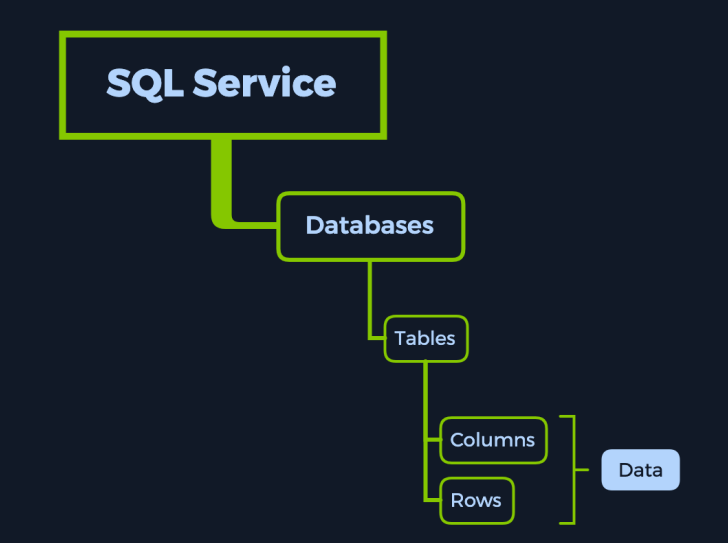
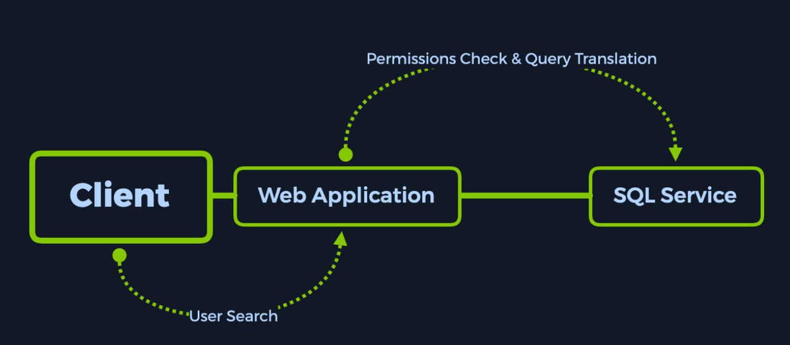
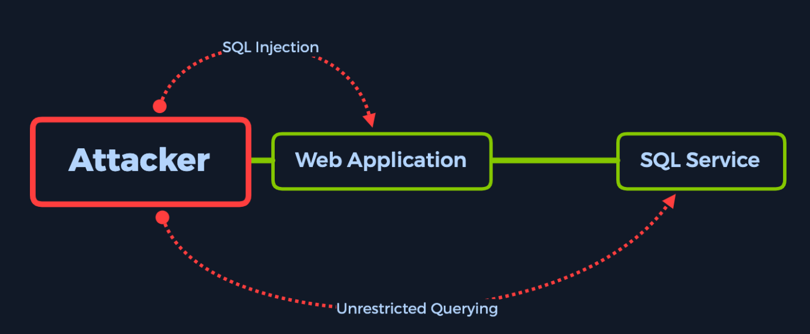
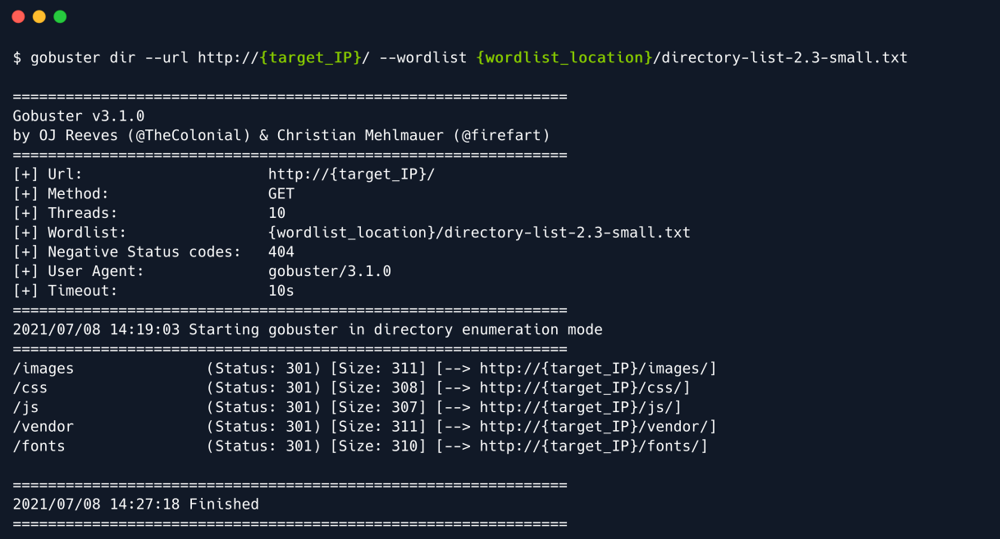

# Appointment Write-up

Prepared by: 0ne-nine9, ilinor

## Introduction

Appointment is a box that is mostly web-application oriented. More specifically, we will find out how to
perform an SQL Injection against an SQL Database enabled web application. Our target is running a

website with search capabilities against a back-end database containing searchable items vulnerable to this
type of attack. Not all items in this database should be seen by any user, so different privileges on the
website will grant you different search results.

**Hypothetically**（假设）, an administrator of the website will search up users, their emails, billing information,
shipping address, and others. In contrast, a simple user or unauthenticated visitor might only have
permission to search for the products on sale. These tables of information will be separate. However, for
an attacker with knowledge on web application vulnerabilities - specifically SQL Injection, in this case - the
separation between those tables will mean nothing, as they will be able to exploit the web application to
directly query any table found on the SQL Database of the webserver.



An excellent example of how an SQL Service typically operates is the log-in process utilized for any user.
Each time the user wants to log in, the web application sends the log-in page input (username/password
combination) to the SQL Service, comparing it with stored database entries for that specific user. Suppose
the specified username and password match any entry in the database. In that case, the SQL Service will
report it back to the web application, which will, in turn, log the user in, giving them access to the restricted
parts of the website. Post-log-in, the web application will set the user a special permission in the form of a
cookie or authentication token that associates his online **presence**（状态） with his authenticated presence on the
website. This cookie is stored both locally, on the user's browser storage, and the webserver.

Afterward, if the user wants to search through the list items listed on the page for something in particular,
he will input the object's name in a search bar, which will trigger the same SQL Service to run the SQL query
on behalf of the user. Suppose an entry for the searched item exists in the database, typically under a
different table. In that case, the associated information is retrieved and sent to the web application to be
presented to the user as images, text, links, and other types, such as comments and reviews.




The reason websites use databases such as MySQL, MariaDB, or other kinds is that the data they collect or
serve needs to be stored somewhere. Data could be usernames, passwords, posts, messages, or more
sensitive sets such as PII ([Personally Identifiable Information](https://en.wikipedia.org/wiki/Personal_data)), which is protected by international data
privacy laws. Any enterprise with a **disregard**（忽视） towards protecting its users' PII is welcomed with very **hefty**（数目，数量）相当大的）fines from international **regulators**（监管部门） and data privacy agencies.

SQL Injection is a common way of exploiting web pages that use SQL Statements that retrieve and store
user input data. If configured incorrectly, one can use this attack to exploit the well-known SQL Injection vulnerability, which is very dangerous. There are many different techniques of protecting from SQL injections, some of them being input validation, parameterized queries, stored procedures, and implementing a WAF (Web Application Firewall) on the **perimeter**（外缘） of the server's network. However, **instances can be found where none of these fixes（修复） are in place**（可以找到没有这些修复程序的实例）, hence why this type of attack is **prevalent**（普遍的）, according to the [OWASP Top 10](https://owasp.org/www-project-top-ten/) list of web vulnerabilities. 




Let us take a look at our target and see if it **fits the bill for this scenario**（符合这种情况）.

## Enumeration

First, we perform an nmap scan to find the open and available ports and their services. If no **alternative**（可替代的） flag is specified in the command syntax, nmap will scan the most common 1000 TCP ports for active services.
This will suit us in our case.

Additionally, we will need super-user privileges to run the command below with the `-sC` or `-sV` flags. This is because script scanning (-sC) and version detection (-sV) are considered more intrusive methods of scanning the target. This results in a higher probability of being caught by a perimeter security device on the
target's network.

```bash
-sC: Performs a script scan using the default set of scripts. It is equivalent to --
script=default. Some of the scripts in this category are considered intrusive and
should not be run against a target network without permission.
```

```bash
-sV: Enables version detection, which will detect what versions are running on what
port.
```


The only open port we detect is port 80 TCP, which is running the `Apache httpd` server version `2.4.38`.

Apache HTTP Server is a free and open-source application that runs web pages on either physical or virtual
web servers. It is one of the most popular HTTP servers, and it usually runs on standard HTTP ports such as
ports 80 TCP, 443 TCP, and alternatively on HTTP ports such as 8080 TCP or 8000 TCP. HTTP stands for
Hypertext Transfer Protocol, and it is an application-layer protocol used for transmitting **hypermedia**（超媒体）
documents, such as HTML (Hypertext Markup Language).

The nmap scan provided us with the exact version of the Apache httpd service, which is 2.4.38. Usually, a
good idea would be to search up the service version on popular vulnerability databases online to see if any
vulnerability exists for the specified version. However, in our case, this version does not contain any known
vulnerability that we could potentially exploit.

In order to further enumerate the service running on port 80, we can navigate directly to the IP address of
the target from our browser, inside our Pwnbox instance or Virtual Machine.


**Note** : Starting from below, we will be exploring the concept of brute-forcing different directories to include
in our Enumeration phase, which will not help us exploit the target and is considered an optional but **good-**
**to-know**（不可不知） step. This section is considered optional for Tier 0, but represents a valuable step in the
assessment process. If you would like to skip it, you can scroll down to the Foothold section.

By typing the IP address of the target into the URL field of our browser, we are faced with a website
containing a log-in form. Log-in forms are used to authenticate users and give them access to restricted
parts of the website depending on the privilege level associated with the input username. Since we are not
aware of any specific credentials that we could use to log-in, we will check if there are any other directories
or pages useful for us in the enumeration process. It is always considered good practice to fully enumerate
the target before we target a specific vulnerability we are aware of, such as the SQL Injection vulnerability in
this case. We need the whole picture to ensure we are not missing anything and fall into a rabbit hole, which
could quickly become frustrating（令人沮丧的）.

Think of web directories as "web folders" where other resources and relevant files are stored and
organized, such as other pages, log-in forms, administrative log-in forms, images, and configuration file
storage such as CSS, JavaScript, PHP, and more. Some of these resources are linked directly from the
**landing**（登陆 ） page of the website. **Pages we are all accustomed to**（我们都习以为常的页面）, such as `Home`, `About`, `Contact`, `Register`,and `Log-in` pages, are considered separate web directories. When navigating to these pages, the URL address at the top of our browser window will change depending on our current location. For example, if we
navigate from the Home page to the Contact page of a website, the URL would change as follows:

Home page:

```
https://www.example.com/home
```

Contact page:

```
https://www.example.com/contact
```

Some pages might be **nested**（嵌套） in others, which means that the directory for one page could be found in a bigger directory containing the previous page. Let us take a `Forgot Password page` for this example. These
are usually found under the `Login` directory because you can get redirected to it from the log-in form if you forgot your user password.

Log-in page:

```
https://www.example.com/login
```

Forgot Password page:

```
https://www.example.com/login/forgot
```

However, suppose buttons and links to the desired directories are not provided. In that case, because the
directories we are looking for either contain sensitive material or simply resources for the website to load
images and videos, we can provide the names of those directories or web pages in the same browser URL
field to see if it will load anything. Your browser by itself will ~~not~~ block access to these directories simply
because there is no link or button on the webpage for them. Website administrators will need to make sure
directories containing sensitive information are properly secured so that users can not just simply manually
navigate to them.

When navigating through web directories, the HTTP client, which is your browser, communicates with the
HTTP server (in this case Apache 2.4.38) using the HTTP protocol by sending an HTTP Request (a GET or
POST message) which the server will then process and return with an HTTP Response.

HTTP Responses contain status codes, which detail the interaction status between the client's request and
how the server handled it. Some of the more common status codes for the HTTP protocol are:

```
HTTP1/1 200 OK : Page/resource exists, proceeds with sending you the data.

HTTP1/1 404 Not Found : Page/resource does not exist.

HTTP1/1 302 Found : Page/resource found, but by redirection to another directory (moved
temporarily). This is an invitation to the user-agent (the web browser) to make a
second, identical request to the new URL specified in the location field. You will
perceive the whole process as a seamless redirection to the new URL of the specified
resource.
```

If you would like to learn more about how Web Requests work, you can check our Academy module called
[Web Requests](https://academy.hackthebox.eu/module/details/35)!


Let us take a look at the complete process for searching up and accessing a hidden directory. By specifying
the IP address of the target that runs an HTTP server in the browser URL field followed by a forward-slash
(/) and the name of the directory or file we are looking for, the following events will take place:


- The user-agent (the browser / the HTTP client) will send a GET request to the HTTP Server with the URL of the resource we requested
- The HTTP server will look up the resource in the specified location (the given URL)
- If the resource or directory exists, we will receive the HTTP Server response - containing the data we requested (be it a webpage, an image, an audio file, a script, etc.) and response code 200 OK, because the resource was found and the request was fulfilled with success.
- If the resource or directory cannot be found at the specified address, and there is no redirection
implemented for it by the server administrator, the HTTP Server response will contain the typical 404
Page with the response code 404 `Not Found` attached.

These two cases above are what we will be focusing on when attempting to enumerate hidden directories
or resources. However, instead of manually navigating through the URL search bar to find this hidden data,
we will be using a tool that will automate the search for us. This is where tools such as Gobuster, Dirbuster,
Dirb, and others **come into play**（起作用 ）.

These are known as brute-forcing tools. Brute-force is a method of submitting data provided through a
specially made list of variables known as the wordlist in an attempt to guess the correct input for it to be
validated and access to be gained. Applying the brute-forcing method to web directories and resources with
such a tool will inject the variables from the wordlist one by one, inconsequent requests to the HTTP server,
and then read the HTTP response code for each request to see if it is accepted as an existing resource or
not. In our case, the wordlists we will be using will contain standard directory and file names (such as
`images`, `scripts`, `login.php`,`admin.php`), combined with more uncommon ones.

The same attack type comes into play for password brute-forcing - submitting passwords from a wordlist
until we find the right one for the specified username. This method is prevalent for low-skilled attackers due
to its low complexity, with the **downside**（缺点） of being "noisy", meaning that it involves sending a large number of
requests every second, so much that it becomes easily detectable by perimeter security devices that are
**fine-tuned**（微调？） to listen for non-human interactions with log-in forms.

For our case, we will be running a tool called Gobuster, which will brute-force the directories and files provided in the wordlist of our choice. Gobuster comes pre-installed with Parrot OS. However, if you are using a different operating system, you can install it by proceeding with the steps below.

### Gobuster

Gobuster is written in Golang, which is short for the Go programming language. According to Wikipedia's
definition of [Golang](https://en.wikipedia.org/wiki/Go_(programming_language)):

```
Go is a statically typed, compiled programming language designed at Google [..].

Go is syntactically similar to C but with memory safety, garbage collection, structural
typing, and CSP-style concurrency（并发性）. The language is often referred to as Golang because
of its domain name, golang.org, but the proper name is Go.

Go is influenced by C, but with an emphasis on greater simplicity and safety. The
language consists of:

- A syntax and environment adopting patterns more common in dynamic languages:
  - Optional concise variable declaration and initialization through type inference
  [..].
  - Fast compilation.
  - Remote package management (go get) and online package documentation.
  
- Distinctive approaches to particular problems:
  - Built-in concurrency primitives: light-weight processes (goroutines), channels, and
  the select statement.
  - An interface system in place of virtual inheritance and type embedding instead of
  non-virtual inheritance.
  - A toolchain that, by default, produces statically linked native binaries without
  external dependencies.
  
  
- A desire to keep the language specification simple enough to hold in a programmer's
  head, in part by omitting features that are common in similar languages.
```


### Installation

Since this tool is written in Go, you need to install the Go language/compiler/etc. Full details of installation
and setup can be found on the Go language website. You need at least Go version 1.16.0 to compile
Gobuster.

Once installed, you have two options:

#### A. Using the go install command

If you have a Go environment ready to go (at least go 1.16), it is as easy as:

```
go install github.com/OJ/gobuster/v3@latest
```

After the installation finishes, you can skip to the "Using Gobuster" section.

#### B. Building from source code and compiling

First, you will need to clone the repository:

```
git clone https://github.com/OJ/gobuster.git
```

After cloning is complete, there will be a gobuster folder in the directory you are currently in. Navigate to the folder where the files are located. The gobuster has external dependencies, and so they need to be **pulled**（引入） in first:

```
go get && go build
```

This will create a gobuster binary for you. If you want to install it in the $GOPATH/bin folder, you can run:

```
go install
```

If you have all the dependencies already, you can make use of the build scripts:

- make - builds for the current Go configuration (i.e., runs go build).
- make windows - builds 32 and 64-bit binaries for Windows and writes them to the build folder.
- make linux - builds 32 and 64-bit binaries for Linux and writes them to the build folder.
- make darwin - builds 32 and 64-bit binaries for Darwin and writes them to the build folder.
- make all - builds for all platforms and architectures, and writes the resulting binaries to the build
  folder.
- make clean - clears out the build folder.
- make test - runs the tests.

### Using Gobuster

To see how we can use Gobuster, we can use the following syntax.


After checking the help option, we can now use the program to find interesting pages and directories.

However, we still lack a wordlist. There is a dedicated folder with a myriad of wordlists, dictionaries, and
rainbow tables that comes pre-installed with Parrot OS, found under the path `/usr/share/wordlists`.
However, you can download the SecLists collection as well, it being one of the most famous wordlist
collections in use today. SecLists can be downloaded by following this [link](https://github.com/danielmiessler/SecLists).

To download it, type the following command:

```
git clone https://github.com/danielmiessler/SecLists.git
```

Now, we can start properly using Gobuster to its full capabilities. The flags we will be using with this
command are as follows:

```
dir : Specify that we wish to do web directory enumeration.
--url : Specify the web address of the target machine that runs the HTTP server.
--wordlist : Specify the wordlist that we want to use.
```



After checking out the web directories, we have found no helpful information. The results present in our
output represent default directories for most websites, and most of the time, they do not contain files that
could be exploitable or useful for an attacker in any way. However, it is still worth checking them because
sometimes, they could contain non-standard files placed there by mistake.

## Foothold

Since Gobuster did not find anything useful, we need to check for any default credentials or bypass the log-
in page **somehow**（以某种方式）. To check for default credentials, we could type the most common combinations in the username and password fields, such as:


```
admin:admin
guest:guest
user:user
root:root
administrator:password
```

After attempting all of those combinations, we have still failed to log in. We could, hypothetically, use a tool
to attempt brute-forcing the log-in page. However, that would take much time and might trigger a security
measure.

The next **sensible**（合理的） **tactic**（战术） would be to test the log-in form for a possible SQL Injection vulnerability. This vector has been described thoroughly in the Introduction section of the write-up:

```
SQL Injection is a common way of exploiting web pages that use `SQL Statements` that
retrieve and store user input data. If configured incorrectly, one can use this attack
to exploit the well-known `SQL Injection` vulnerability, which is very dangerous. There
are many different techniques of protecting from SQL injections, some of them being
input validation, parameterized queries, stored procedures, and implementing a WAF (Web
Application Firewall) on the perimeter of the server's network. However, instances can
be found where none of these fixes are in place, hence why this type of attack is
prevalent, according to the [OWASP Top 10](https://owasp.org/www-project-top-ten/) list
of web vulnerabilities.
```


Here is an example of how authentication works using PHP & SQL:

```php
<?php
mysql_connect("localhost", "db_username", "db_password"); # Connection to the SQL Database.

mysql_select_db("users"); # Dat abase table where user information is stored.

$username=$_POST['username']; # User-specified username.
$password=$_POST['password']; # User-specified password.

$sql="SELECT * FROM users WHERE username='$username' AND password='$password'";
# Query for user/pass retrieval from the DB.

$result=mysql_query($sql); # Performs query stored in $sql and stores it in $result.

$count=mysql_num_rows($result);
# Sets the $count variable to the number of rows stored in $result.

if ($count== 1 ){
# Checks if there's at least 1 result, and if yes:
$_SESSION['username'] = $username; # Creates a session with the specified $username.
$_SESSION['password'] = $password; # Creates a session with the specified $password.
header("location:home.php"); # Redirect to homepage.
 
    else { # If there's no singular result of a user/pass combination:
header("location:login.php");
# No redirection, as the login failed in the case the $count variable is not equal to
1, HTTP Response code 200 OK.
}
?>
```


Notice how after the `#` symbol, everything turns into a comment? This is how the PHP language works.
Keep that in mind for later.

This code above is vulnerable to SQL Injection attacks, where you can modify the query (the $sql variable)
through the log-in form on the web page to make the query do something that is not supposed to do -bypass the log-in altogether!

Note that we can specify the username and password through the log-in form on the web page. However, it
will be directly embedded in the $sql variable that performs the SQL query without input validation. Notice
that no regular expressions or functions forbid us from inserting special characters such as a single quote
or hashtag. This is a dangerous practice because those special characters can be used for modifying the
queries. The pair of single quotes are used to specify the exact data that needs to be retrieved from the SQL
Database, while the hashtag symbol is used to make comments. Therefore, we could manipulate the query
command by inputting the following:

```
Username: admin'#
```

We will close the query with that single quote, allowing the script to search for the admin username. By adding the hashtag, we will comment out the rest of the query, which will make searching for a matching password for the specified username **obsolete**（废弃的）. If we look further down in the PHP code above, we will see that the code will only approve the log-in once there is precisely one result of our username and password combination. However, since we have skipped the password search part of our query, the script will now only search if any entry exists with the username admin. In this case, we got lucky. There is indeed an account called admin, which will validate our SQL Injection and return the 1 value for the $count variable, which will be put through the if statement, allowing us to log-in without knowing the password. If there was no admin account, we could try any other accounts until we found one that existed. (administrator, root, john_doe, etc.) Any valid, existing username would make our SQL Injection work. 

In this case, because the password-search part of the query has been skipped, we can throw anything we want at the password field, and it will not matter. 

```
Password: abc
```

To be more precise, here is how the query part of the PHP code gets affected by our input.


Notice how following our input, we have commented out the password check section of the query? This will
result in the PHP script returning the value 1 (1 row found) for `username = 'admin'` without checking the password field to match that entry. This is due to a lack of input validation in the PHP code shown above.


After pressing the log-in button, the exploit code is sent, and as suspected, we are presented with the following page:


We successfully performed a primary SQL Injection and got the flag. Congratulations!

## 答案

1. Structured Query Language
2. sql injection
3. **personally identifiable information**
4. **[A03:2021-Injection](https://owasp.org/Top10/A03_2021-Injection/)** 
5. Apache httpd 2.4.38 ((Debian))
6. 443
7. directory（我一直不太能区分文件夹和目录，所以这个题是在告诉我们文件夹在web应用行业内被称为目录？）
8. 404
9. dir
10. #
11. Congratulations
12. e3d0796d002a446c0e622226f42e9672