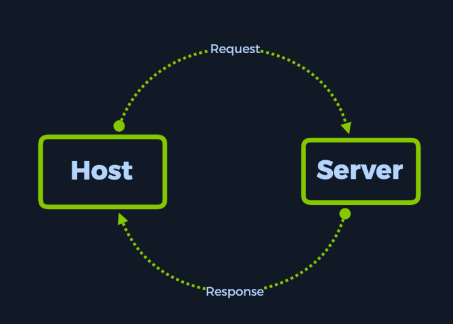
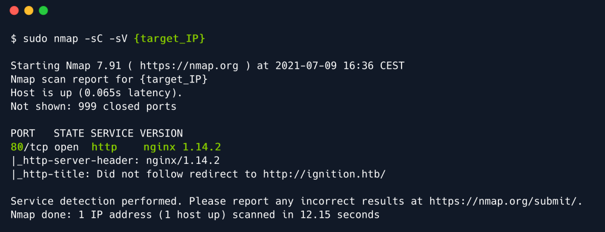
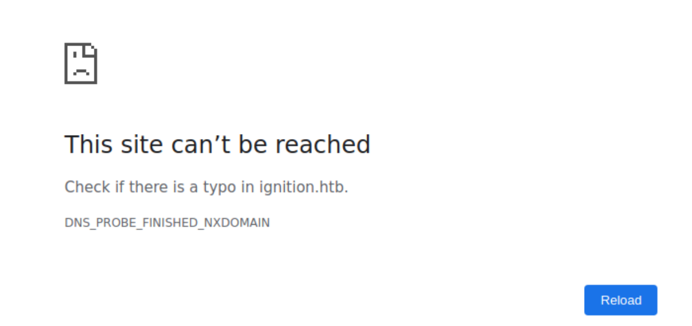
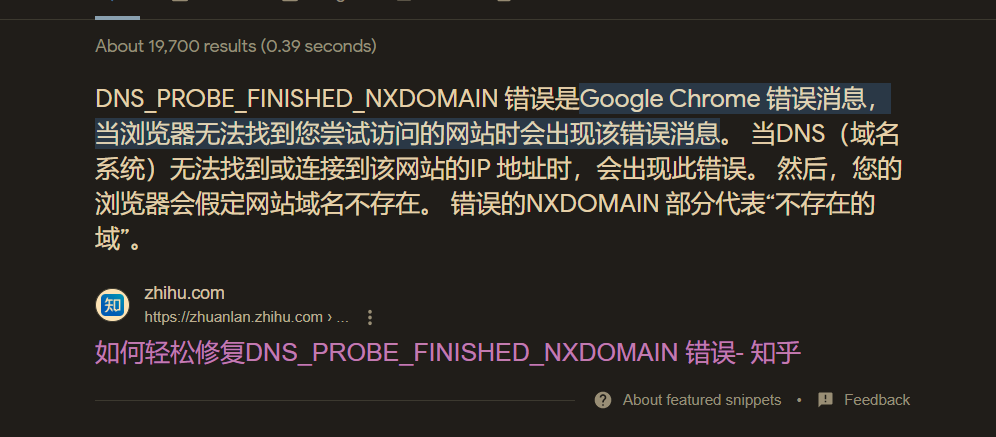
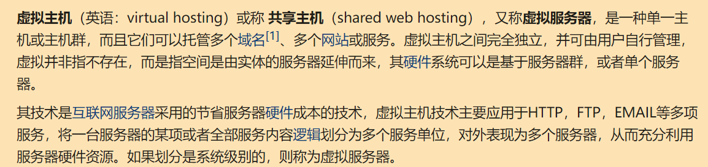
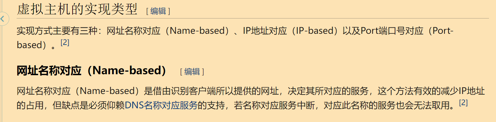

# Ignition

- 今日靶机仅有七个任务，应该工作量不大。

## 前言

如果我们未来想成为一名网络安全工程师，那么网络知识对我们来说就十分重要。

网络相关的应用有很多，比如活动目录、Kerberos 身份认证、服务器消息块、超文本传输协议 HTTP、SSH 等，不过在这一次靶场练习中，我们只需要用到其中的一部分，比如 HTTP、VHosts、DNS。

> 在打这个靶机之前，官方建议我们先刷一遍它的 [Introduction to Networking](https://academy.hackthebox.com/module/details/34)，有网络功底的直接开冲！

在你初学网络时，你可能会发现你对于主机与服务器之间的连接仅有一个表面的、粗浅的理解，你可能会认为数据包只是简单地从你的主机发送到服务器，然后再从服务器发回一个响应。



当前的靶机阐述了一些网络的概念，为了更好的理解它们，本篇 WP 会包含大量的示例图以便加深你对相关网络知识的理解。现在让我们以一个 web 请求为例（web 请求指的是通过你的 web 浏览器访问一个网站，是一种很简单的操作）。

## 枚举

- 老样子，还是以 nmap 扫描作为我们的首要操作，使用 `-sC` 和 `-sV` 选项进行默认的脚本扫描和版本探测。

扫描结果如下：



从上图可以看到，靶机似乎只开放了一个 80 端口，运行着的服务是 nginx 1.14.2。不过我们还注意到图中的 http-title 字段中出现了 `Did not follow redirect to http://ignition.htb/` 字样，我们需要留意一下该域名。

我们在浏览器中访问一下靶机的 80 端口，看看提供了什么服务：

可以明显地观察到输入 IP 访问之后跳转到了 `http://ignition.htb/` 网址，最后回显了网址不可达。



并且给出了具体的错误信息：`DNS_PROBE_FINISHED_NXDOMAIN`

> 你可能会感到很惊讶，为什么通过直接通过 IP 访问服务器都会失败？我直接用 IP 访问网站讲道理不是应该和 DNS 没有关系吗？为什么最后出现了和 DNS 相关联的错误呢？

我们谷歌一下该错误信息，看看具体是什么：

```
DNS_PROBE_FINISHED_NXDOMAIN 是什么
```



- 相关错误详细分析，参看此篇[文章](https://kinsta.com/knowledgebase/dns_probe_finished_nxdomain/)。

经过一番学习，我们知道该错误可能是由于以下两种原因造成的：

1. 我们输入了错误的域名，导致 DNS 服务器不能找到和该错误域名相关联的 IP 地址
2. 我们从未在浏览器的地址栏中输入过类似 `ignition.htb` 的主机名，但是网站期望我们这么做

我们这里直接通过 IP 访问服务器，所以出错的原因显然是第二种。现在来说说为什么我们直接通过 IP 访问服务器也会得到错误回显。

### Name-based VHosting

- 第二种原因的形成和基于网址名称的虚拟主机 **VHosting** 有关，那么什么是虚拟主机？

根据[维基百科](https://zh.wikipedia.org/wiki/%E8%99%9A%E6%8B%9F%E4%B8%BB%E6%9C%BA)，虚拟主机定义如下：





> 虚拟主机是在一个单一服务器（或是服务器池）上持有多个域名（每个域名独立处理）的方法。[1]虚拟主机允许在不要求所提供的服务都使用相同的主机名的情况下共享其资源，比如内存和处理器周期。
>
> 虚拟主机这个术语通常被用来称呼 web 服务器，但是相关的原理对其他的互联网服务也是一样的。
>
> 基于网址名称对应的虚拟主机所需的前置技术是一个支持 HTTP /1.1 的 web 浏览器，浏览器会在请求中包含目标主机名。网址名称对应的虚拟主机可以用一个 ip 地址持有多个网站，并根据请求中的目标主机名返回正确的网站内容。更具体地说，是通过 HTTP 首部中的 Host 字段来返回响应内容。
>
> 所以有时候你会看到同一个 ip 有多个域名，并且你访问不同的域名有不同的服务，这就是基于网址名称对应的虚拟主机在发挥作用。
>
> 另外，如果我们未能正确配置 DNS，那么即使已知了服务器的 IP 地址，我们也很难访问到一个 虚拟主机的网站。
>
> 因为如果用户尝试直接用 IP 地址访问服务器的话，比如 http://10.23.45.67/ ，那么 web 浏览器会将 IP 地址作为主机名。由于 web 服务器依赖于 web 客户端 即浏览器告诉它要使用的服务器名（指要使用的虚拟主机的名字 vhost）是什么，所以服务器会回显一个默认的网站，（这通常并不是用户所期望访问的网站），然后我们的浏览器就会跳转去访问服务器回显的网站，此时如果没有配置该网站相关联的 DNS，那么最终就会出错。
>
> 现在我们简单说说 DNS 是什么。
>
> DNS 全称为 Domain Name System 即域名系统。DNS 是一个层次化的、分布式的命名系统，本地的或是连接到互联网上的计算机、服务或其他资源等都需要使用它。
>
> 

好的，经过以上学习，我们已经成功理解了为什么直接通过 IP 访问依然会发生错误，最后的底层原因还是采用了虚拟主机的服务器回显了一个我们无法解析的默认网址域名。

那么我们现在要做的事情就是修改主机的 hosts 文件，配置一下服务器回显的域名相关联的 IP 地址：

