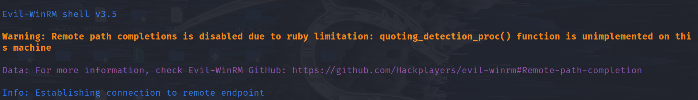

今天的WP尤其详细，写的蛮不错的。

讲授到了两个实用的程序，分别是 Responder 和 John the ripper。

responder 用于捕获 smb 流量，主要是获取 NetNTLMv2 hash值

Jhon the ripper 主要是用于爆破 密码的 hash 值。

最后是利用 evil-winrm 工具连接到服务器的winrm服务。

但是我在使用这个工具时遇见了一些问题，具体表现在连接成功之后无法用dir命令列出文件，同时启动时也有一些警示信息：

