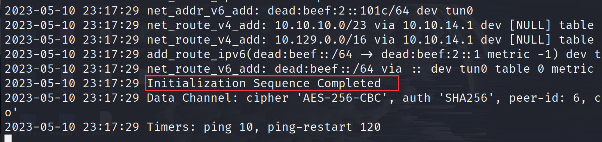

# HackTheBox
记录我在HackTheBox 实验室以及学院学习的历程。

## VPN连接

注意注意！！！！

一定要选择下载tcp版本的vpn文件，这样我们才可以成功连接。

udp版本的不知道为什么连接不了！

```bash
sudo openvpn test.vpn
```




## TIER0

- [mongo](./TIER0/Mongod/README.md)

